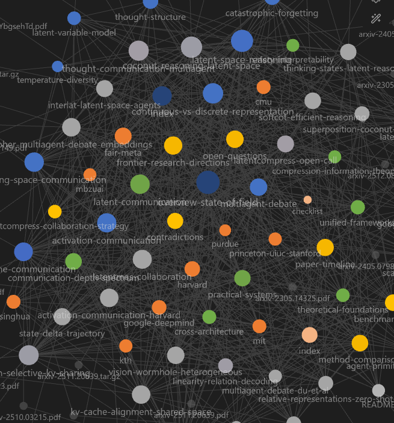

# Beyond the Token Bottleneck

### What happens when LLMs stop talking and start *thinking* in vectors?

[](wiki/analyses/paper-timeline.md) [](wiki/) [](wiki/) [](https://obsidian.md)

An open research wiki mapping the frontier of **latent-space reasoning**, **continuous thought**, and **inter-agent latent communication** in large language models.

[Explore the Wiki](#-entry-points) | [View the Spectrum](#-the-communication-depth-spectrum) | [Read the Overview](wiki/overview-state-of-field.md)

---

## The Central Question

Large language models are internally continuous systems — dense vectors in **R^d** at every layer — yet they're forced to interface with the world through **discrete token sampling**. This bottleneck:

- **Discards** distributional uncertainty (a full probability distribution collapses to one token)
- **Prevents** superposition of hypotheses (one token = one path)
- **Wastes** compute on fluency tokens that carry no reasoning content

> **What happens when you remove it — both within a single model and between collaborating models?**

This wiki systematically tracks **25+ papers** (Dec 2022 – Apr 2026) exploring that question, organized into a deeply cross-referenced knowledge graph with 1280+ internal links.

---

## Research Threads

### Thread 1: Latent Reasoning — *Intra-agent continuous thought*

Feed hidden states back as input embeddings instead of decoding to tokens. Models reason silently in continuous vector space, enabling **superposition** — maintaining multiple reasoning paths simultaneously in a single vector.

**Key result**: Coconut achieves 97.0% on planning tasks via emergent BFS, vs. 77.5% for chain-of-thought.

**Key papers**: Coconut, SoftCoT, Thinking States, iCoT, Pause Tokens, Superposition Theory

### Thread 2: Latent Communication — *Inter-agent continuous channels*

Replace text-based multi-agent debate with continuous representations. A **10-level depth spectrum** from natural language (~15 bits/position) to full hidden-state sequences (~40K bits/position).

**Key result**: LatentMAS achieves 471x theoretical compression over text with zero training.

**Key papers**: CIPHER, AC, KVComm, C2C, Interlat, SDE, ThoughtComm, Vision Wormhole, LatentMAS

---

## The Communication Depth Spectrum

One of the wiki's central frameworks — a 10-level taxonomy of how agents can share information, ordered from shallowest to deepest:

```
  Compatible                                                    Restrictive
  Interpretable                                                 Opaque
  Low bandwidth                                                 High bandwidth

  L0       L1       L2       L3       L4       L5      L6      L7      L8       L9
  NL      Emb     Delta   Struct   Vision   KV-sel   KV-x     AC    Full-HS   KV+Lat
  |---------|---------|---------|---------|---------|---------|---------|---------| 
  ~15                                                                        ~40K
  bits/pos                                                                   bits/pos
```

> **The research frontier is about bending this curve** — achieving high information density without requiring tight architectural coupling.

See [`communication-depth-spectrum`](wiki/mocs/communication-depth-spectrum.md) for the full guided walkthrough.

---

## Entry Points

| | Page | What You'll Find |
|---|------|------------------|
| **Overview** | [`overview-state-of-field`](wiki/overview-state-of-field.md) | Single narrative synthesis of the entire research landscape |
| **Reasoning** | [`latent-reasoning`](wiki/mocs/latent-reasoning.md) | Guided path: Pause Tokens → iCoT → Coconut → Superposition → SoftCoT |
| **Communication** | [`latent-communication`](wiki/mocs/latent-communication.md) | Guided path across all communication methods |
| **Depth Spectrum** | [`communication-depth-spectrum`](wiki/mocs/communication-depth-spectrum.md) | 10-level walkthrough from NL to full working memory |
| **Unified** | [`unified-frameworks`](wiki/mocs/unified-frameworks.md) | Systems combining reasoning + communication |
| **Cross-Architecture** | [`cross-architecture`](wiki/mocs/cross-architecture.md) | Cross-architecture compatibility |
| **Practical Systems** | [`practical-systems`](wiki/mocs/practical-systems.md) | Engineering lens: scaling, method selection, deployment |
| **Theoretical** | [`theoretical-foundations`](wiki/mocs/theoretical-foundations.md) | Mathematical underpinnings |
| **Compression** | [`compression-information-theory`](wiki/mocs/compression-information-theory.md) | Compression & Information-Theoretic Bounds |
| **Safety** | [`safety-interpretability`](wiki/mocs/safety-interpretability.md) | Safety, Interpretability & Auditability of Latent Systems |
| **Comparison** | [`method-comparison`](wiki/analyses/method-comparison.md) | Side-by-side table: training, architecture, results |
| **Frontiers** | [`frontier-research-directions`](wiki/analyses/frontier-research-directions.md) | Where the field is heading next |

---

## Vault Structure

```
beyond-the-token-bottleneck/
├── raw/                              # Immutable source documents
│   ├── pdf/                          # ~35 source PDFs (arXiv, ACL, ICML, NeurIPS)
│   ├── latex/                        # LaTeX source archives
│   └── assets/                       # Static assets
├── workflows/                        # Maintainer workflow playbooks used by AGENTS.md
├── wiki/                             # Research wiki (65 pages)
│   ├── sources/                      # Paper summaries by theme
│   │   ├── reasoning/               #   Coconut, SoftCoT, Pause Tokens, ...
│   │   ├── communication/           #   CIPHER, AC, KVComm, C2C, ...
│   │   │   ├── embeddings/          #     Output-layer methods
│   │   │   ├── activations/         #     Hidden-state methods
│   │   │   ├── kv-cache/            #     KV-cache methods
│   │   │   └── structured/          #     Disentangled methods
│   │   ├── unified/                 #   LatentMAS, Vision Wormhole, ...
│   │   └── meta/                    #   Scaling, expressivity theory
│   ├── concepts/                    # 10 cross-cutting concept pages
│   ├── entities/                    # 11 research group profiles
│   ├── analyses/                    # 7 synthesis & comparison pages
│   ├── mocs/*.md                    # 9 Maps of Content
│   ├── index.md                     # Wiki index
│   ├── log.md                       # Change log
│   └── overview-state-of-field.md   # Top-level narrative
├── AGENTS.md                         # Wiki schema & LLM instructions
└── README.md
```

---

## Features

| Deep Analysis | Cross-Referenced | LaTeX Math | Visual Diagrams | Guided Paths |
|:---:|:---:|:---:|:---:|:---:|
| Not summaries — detailed mechanisms, math, experimental numbers, ablation insights. 800–2000+ words per concept page. | 1280+ internal wiki-links. Every mention of a concept, entity, or paper links to its page. | All equations rendered with proper notation. Custom MathJax preamble with shared macros. | 33 Mermaid flowcharts for architectures, pipelines, and paper lineage trees. | Maps of Content with narrative reading order — not just link lists. |

---

## Knowledge Graph



The Obsidian graph view is configured with an Excel-style categorical palette so each wiki section is visually distinct: concepts (blue), entities (orange), sources (gray), analyses (gold), MOCs (green), top-level wiki notes (dark blue), `raw/` (light orange), and `workflows/` (dark green).

---

## Obsidian Setup

This vault is designed for [Obsidian](https://obsidian.md). Clone and open the repo as a vault.

### Community Plugins Used

| Plugin | Purpose | Install |
|--------|---------|---------|
| **LaTeX Suite** | Fast math typesetting via text expansion snippets | [GitHub](https://github.com/artisticat1/obsidian-latex-suite) |
| **Extended MathJax** | Custom preamble with `\R`, `\Loss`, `\E` macros | [GitHub](https://github.com/xldenis/obsidian-latex) |
| **Pandoc** | Export pages to PDF, DOCX, or ePub | [GitHub](https://github.com/OliverBalfour/obsidian-pandoc) |
| **TikZJax** | TikZ diagram rendering | [GitHub](https://github.com/artisticat1/obsidian-tikzjax) |
| **Diagrams (Draw.io)** | Diagram editor (installed but not used for wiki content; AGENTS.md prohibits `.drawio` files in favor of Mermaid) | [GitHub](https://github.com/zapthedingbat/drawio-obsidian) |

### Quick Start

```bash
git clone https://github.com/CompleteTech-LLC-AI-Research/beyond-the-token-bottleneck.git
cd beyond-the-token-bottleneck
# Open this folder as a vault in Obsidian
# Enable community plugins when prompted
# Start with: wiki/overview-state-of-field.md
```

---

## How This Wiki Was Built

This vault implements the [**LLM Wiki pattern**](https://gist.github.com/karpathy/442a6bf555914893e9891c11519de94f) described by Andrej Karpathy — where an LLM doesn't just retrieve documents (RAG-style) but **incrementally builds and maintains a persistent, structured wiki** that compounds knowledge over time. The key insight: *"the tedious part of maintaining a knowledge base is not the reading or the thinking — it's the bookkeeping,"* and LLMs excel at exactly that bookkeeping.

The workflow:

1. **Ingest** — Source papers are collected into `raw/pdf/`
2. **Summarize** — An LLM reads each paper and generates a structured source summary following the schema in `AGENTS.md`
3. **Extract** — Entities (research groups) and concepts (ideas, frameworks) are identified and given their own pages
4. **Cross-reference** — Every mention of a known entity or concept is linked. Contradictions and connections between papers are surfaced.
5. **Synthesize** — Maps of Content provide guided reading paths. Analysis pages compare methods and identify frontier directions.

Detailed maintainer playbooks for these operational workflows live in `workflows/*.md`.

The result is a deeply interlinked knowledge graph that's more useful than any individual paper summary — a **second brain** for latent-space reasoning research.

---

## Related Research

### Latent Communication Open Call

**[billion-token-one-task/latent-communication](https://github.com/billion-token-one-task/latent-communication)**

An open collaboration initiative recruiting researchers to advance latent communication for LLM agents. Their team has demonstrated **91% accuracy on GSM8K using 512-byte compressed latent vectors** — replacing MB-level token communication with near-lossless continuous channels. Three active research directions:

- Large-scale compressor training across task families
- Native latent communication pretraining
- Hybrid latent + tool-use communication

This wiki's [`latent-communication`](wiki/mocs/latent-communication.md) and [`method-comparison`](wiki/analyses/method-comparison.md) provide deep background on the methods underlying their work — particularly KV-cache compression (KVComm, C2C), embedding-space communication (CIPHER, SDE), and the theoretical foundations of why continuous channels outperform discrete ones.

### Karpathy's LLM Wiki Pattern

**[karpathy/442a6bf...](https://gist.github.com/karpathy/442a6bf555914893e9891c11519de94f)**

The methodology behind this vault. Karpathy's gist describes a three-layer architecture — **raw sources** (immutable), **the wiki** (LLM-generated), and **the schema** (configuration) — where the LLM acts as an active maintainer rather than a passive retriever.

This repo is a production implementation of that pattern applied to a focused research domain. Our schema ([`AGENTS.md`](AGENTS.md)) defines page types, linking conventions, depth standards, and workflows. The LLM ingests papers, updates 10-15 pages per source, and maintains cross-references across 1280+ links — exactly the "bookkeeping" that makes knowledge bases collapse when maintained by hand.

---

## Papers Tracked

<details>
<summary><strong>Latent Reasoning (6 papers)</strong></summary>

| Year | Paper | Authors | Venue |
|------|-------|---------|-------|
| 2023 | [Think Before You Speak: Pause Tokens](https://arxiv.org/abs/2310.02226) | Goyal et al. | ICLR 2024 |
| 2024 | [From Explicit CoT to Implicit CoT (iCoT)](https://arxiv.org/abs/2405.14838) | Deng, Choi, Shieber | arXiv |
| 2024 | [Coconut: Reasoning in Continuous Latent Space](https://arxiv.org/abs/2412.06769) | Hao et al. | ICLR 2025 |
| 2025 | [SoftCoT: Soft Chain-of-Thought](https://arxiv.org/abs/2502.12134) | Xu et al. | ACL 2025 |
| 2025 | [Reasoning by Superposition](https://arxiv.org/abs/2505.12514) | Zhu et al. | NeurIPS 2025 |
| 2026 | [Thinking States: Supervised Latent Reasoning](https://arxiv.org/abs/2602.08332) | Amos et al. | arXiv |

</details>

<details>
<summary><strong>Latent Communication (12 papers)</strong></summary>

| Year | Paper | Authors | Venue |
|------|-------|---------|-------|
| 2023 | [CIPHER: Multiagent Debate through Embeddings](https://arxiv.org/abs/2310.06272) | Pham et al. | ICLR 2024 |
| 2025 | [Communicating Activations Between LM Agents](https://arxiv.org/abs/2501.14082) | Ramesh, Li | ICML 2025 |
| 2025 | [SDE: State Delta Trajectory](https://arxiv.org/abs/2506.19209) | Tang et al. | EMNLP 2025 |
| 2025 | [KVComm: Selective KV Sharing](https://arxiv.org/abs/2510.03346) | Shi et al. | ICLR 2026 |
| 2025 | [Cache-to-Cache (C2C)](https://arxiv.org/abs/2510.03215) | Fu et al. | ICLR 2026 |
| 2025 | [KVCOMM: Online Cross-context KV Communication](https://arxiv.org/abs/2510.12872) | Ye et al. | NeurIPS 2025 |
| 2025 | [ThoughtComm: Thought Communication in Multiagent](https://arxiv.org/abs/2510.20733) | Zheng et al. | NeurIPS 2025 |
| 2025 | [Interlat: Agents Communicating in Latent Space](https://arxiv.org/abs/2511.09149) | Du et al. | OpenReview |
| 2025 | [LatentMAS: Latent Collaboration in MAS](https://arxiv.org/abs/2511.20639) | Zou et al. | arXiv |
| 2026 | [KV-Cache Alignment (Shared Space)](https://arxiv.org/abs/2601.06123) | Dery et al. | arXiv |
| 2026 | [Vision Wormhole: Heterogeneous MAS](https://arxiv.org/abs/2602.15382) | Liu et al. | arXiv |
| 2026 | [Agent Primitives: Latent Building Blocks](https://arxiv.org/abs/2602.03695) | Jin et al. | arXiv |

</details>

<details>
<summary><strong>Theoretical Foundations & Meta (7 papers)</strong></summary>

| Year | Paper | Authors | Venue |
|------|-------|---------|-------|
| 2022 | [Relative Representations: Zero-Shot Latent Space Communication](https://arxiv.org/abs/2209.15430) | Moschella et al. | ICLR 2023 |
| 2023 | [Towards Revealing the Mystery behind Chain of Thought](https://arxiv.org/abs/2305.15408) | Feng et al. | NeurIPS 2023 |
| 2023 | [Multiagent Debate for Factuality and Reasoning](https://arxiv.org/abs/2305.14325) | Du et al. | arXiv |
| 2023 | [Linearity of Relation Decoding in Transformers](https://arxiv.org/abs/2308.09124) | Hernandez et al. | ICLR 2024 |
| 2024 | [The Platonic Representation Hypothesis](https://arxiv.org/abs/2405.07987) | Huh et al. | ICML 2024 |
| 2025 | [Scaling Agent Systems](https://arxiv.org/abs/2512.08296) | Kim et al. | arXiv |
| — | [LatentCompress Open Call](https://github.com/billion-token-one-task/latent-communication) | billion-token-one-task | GitHub |

</details>

---

## Topics Covered

`latent-space-reasoning` `continuous-thought` `chain-of-thought` `multi-agent-systems` `LLM-communication` `KV-cache-sharing` `activation-communication` `embedding-space` `transformer-internals` `hidden-state-transfer` `vision-language-models` `self-distillation` `representation-learning` `platonic-representation-hypothesis` `multi-agent-debate` `training-free-inference` `latent-variable-models` `disentangled-representations` `cross-architecture` `practical-systems` `theoretical-foundations`

---

## License

This repository uses split licensing:

- Code and automation are licensed under Apache-2.0. See `LICENSE-APACHE`.
- Original wiki and documentation content are licensed under CC BY 4.0. See `LICENSE-CC-BY`.

Third-party papers, PDFs, LaTeX sources, and other imported research artifacts are not covered by these licenses and remain under their original terms.

---

**Built by [CompleteTech LLC AI Research](https://github.com/CompleteTech-LLC-AI-Research)**

Methodology based on the [LLM Wiki pattern](https://gist.github.com/karpathy/442a6bf555914893e9891c11519de94f) by Andrej Karpathy.

Research wiki content is provided for educational and research purposes.
Source PDFs in `raw/pdf/` are subject to their respective publishers' copyright terms.
