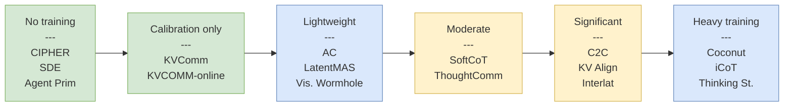
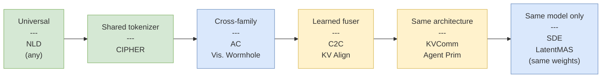

# Method Comparison

A unified comparison of all methods in this wiki across key dimensions. For theoretical/foundational papers, see the separate section below.

## Empirical Methods

### Reasoning Methods (Intra-Agent)

| Method | Channel | Training | Cross-Arch | Compute vs NL | Scale Tested | Key Result |
|--------|---------|----------|------------|---------------|-------------|------------|
| [[coconut-reasoning-latent-space\|Coconut]] | Hidden-state feedback | Yes (multi-stage curriculum) | No | 3–10× fewer tokens | GPT-2 | ProsQA 97.0% (+19.5pp vs CoT) |
| [[icot-internalize-cot\|iCoT]] | Implicit compression | Yes (progressive removal) | No | 11× inference speedup | GPT-2 Small, Mistral 7B | GSM8K 51% no visible reasoning |
| [[softcot-efficient-reasoning\|SoftCoT]] | Soft embeddings | Yes (projection only, frozen backbone) | Yes (any backbone) | 4× token compression | LLaMA-3.1-8B, Qwen2.5-7B | +2.31pp avg, preserves instruction tuning |
| [[thinking-states-latent-reasoning\|Thinking States]] | Compressed NL → states | Yes (teacher forcing) | No | 2.66× speedup | Qwen2.5-0.5B/1.5B | OOD generalization 97.71% |
| [[pause-tokens\|Pause Tokens]] | Learnable embeddings | Yes (pretraining + finetune) | No | Minimal (width only) | 130M, 1B | SQuAD +19.5 EM pts |

### Diagnostic & Inference-Time Augmentations

| Method | Target | Training | What It Tests | Scale | Key Result |
|---|---|---|---|---|---|
| [[latent-reasoning-supervision-analysis\|Cui et al. (Improved Coconut)]] | COCONUT, CODI, SIM-CoT, CoLaR | Modified curriculum (Coconut only) | Shortcut behavior + BFS hypothesis + supervision–exploration trade-off | GPT-2, LLaMA-3.2-1B | Improved Coconut +7pp on GSM8K-Aug; falsifies iterative BFS |
| [[inference-time-scaling-continuous-reasoning\|Wang et al. (PRM/ORM Reranking)]] | COCONUT | PRM (hard + soft) + ORM via MATH-Shepherd MC annotation | Whether discrete-space inference-time scaling transfers to continuous space | GPT-2 | Pass@32 = 44.43%; best reranker recovers only 19.8% of headroom; geometric homogeneity diagnosed (IsoScore$\star \approx 0.013$) |

### Communication Methods (Inter-Agent)

| Method | Channel | Training | Cross-Arch | Compute vs NL | Scale Tested | Key Result |
|--------|---------|----------|------------|---------------|-------------|------------|
| [[multiagent-debate-du-et-al\|Du et al. NLD]] | Natural language | No | Yes (universal) | 9× cost (baseline) | ChatGPT | GSM8K +8pp over single |
| [[cipher-multiagent-debate-embeddings\|CIPHER]] | Output embeddings | No | Shared tokenizer | ~Same | LLaMA-65B, Falcon-40B | +0.5–5.0% over NLD |
| [[state-delta-trajectory\|SDE]] | Hidden-state deltas | No | Same model only | Selective (1–3 layers) | Qwen2.5-7B/14B, LLaMA-8B | College Math +7.3pp over CIPHER |
| [[thought-communication-multiagent\|ThoughtComm]] | Disentangled latents | Yes (autoencoder + prefix) | Same embedding dim | Independent of model size | 0.6B–8B (5 models) | MATH 93.0% (vs 43.6% single) |
| [[activation-communication-harvard\|AC]] | Single-layer activation | Optional (3K samples) | Yes (cross-family) | <¼ compute | 1.5B–9B (3 families) | 48/57 MMLU > NLD |
| [[interlat-latent-space-agents\|Interlat]] | Full hidden-state seq. | Yes (curriculum + 3-loss) | Yes (with adapter) | $2600\times$ bandwidth, $46\times$ speedup | Qwen2.5-7B | ALFWorld 70.48%/65.42% |
| [[kvcomm-selective-kv-sharing\|KVComm]] | KV-cache (selected) | No (calibration only) | Same architecture | 30% layers $\approx$ full | 3B–8B (9 pairs) | HotpotQA F1 0.57 vs NLD 0.43 |
| [[cache-to-cache-semantic-communication\|C2C]] | KV-cache (fused) | Yes (per-pair fuser) | Yes (cross-family) | 2.5× speedup | 0.6B–14B (3 families) | +6.4–14.2% vs receiver alone |
| [[kv-cache-alignment-shared-space\|KV Alignment]] | KV-cache (shared space) | Yes (per-model adapter) | Yes (via shared space) | ~¼ model size adapter | Gemma-2 100M–400M | Self-improvement effect; zero-shot extensibility |
| [[kvcomm-online-cross-context\|KVCOMM-online]] | KV-cache (offset reuse) | No | Same model | 6.7× prefill speedup | Multi-agent systems | 7.8× speedup, <2.5% quality drop |

### Unified Methods (Reasoning + Communication)

| Method | Channel | Training | Cross-Arch | Compute vs NL | Scale Tested | Key Result |
|--------|---------|----------|------------|---------------|-------------|------------|
| [[latentmas-collaboration\|LatentMAS]] | Hidden-state + KV-cache | No (ridge regression) | Homogeneous only | $4\text{--}4.3\times$ faster | Qwen3-4B/8B/14B | GSM8K 95.2% (+11.5pp vs single) |
| [[vision-wormhole-heterogeneous\|Vision Wormhole]] | VLM visual pathway | Weak (<100 anchors) | Yes (heterogeneous) | 1.87–5.47× speedup | 1.6B–12B | +6.3pp vs TextMAS, +13.2pp code |
| [[agent-primitives-building-blocks\|Agent Primitives]] | KV-cache + RoPE | No (in-context learning) | Yes (cross-family) | 3–4× token reduction | 8B–70B | 75.3% vs 58.8% single (+16.5pp) |

## Cross-Cutting Dimensions

### Training Requirements Spectrum

### Cross-Architecture Compatibility Spectrum

Note on [[agent-primitives-building-blocks|Agent Primitives]]' placement: while the paper restricts to same-model configurations to satisfy the input-output alignment assumption (Equation 2), it is tested across model families (Qwen3 and LLaMA-based DeepSeek). The RoPE re-encoding mechanism is architecture-sensitive — Qwen tolerates misalignment gracefully (1-13pp drop) while LLaMA collapses catastrophically (30-60pp drop without re-encoding). This suggests that "same architecture" is necessary but the sensitivity varies dramatically by model family.

### Information Density vs Compatibility

| | Low compatibility | Medium | High |
|---|---|---|---|
| **High density** | LatentMAS ($471\times$) | Interlat ($2600\times$) | — |
| **Medium density** | SDE (deltas) | ThoughtComm (structured) | CIPHER (embeddings) |
| **Low density** | — | — | NLD (${\sim}15$ bits/pos) |

The frontier goal: move toward the **upper-right** — high density AND high compatibility. Current best candidates: [[vision-wormhole-heterogeneous|Vision Wormhole]] (architectural bypass) and [[kv-cache-alignment-shared-space|KV Alignment]] (learned shared space).

### Noise Robustness

A dimension often overlooked: how gracefully does each communication channel degrade under noisy or adversarial conditions?

| Method | Noise tolerance | Evidence |
|--------|----------------|----------|
| NLD | Low — 47% accuracy at 10 noise sentences | [[agent-primitives-building-blocks\|Agent Primitives Table 4]] |
| KV-cache | High — 93% accuracy at 10 noise sentences | [[agent-primitives-building-blocks\|Agent Primitives Table 4]] |
| Latent compressed (512B) | Moderate — $Q \propto e^{-T\varepsilon/C}$ degradation | [[latentcompress-open-call]] |

[[agent-primitives-building-blocks|Agent Primitives]]' noise injection experiment is the strongest empirical evidence that latent communication channels are inherently more robust than text. At 25 injected noise sentences, KV-cache retains 77% vs. 40% for NL — a 37pp gap. The likely explanation: attention-based integration naturally down-weights irrelevant KV entries, while text-based agents must parse and filter noise through their language understanding pipeline, which is more brittle.

### Topology and Composition

Methods differ not just in *what* they communicate but in *how* the communication is structured:

| Topology | Methods | Strengths | Weaknesses |
|----------|---------|-----------|------------|
| Sequential pipeline | LatentMAS, Agent Primitives (Review/Planning), Interlat | Simple, low overhead | Error propagation, no parallelism |
| Parallel + aggregation | Agent Primitives (Voting), ThoughtComm | Diversity, parallelizable | Aggregation is lossy |
| Debate (iterative) | Du et al., CIPHER, SDE | Self-correction, convergence | High token/compute cost |
| Hub-and-spoke | KV Alignment, Vision Wormhole | $O(N)$ scaling, extensible | Hub is bottleneck |
| Pairwise | C2C | Rich pair-specific adaptation | $O(N^2)$ fusers |
| Composable | Agent Primitives (Organizer) | Task-adaptive structure | Requires meta-agent (Organizer) |

[[agent-primitives-building-blocks|Agent Primitives]] is the only method that **dynamically selects** topology per query. The Organizer's ability to compose Review, Voting, and Planning primitives yields 3.5-7.0% additional improvement over the strongest single primitive, suggesting that no single topology is universally optimal.

## Theoretical & Foundational Papers

These papers provide theoretical grounding rather than new methods:

| Paper | Key Contribution | Relevance |
|-------|-----------------|-----------|
| [[superposition-coconut-theory\|Superposition Theory]] | Proof: continuous CoT = parallel BFS in $D$ steps vs $O(n^2)$ discrete | Why Coconut works |
| [[cot-expressivity-theory\|CoT Expressivity]] | Proof: CoT increases effective depth ($\text{TC}^0 \to \text{NC}^1$) | Why reasoning steps help at all |
| [[platonic-representation-hypothesis\|Platonic Rep.]] | Models converge to shared statistical structure | Why cross-family AC works |
| [[relative-representations-zero-shot\|Relative Rep.]] | Latent spaces related by isometries; zero-shot stitching | Foundation for cross-model alignment |
| [[linearity-relation-decoding\|Linearity of Relations]] | Linear relational embeddings; mid-layer enrichment | Why layer ~26 is optimal for AC |
| [[scaling-agent-systems\|Scaling Framework]] | Task-contingent coordination; 5 architectures × 180 configs | When multi-agent helps vs hurts |
| [[latentcompress-open-call\|LatentCompress]] | 512-byte compression baseline; bandwidth-accuracy curves | Practical compression targets |
| [[latent-reasoning-supervision-analysis\|Latent Reasoning Supervision Analysis]] (Cui et al.) | Empirical test of Coconut's BFS hypothesis on 4 methods (Coconut, CODI, SIM-CoT, CoLaR); identifies the supervision–exploration trade-off and Improved Coconut variant | Falsifies the iterative-BFS claim while confirming the capacity claim; bounds the latent reasoning design space |

## Method Selection Guide

When choosing a latent communication method, the primary decision factors are: (1) whether you control the model weights, (2) whether agents share the same architecture, and (3) the deployment constraints.

**Do you need cross-architecture support?**
- *Yes, heterogeneous VLMs*: **[[vision-wormhole-heterogeneous|Vision Wormhole]]** — the only method supporting truly heterogeneous backbones with minimal training. Best for small-to-mid models (1.6B-4B); bandwidth bottleneck at 8B+.
- *Yes, heterogeneous text-only*: **[[activation-communication-harvard|AC]]** for zero-shot (no training, single-layer), or **[[cache-to-cache-semantic-communication|C2C]]** / **[[kv-cache-alignment-shared-space|KV Alignment]]** for richer transfer (requires trained fusers/adapters).
- *No, same model family*: Continue below.

**Can you train adapters or modify the pipeline?**
- *No training allowed*: **[[agent-primitives-building-blocks|Agent Primitives]]** (composable, task-adaptive, tested up to 70B), **[[kvcomm-selective-kv-sharing|KVComm]]** (selective layer sharing, calibration only), or **[[state-delta-trajectory|SDE]]** (delta-based, no calibration needed).
- *Minimal training OK*: **[[latentmas-collaboration|LatentMAS]]** (ridge regression, training-free but architecture-sensitive — avoid LLaMA backbones).
- *Training budget available*: **[[thought-communication-multiagent|ThoughtComm]]** (structured, disentangled) or **[[interlat-latent-space-agents|Interlat]]** (maximum bandwidth, $2600\times$).

**What is your primary optimization target?**
- *Accuracy*: Agent Primitives (+16.5pp avg at 8B), ThoughtComm (93.0% MATH), Interlat (ALFWorld 70.48%).
- *Latency/throughput*: KVCOMM-online (7.8x prefill speedup), LatentMAS (4-4.3x end-to-end), Vision Wormhole (up to 16.5x on mid-sized models).
- *Robustness to noise*: KV-cache methods (Agent Primitives demonstrates 93% vs 47% NL at 10 noise sentences).

**Important caveats**:
- LatentMAS catastrophically fails on LLaMA-based models ($-10.1$pp average on DeepSeek-R1-Distill-Llama-70B). Use Agent Primitives instead for LLaMA backbones. — [[agent-primitives-building-blocks]]
- Vision Wormhole accuracy degrades at 8B+ scale (up to $-33$pp on AIME) due to fixed visual-token bandwidth. Scaling bandwidth via multi-image injection is untested. — [[vision-wormhole-heterogeneous]]
- The scaling framework predicts MAS hurts on sequential planning tasks ($-70\%$) regardless of communication medium. Latent methods address lossy communication but not task-architecture mismatch. — [[scaling-agent-systems]]

## Key Takeaways

1. **No single method dominates** — the optimal choice depends on whether you need cross-architecture support, training-free deployment, or maximum throughput.
2. **Training-free methods are competitive** — [[latentmas-collaboration|LatentMAS]], [[agent-primitives-building-blocks|Agent Primitives]], [[kvcomm-selective-kv-sharing|KVComm]], and [[state-delta-trajectory|SDE]] achieve strong results without model modification. Agent Primitives' composed approach is particularly strong: +16.5pp at 8B scale with fewer tokens than a single agent, and stable across both Qwen and LLaMA families.
3. **The compatibility-density frontier is advancing** — [[vision-wormhole-heterogeneous|Vision Wormhole]] and [[kv-cache-alignment-shared-space|KV Alignment]] show paths to high density with cross-architecture support. Vision Wormhole's $O(N)$ hub-and-spoke alignment via ridge regression is especially promising for heterogeneous deployments.
4. **Compute savings are substantial** — most latent methods offer 2-7x speedup over NLD while improving accuracy. At the extreme, KVCOMM-online achieves 7.8x prefill speedup and Agent Primitives uses fewer tokens than a single agent while running 4 agents.
5. **Scale remains the biggest unknown** — most results are at 1-14B; frontier-scale validation (70B+) is sparse. Agent Primitives is the only method tested at 70B, where gains shrink to +6.3pp (from +16.5pp at 8B), suggesting diminishing returns at scale.
6. **Architecture sensitivity is a hidden failure mode** — [[latentmas-collaboration|LatentMAS]] and [[agent-primitives-building-blocks|Agent Primitives]] both reveal that LLaMA-based models are dramatically more sensitive to positional encoding and latent injection than Qwen-based models. This is not a property of the communication method but of the backbone, and it is not predictable from model size alone.
7. **Composability matters** — Agent Primitives' key insight is that no single primitive (Review, Voting, Planning) dominates across tasks. Composing primitives via a meta-agent yields 3.5-7.0% additional improvement. Future methods should consider task-adaptive composition rather than fixed topologies.
