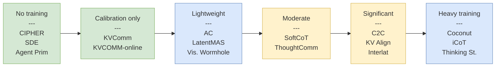
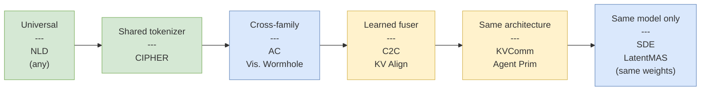

### Training Requirements Spectrum

### Cross-Architecture Compatibility Spectrum

Note on [[agent-primitives-building-blocks|Agent Primitives]]' placement: while the paper restricts to same-model configurations to satisfy the input-output alignment assumption (Equation 2), it is tested across model families (Qwen3 and LLaMA-based DeepSeek). The RoPE re-encoding mechanism is architecture-sensitive — Qwen tolerates misalignment gracefully (1-13pp drop) while LLaMA collapses catastrophically (30-60pp drop without re-encoding). This suggests that "same architecture" is necessary but the sensitivity varies dramatically by model family.

### Information Density vs Compatibility

| | Low compatibility | Medium | High |
|---|---|---|---|
| **High density** | LatentMAS ($471\times$) | Interlat ($2600\times$) | — |
| **Medium density** | SDE (deltas) | ThoughtComm (structured) | CIPHER (embeddings) |
| **Low density** | — | — | NLD (${\sim}15$ bits/pos) |

The frontier goal: move toward the **upper-right** — high density AND high compatibility. Current best candidates: [[vision-wormhole-heterogeneous|Vision Wormhole]] (architectural bypass) and [[kv-cache-alignment-shared-space|KV Alignment]] (learned shared space).

### Noise Robustness

A dimension often overlooked: how gracefully does each communication channel degrade under noisy or adversarial conditions?

| Method | Noise tolerance | Evidence |
|--------|----------------|----------|
| NLD | Low — 47% accuracy at 10 noise sentences | [[agent-primitives-building-blocks\|Agent Primitives Table 4]] |
| KV-cache | High — 93% accuracy at 10 noise sentences | [[agent-primitives-building-blocks\|Agent Primitives Table 4]] |
| Latent compressed (512B) | Moderate — $Q \propto e^{-T\varepsilon/C}$ degradation | [[latentcompress-open-call]] |

[[agent-primitives-building-blocks|Agent Primitives]]' noise injection experiment is the strongest empirical evidence that latent communication channels are inherently more robust than text. At 25 injected noise sentences, KV-cache retains 77% vs. 40% for NL — a 37pp gap. The likely explanation: attention-based integration naturally down-weights irrelevant KV entries, while text-based agents must parse and filter noise through their language understanding pipeline, which is more brittle.

### Topology and Composition

Methods differ not just in *what* they communicate but in *how* the communication is structured:

| Topology | Methods | Strengths | Weaknesses |
|----------|---------|-----------|------------|
| Sequential pipeline | LatentMAS, Agent Primitives (Review/Planning), Interlat | Simple, low overhead | Error propagation, no parallelism |
| Parallel + aggregation | Agent Primitives (Voting), ThoughtComm | Diversity, parallelizable | Aggregation is lossy |
| Debate (iterative) | Du et al., CIPHER, SDE | Self-correction, convergence | High token/compute cost |
| Hub-and-spoke | KV Alignment, Vision Wormhole | $O(N)$ scaling, extensible | Hub is bottleneck |
| Pairwise | C2C | Rich pair-specific adaptation | $O(N^2)$ fusers |
| Composable | Agent Primitives (Organizer) | Task-adaptive structure | Requires meta-agent (Organizer) |

[[agent-primitives-building-blocks|Agent Primitives]] is the only method that **dynamically selects** topology per query. The Organizer's ability to compose Review, Voting, and Planning primitives yields 3.5-7.0% additional improvement over the strongest single primitive, suggesting that no single topology is universally optimal.
