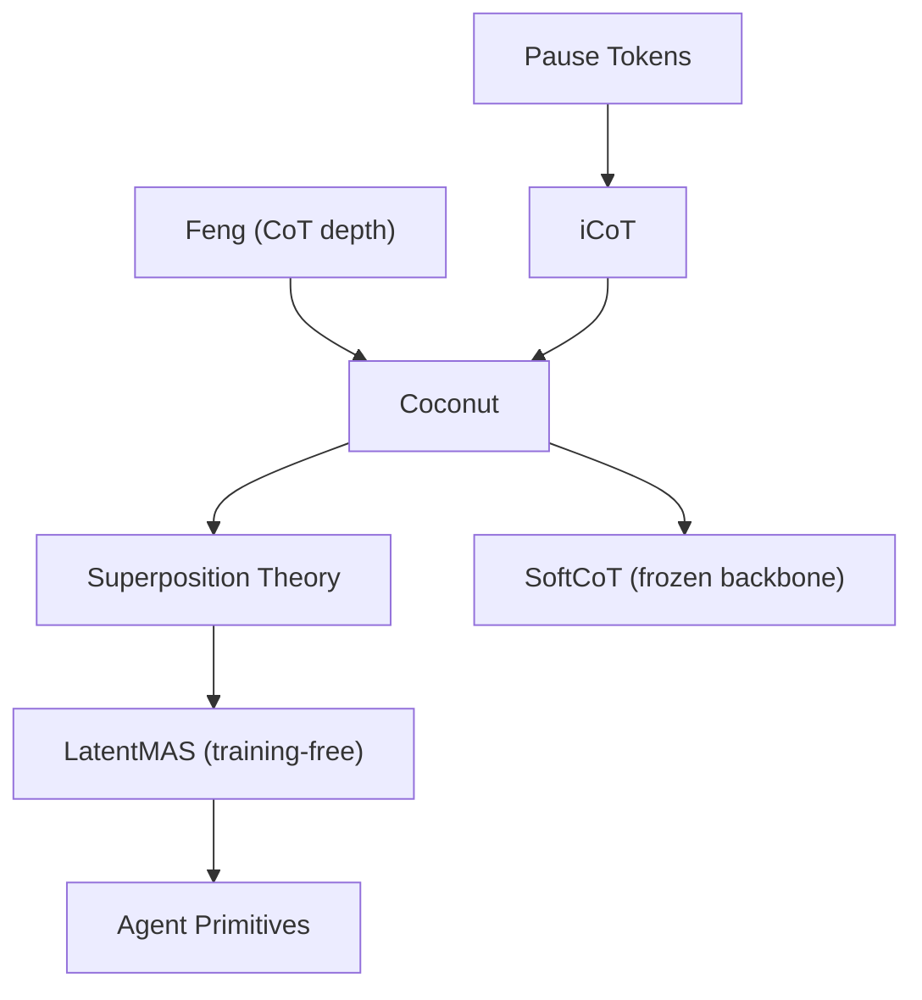
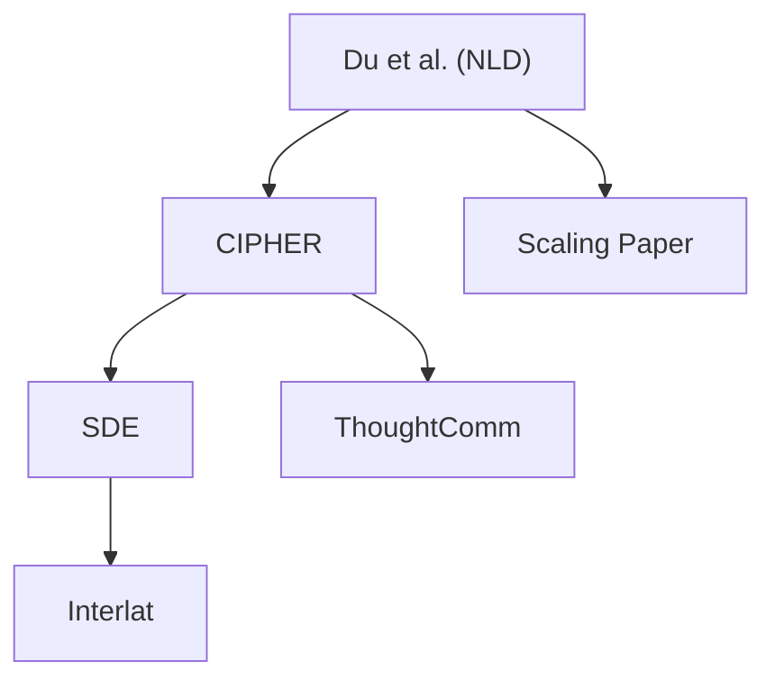
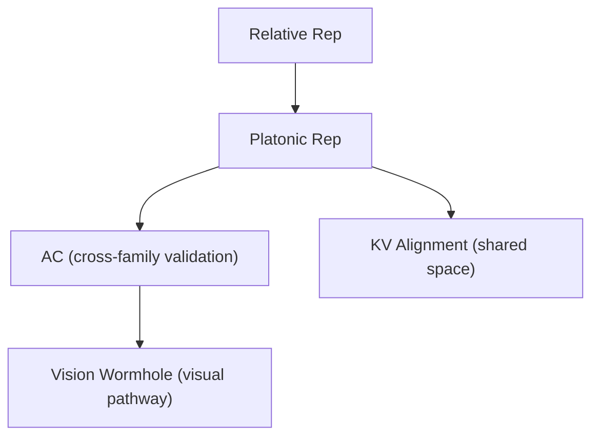
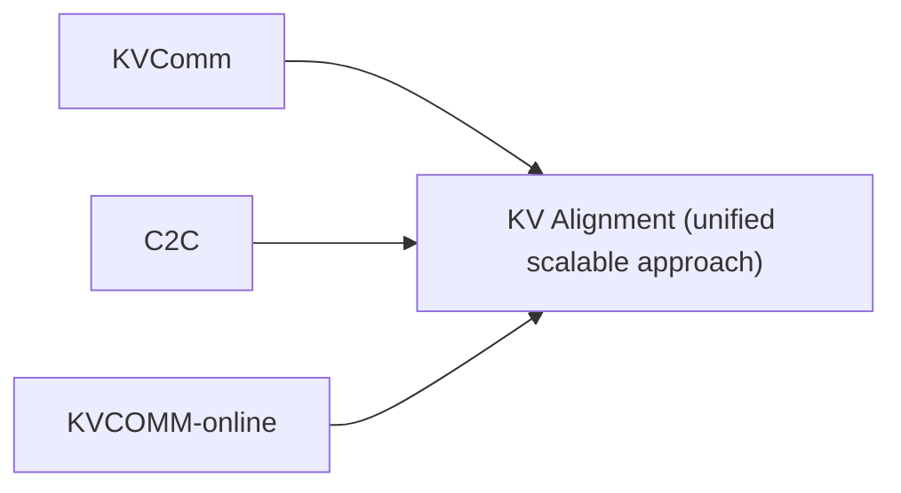

# Paper Timeline & Field Evolution

Chronological view of all 26 papers tracked in this wiki, showing how the field evolved from theoretical foundations through to unified frameworks.

## Timeline

### 2022

| Date | Paper | Thread | Key Advance |
|------|-------|--------|-------------|
| Sep 2022 | [[relative-representations-zero-shot\|Relative Representations]] (Moschella et al.) | Theory | Latent spaces related by isometries; zero-shot stitching possible |

### 2023 — Theoretical Foundations

| Date | Paper | Thread | Key Advance |
|------|-------|--------|-------------|
| May 2023 | [[multiagent-debate-du-et-al\|Multiagent Debate]] (Du et al.) | Communication | **Foundational**: first proof LLM debate improves reasoning. Establishes NLD protocol. |
| May 2023 | [[cot-expressivity-theory\|CoT Expressivity]] (Feng et al.) | Theory | Proof that CoT increases effective transformer depth ($\text{TC}^0 \to \text{NC}^1$) |
| Aug 2023 | [[linearity-relation-decoding\|Linearity of Relations]] (Hernandez et al.) | Theory | Mid-layer enrichment; explains why layer ~26 is special |
| Oct 2023 | [[pause-tokens\|Pause Tokens]] (Goyal et al.) | Reasoning | Existence proof: transformers use non-linguistic computation |
| Oct 2023 | [[cipher-multiagent-debate-embeddings\|CIPHER]] (Pham et al.) | Communication | **First latent communication**: embedding averages outperform NLD by 0.5–5% |

2023 establishes the theoretical and empirical foundations. Du et al. creates the debate paradigm everyone builds on. [[cipher-multiagent-debate-embeddings|CIPHER]] proves continuous communication works. Feng et al. explains *why* extra reasoning steps help.

### 2024 — The Latent Reasoning Breakthrough

| Date | Paper | Thread | Key Advance |
|------|-------|--------|-------------|
| May 2024 | [[platonic-representation-hypothesis\|Platonic Representation Hypothesis]] (Huh et al.) | Theory | Models converge to shared statistical structure; explains cross-family compatibility |
| May 2024 | [[icot-internalize-cot\|iCoT]] (Deng et al.) | Reasoning | Progressive CoT removal curriculum; direct precursor to Coconut |
| Dec 2024 | [[coconut-reasoning-latent-space\|Coconut]] (Hao et al.) | Reasoning | **Breakthrough**: hidden-state feedback, emergent BFS via superposition, 97% ProsQA |

2024 is the year of [[coconut-reasoning-latent-space|Coconut]]. The [[platonic-representation-hypothesis|Platonic Representation Hypothesis]] provides theoretical grounding for why cross-model communication should work. [[icot-internalize-cot|iCoT]] develops the curriculum approach that Coconut perfects. Then Coconut itself demonstrates that continuous reasoning enables qualitatively new computation (superposition).

### 2025 — The Cambrian Explosion

| Date | Paper | Thread | Key Advance |
|------|-------|--------|-------------|
| Jan 2025 | [[activation-communication-harvard\|Activation Communication]] (Ramesh & Li) | Communication | Single-layer activation transfer, <¼ compute, **cross-family works** |
| Feb 2025 | [[softcot-efficient-reasoning\|SoftCoT]] (Xu et al.) | Reasoning | Frozen backbone + external assistant. Discovers [[catastrophic-forgetting|catastrophic forgetting]] barrier. |
| May 2025 | [[superposition-coconut-theory\|Superposition Theory]] (Zhu et al.) | Theory | Rigorous proof: continuous CoT = parallel BFS, $D$ steps vs $O(n^2)$ |
| Jun 2025 | [[state-delta-trajectory\|SDE]] (Tang et al.) | Communication | Hidden-state *deltas* outperform raw states. Reasoning dynamics > reasoning states. |
| Oct 2025 | [[kvcomm-selective-kv-sharing\|KVComm]] (Shi et al.) | Communication | 30% of KV layers $\approx$ full performance. Training-free. |
| Oct 2025 | [[cache-to-cache-semantic-communication\|C2C]] (Fu et al.) | Communication | Learned cross-architecture KV fusion with gating |
| Oct 2025 | [[kvcomm-online-cross-context\|KVCOMM-online]] (Ye et al.) | Communication | 7.8× prefill speedup via offset reuse |
| Oct 2025 | [[thought-communication-multiagent\|ThoughtComm]] (Zheng et al.) | Communication | Disentangled thoughts with identifiability guarantees |
| Nov 2025 | [[interlat-latent-space-agents\|Interlat]] (Du et al.) | Communication | Full hidden-state sequences, 2600× bandwidth, cross-family |
| Nov 2025 | [[latentmas-collaboration\|LatentMAS]] (Zou et al.) | Unified | **First unified framework**: latent reasoning + KV-cache transfer, training-free |
| Dec 2025 | [[scaling-agent-systems\|Scaling Agent Systems]] (Kim et al.) | Meta | Task-contingent coordination framework; 180 configurations |

2025 is the explosion year. Ten papers in a single year, covering every communication depth level. Key dynamics:

- **January**: [[activation-communication-harvard|AC]] proves cross-family communication works, validating the Platonic hypothesis
- **February**: [[softcot-efficient-reasoning|SoftCoT]] discovers the [[catastrophic-forgetting|catastrophic forgetting]] barrier — the field's central unsolved problem
- **May**: [[superposition-coconut-theory|Superposition theory]] provides mathematical backing for [[coconut-reasoning-latent-space|Coconut]]'s most striking finding
- **June**: [[state-delta-trajectory|SDE]] introduces deltas, showing *dynamics* matter more than *states*
- **October**: Four papers simultaneously attack [[kv-cache-communication|KV-cache communication]] from different angles (selection, fusion, speed, structure)
- **November**: [[latentmas-collaboration|LatentMAS]] unifies reasoning + communication for the first time
- **December**: The [[scaling-agent-systems|Scaling paper]] provides quantitative framework, showing MAS benefits are task-contingent

### 2026 — Unification & Heterogeneity

| Date | Paper | Thread | Key Advance |
|------|-------|--------|-------------|
| Jan 2026 | [[kv-cache-alignment-shared-space\|KV Cache Alignment]] (Dery et al.) | Communication | Shared interlingua space, O(N) scaling, self-improvement effect |
| Feb 2026 | [[agent-primitives-building-blocks\|Agent Primitives]] (Jin et al.) | Unified | Composable Review/Voting/Planning operators, beats 10 MAS baselines |
| Feb 2026 | [[thinking-states-latent-reasoning\|Thinking States]] (Amos et al.) | Reasoning | Supervised latent reasoning, teacher forcing, identifies state ambiguity |
| Feb 2026 | [[vision-wormhole-heterogeneous\|Vision Wormhole]] (Liu et al.) | Unified | VLM visual pathway as universal heterogeneous channel |
| Feb 2026 | [[latent-reasoning-supervision-analysis\|Latent Reasoning Supervision Analysis]] (Cui et al.) | Reasoning / Meta | **First empirical reckoning**: tests Coconut's BFS hypothesis directly. Capacity confirmed (Pass@100 advantage 20+ pts), iterative BFS falsified (diversity *decreases* with depth). Identifies the supervision–exploration trade-off. |
| 2026 | [[latentcompress-open-call\|LatentCompress]] | Meta | 512-byte compression baseline, bandwidth-accuracy curves |

2026 focuses on making latent methods **practical**: solving cross-architecture compatibility ([[kv-cache-alignment-shared-space|KV Alignment]], [[vision-wormhole-heterogeneous|Vision Wormhole]]), providing composable abstractions ([[agent-primitives-building-blocks|Agent Primitives]]), pushing toward production viability ([[thinking-states-latent-reasoning|Thinking States]]), and **diagnostic critique** ([[latent-reasoning-supervision-analysis|Cui et al.]]) — the first systematic empirical test of whether the field's central hypothesis (BFS via superposition) actually holds. Cui et al. mark a transition from a pure proof-of-concept phase into a more mature phase where claims are rigorously tested and the design space is bounded by *trade-offs*, not just unsolved engineering problems.

## Citation Chains

Key intellectual lineages showing how ideas flow between papers:

## Acceleration Pattern

| Period | Papers | Key Theme |
|--------|--------|-----------|
| Sep 2022 – Oct 2023 | 5 | Theoretical foundations + first experiments |
| May 2024 – Dec 2024 | 3 | [[coconut-reasoning-latent-space\|Coconut]] breakthrough year |
| Jan 2025 – Dec 2025 | 11 | Cambrian explosion across all threads |
| Jan 2026 – Apr 2026 | 5 + [[latentcompress-open-call\|LatentCompress]] | Unification and practical viability |

The field is accelerating. The October 2025 cluster (4 KV-cache papers simultaneously) suggests the communication thread has hit critical mass. The 2026 papers focus on making things work together — a sign the field is maturing from proof-of-concept to system design.
