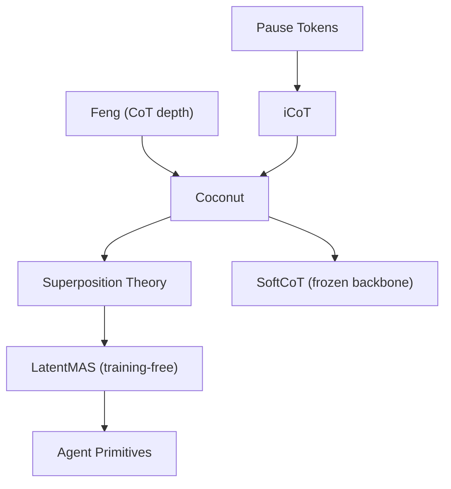
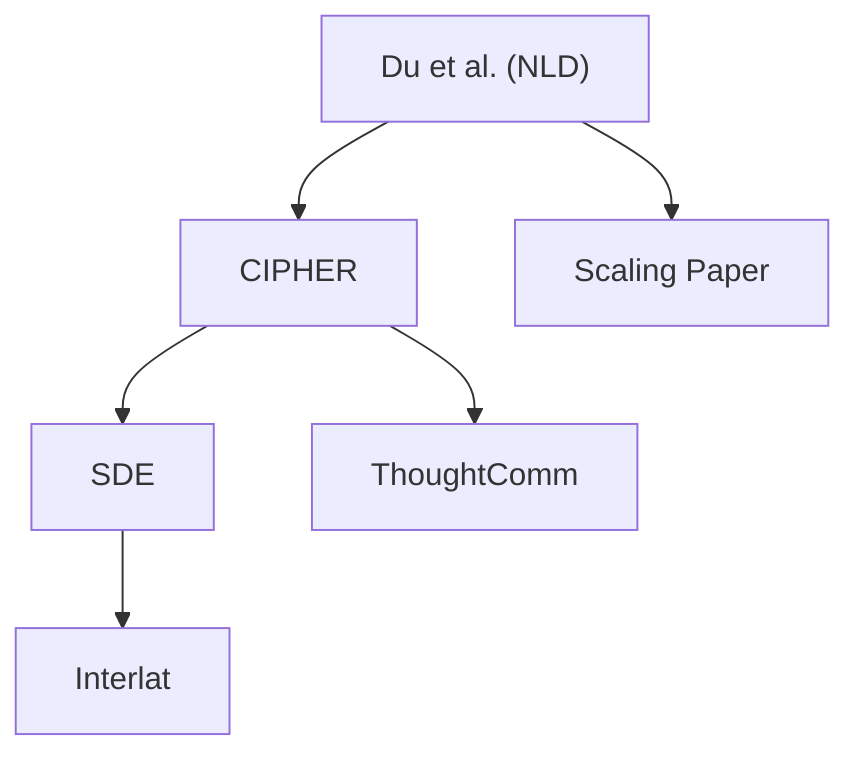
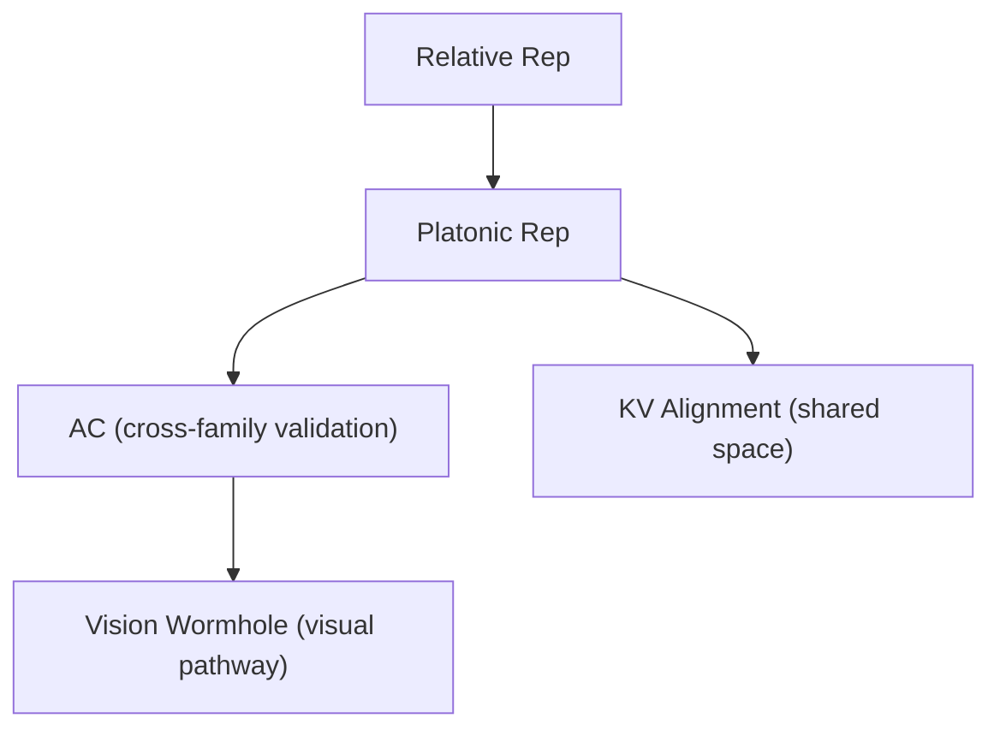
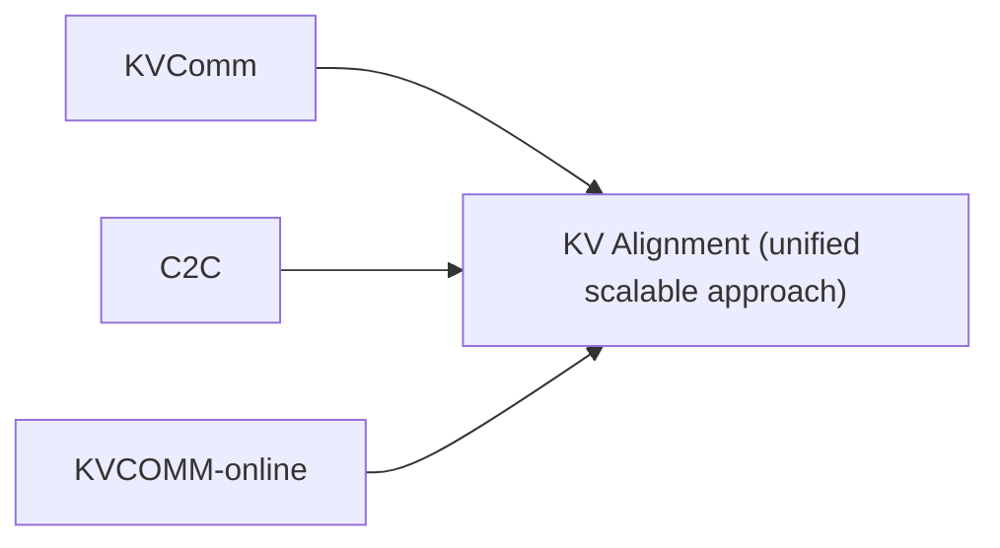

Key intellectual lineages showing how ideas flow between papers:

```mermaid
graph TD
    Feng["Feng (CoT depth)"] --> Coconut
    PauseTokens["Pause Tokens"] --> iCoT
    iCoT --> Coconut
    Coconut --> SuperpositionTheory["Superposition Theory"]
    Coconut --> SoftCoT["SoftCoT (frozen backbone)"]
    SuperpositionTheory --> LatentMAS["LatentMAS (training-free)"]
    LatentMAS --> AgentPrimitives["Agent Primitives"]
```

```mermaid
graph TD
    Du["Du et al. (NLD)"] --> CIPHER
    CIPHER --> SDE
    CIPHER --> ThoughtComm
    SDE --> Interlat
    Du --> ScalingPaper["Scaling Paper"]
```

```mermaid
graph TD
    RelativeRep["Relative Rep"] --> PlatonicRep["Platonic Rep"]
    PlatonicRep --> AC["AC (cross-family validation)"]
    PlatonicRep --> KVAlignment["KV Alignment (shared space)"]
    AC --> VisionWormhole["Vision Wormhole (visual pathway)"]
```

```mermaid
graph LR
    KVComm --> KVAlignment["KV Alignment (unified scalable approach)"]
    C2C --> KVAlignment
    KVCOMMon["KVCOMM-online"] --> KVAlignment
```
