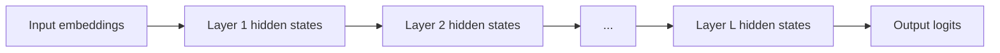
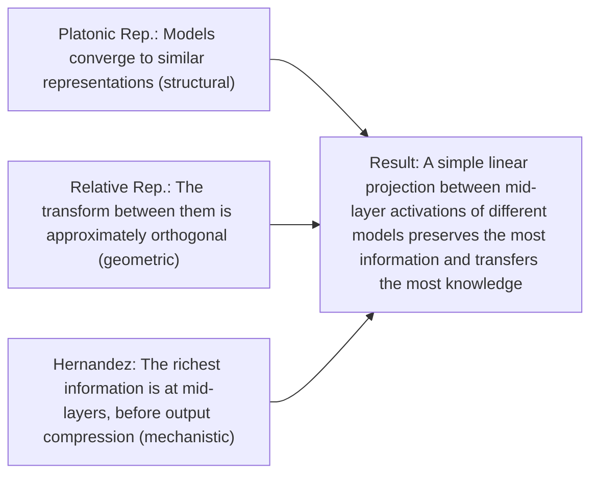

# Activation Communication

Approaches where LLM agents share **hidden-state activations** or intermediate representations directly, rather than text or output embeddings. Five papers in this collection address activation-level communication, each with a distinct approach:

| Paper | What's shared | How | Cross-model? |
|-------|--------------|-----|-------------|
| [[activation-communication-harvard\|AC]] | Single last-token activation at one layer | Replace/sum/mean | Yes (cross-family) |
| [[interlat-latent-space-agents\|Interlat]] | Full sequence of last-layer hidden states | Learned communication adapter | Yes (Qwen→LLaMA) |
| [[latentmas-collaboration\|LatentMAS]] | Full layer-wise KV caches (including latent thoughts) | Direct concatenation with alignment matrix | Same model only |
| [[state-delta-trajectory\|SDE]] | Inter-token hidden state **deltas** | Additive injection at selected layers | Same model only |
| [[agent-primitives-building-blocks\|Agent Primitives]] | KV caches structured via Review/Voting/Planning primitives | Concatenation with RoPE re-encoding | Same model only |

## What Are Activations?

In a transformer, "activations" or "hidden states" refer to the intermediate representations computed at each layer:

Each layer transforms the hidden state through:
1. **Multi-head self-attention**: The model attends to all positions and produces attention-weighted representations (using the [[kv-cache-communication|KV-cache]]).
2. **Feed-forward network (FFN)**: A position-wise transformation that introduces non-linearity.
3. **Residual connections + layer norm**: Stabilize training and preserve information flow.

The hidden state at any given layer is a **$d$-dimensional vector per token position** (e.g., $d = 8192$ for a 70B model). It encodes a rich, contextual representation of the token in the context of everything the model has processed.

## Why Share Activations?

### The Enriched Entity Representation Argument

[[activation-communication-harvard|AC (Ramesh & Li, 2025)]] provides the theoretical foundation: by around the halfway point of an LLM's computation (~layer 26 of 32), the model has developed **enriched entity representations** ([[raw/pdf/arxiv-2501.14082.pdf|AC §3.2, Figure 2]]) — entities in the prompt are populated with additional facts from the model's weights. But by the final layers, these rich representations are **compressed** into next-token predictions, discarding information not needed for that narrow objective.

This creates a layer-depth hierarchy for communication value:

| Layer range | Content | Communication value |
|-------------|---------|-------------------|
| Early (1-12) | Embeddings being contextualized | Low — not yet informative |
| **Mid-late (20-26)** | **Enriched entity representations** | **Highest — broadest contextual knowledge** |
| Final (27-32) | Next-token prediction optimized | Declining — useful info discarded |

[[activation-communication-harvard|AC]] validates this empirically: $k = j = 26$ is optimal across all benchmarks (scanned via 2D contour over all $(k,j) \in \{1,\ldots,30\}^2$).

### Information Hierarchy

Activations are a **strict superset** of what other communication methods transmit:

| Method | What's communicated | Information |
|--------|-------------------|-------------|
| Natural language | Sampled tokens | Model's top-1 prediction only |
| [[cipher-multiagent-debate-embeddings\|CIPHER]] | Probability-weighted embeddings | Prediction + belief distribution |
| [[kv-cache-communication\|KV-cache]] | Key-value pairs | Attention-relevant representations per layer |
| **Activations** | **Hidden state vectors** | **Full computational state: predictions + beliefs + enriched entities + contextual knowledge** |

## Five Approaches to Activation Communication

### 1. Single-Vector Replacement (AC)

[[activation-communication-harvard|AC]] replaces B's last-token activation at one layer with A's activation from the same depth. Despite its simplicity — one vector, one layer — it outperforms natural language debate on **48/57 MMLU datasets** and **6/7 reasoning benchmarks** with **< ¼ the compute**.

**Key findings**:
- **Replace** function beats sum and mean (B retains context at other positions)
- Works **cross-family** (LLaMA ↔ Qwen ↔ Gemma) without learned projections ([[raw/pdf/arxiv-2501.14082.pdf|AC Table 2]]), supporting the Platonic Representation Hypothesis
- Exception: **GSM8K** — debate beats AC because multi-step math benefits from iterative refinement, not single-shot knowledge transfer
- One-shot sufficiency: one activation graft communicates "all of A's knowledge/beliefs about the prompt"

### 2. Full Hidden-State Sequences (Interlat)

[[interlat-latent-space-agents|Interlat]] transmits the **full temporal sequence** of last-layer hidden states from all generation steps — not a single vector but a matrix $H \in \R^{L \times d}$. A learned **communication adapter** (multi-head attention + layer norm + projection) bridges representation spaces.

**Key findings**:
- **2,600× bandwidth** increase per position vs. discrete tokens (~40,000 bits vs ~15 bits) ([[raw/pdf/arxiv-2511.09149.pdf|Interlat §4.1]])
- Best result is **cross-family** (Qwen→LLaMA: 70.95%/71.39% on ALFWorld)
- Beats CoT on **Level-5 MATH** (hardest) — 15.80% vs 15.05% — latent communication preserves "superposition of parallel hypotheses"
- Compression to **8 latent steps** with only 4% accuracy drop and **46× speedup**
- **Curriculum learning is critical** — without it, near-zero success (training instability)

### 3. Training-Free KV-Cache Transfer (LatentMAS)

[[latentmas-collaboration|LatentMAS]] goes beyond sharing input-processing KV-caches: it shares KV caches that include **generated latent thoughts** (hidden states fed back as input embeddings, [[coconut-reasoning-latent-space|Coconut]]-style). The full layer-wise KV cache constitutes a "latent working memory" transferred between agents.

**Key findings**:
- **Training-free** — only a $d \times d$ alignment matrix $M$ computed via ridge regression
- **4-4.3× faster** than TextMAS with **70.8-83.7% fewer tokens**
- Up to **+14.6% accuracy** over single-agent baselines
- Theoretical: latent thoughts can be **$d / \log|V|$ times** more efficient than text — $471.4\times$ for Qwen3-14B
- Unifies latent reasoning ([[coconut-reasoning-latent-space|Coconut]]) + latent communication (KV-cache transfer) in one framework

### 4. State Deltas as Steering Vectors (SDE)

[[state-delta-trajectory|SDE]] introduces a refined approach for **same-model** agents: instead of transmitting raw hidden states (which include context-specific noise from the sender's system prompt), transmit the **inter-token differences** (deltas):

> $s^l_i = h^l_{A,i} - h^l_{A,i-1}$

Each delta acts as a **steering vector** injected additively at 1-3 selected layers, nudging the receiver's representations.

**Key findings**:
- **Deltas outperform raw states** — raw states sometimes degrade below NL baseline; deltas consistently improve. Strongest evidence that deltas, not raw states, are the right abstraction for same-model communication.
- Up to **+17.3%** over NL baselines on agent workflow tasks
- Context-agnostic: deltas capture reasoning dynamics only, stripped of sender's context-specific baseline
- Applied to only 1-3 middle-to-late layers (all layers degrades performance)

### 5. Structured KV-Cache Primitives (Agent Primitives)

[[agent-primitives-building-blocks|Agent Primitives]] uses KV-cache concatenation not just for transmission but to implement **computation structures** — Review (iterative critique), Voting (consensus), Planning (decomposition) — all in latent space.

**Key findings**:
- **+12-16.5% average accuracy** over single-agent across 8 benchmarks
- **RoPE positional re-encoding is critical** — without it, LLaMA-based models catastrophically collapse (AIME25: 56.7% → 26.7%)
- Stable across all backbones (unlike LatentMAS which fails on LLaMA)
- KV-cache communication is **noise-resilient**: retains 93% accuracy at 10 noise sentences vs 47% for NL

## The Information Concentration Problem

[[kvcomm-selective-kv-sharing|KVComm]] showed that the **last token's hidden state** concentrates most output-relevant information in later layers. This creates a dilemma for hidden-state communication:
- **Replacing** the last token's state ([[activation-communication-harvard|AC]] approach): Works because B retains context at other positions
- **Averaging/summing** states: Dilutes or distorts both signals
- **Full sequence transfer** ([[interlat-latent-space-agents|Interlat]]): Avoids the dilemma entirely — transmits all positions
- **Delta transfer** ([[state-delta-trajectory|SDE]]): Also avoids it — deltas don't replace any state, they add to all relevant positions
- **KV-cache approach** ([[kvcomm-selective-kv-sharing|KVComm]], [[latentmas-collaboration|LatentMAS]]): KV pairs integrate through attention (non-destructive)

The field has converged on the understanding that **the last-token hidden state is problematic as a sole communication vector**, but multiple approaches exist to work around this.

## Cross-Model Compatibility

A spectrum of compatibility requirements:

| Approach | What's needed |
|----------|--------------|
| [[activation-communication-harvard|AC]] (no W) | Roughly aligned activation spaces — works across LLaMA/Qwen/Gemma |
| [[activation-communication-harvard|AC]] (with W) | Learned linear mapping (3072 C4 sentences, one-time) |
| [[interlat-latent-space-agents|Interlat]] | Trained communication adapter (MHA + projection) |
| [[latentmas-collaboration|LatentMAS]] | Same model architecture (training-free alignment) |
| [[state-delta-trajectory|SDE]] | Same model weights (deltas only meaningful in shared space) |
| [[agent-primitives-building-blocks|Agent Primitives]] | Same model weights (KV-cache concatenation assumes shared layers) |

Three foundational papers explain **why** cross-model activation communication works at all:

### [[platonic-representation-hypothesis|The Platonic Representation Hypothesis (Huh et al., ICML 2024)]]
Models across architectures, training objectives, and even modalities are **converging toward a shared statistical model of reality**. Higher-performing models are more aligned with each other. Cross-modal alignment (language ↔ vision) correlates linearly with model quality. If true, this means independently trained models arrive at approximately the same internal representations — and cross-model communication should get **easier** with scale, not harder.

### [[relative-representations-zero-shot|Relative Representations (Moschella et al., ICLR 2023)]]
Well-trained models produce latent spaces related by approximately **angle-preserving (isometric) transformations**. By representing data as vectors of cosine similarities to shared anchor samples, representations become invariant to rotations/reflections — enabling **zero-shot model stitching** with no learned mapping. This is the practical mechanism: cross-model activation sharing works because the geometry is preserved, and linear projections are the exact correct tool for the approximately orthogonal transforms between latent spaces. Two orders of magnitude improvement in stitching quality vs. absolute representations.

### [[linearity-relation-decoding|Enriched Entity Representations (Hernandez et al., ICLR 2024)]]
Transformers implement **[[linearity-relation-decoding|linear relational]] embeddings** at intermediate layers: the mapping from subject to object is a simple affine transform for ~48% of relations. Faithfulness **peaks at mid-layers then drops in later layers** — the model enriches representations with relational knowledge at layers ~20-26, then compresses for next-token prediction. This is the mechanistic explanation for why [[activation-communication-harvard|AC]]'s layer-26 is optimal and why [[kvcomm-selective-kv-sharing|KVComm]] finds intermediate layers most transferable: that's where the richest information lives, before the output layers discard it.

### Combined: Why Cross-Model Communication Works

## Structured vs. Unstructured Activation Sharing

[[thought-communication-multiagent|ThoughtComm]] introduces a crucial distinction: raw activation sharing transmits **everything** (maximum information but no organization), while **structured** approaches first disentangle activations into identifiable latent factors, then selectively route relevant factors to each agent. See [[thought-structure]] for the full treatment.

## Connection to Latent-Space Reasoning

Activation communication is closely related to [[latent-space-reasoning]]. [[coconut-reasoning-latent-space|Coconut]] and [[latentmas-collaboration|LatentMAS]] demonstrate that hidden states fed back as input embeddings can encode **superpositions of reasoning paths**. When these hidden states are shared between agents (as in LatentMAS), it enables **collaborative reasoning in latent space** — agents think together without ever "speaking."

Both are instances of the [[continuous-vs-discrete-representation|continuous vs. discrete trade-off]] applied in complementary contexts (intra-agent vs. inter-agent).

## Open Questions

- **Optimal extraction layer**: [[activation-communication-harvard|AC]] finds layer 26/32 optimal for LLaMA. Is this consistent across architectures? Does it scale with model depth?
- **Iterative activation communication**: [[activation-communication-harvard|AC]] is one-shot; could iterative activation grafting (multiple rounds) combine the benefits of AC's information density with debate's iterative refinement?
- **Compression**: [[interlat-latent-space-agents|Interlat]] compresses to 8 latent steps with 4% drop. What's the theoretical minimum bandwidth for lossless activation communication?
- **Heterogeneous architectures**: [[vision-wormhole-heterogeneous|Vision Wormhole]] uses VLM visual pathways to bypass the off-manifold problem. Are there other modality-specific pathways that could serve as universal communication ports?
