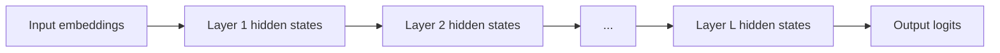

In a transformer, "activations" or "hidden states" refer to the intermediate representations computed at each layer:

Each layer transforms the hidden state through:
1. **Multi-head self-attention**: The model attends to all positions and produces attention-weighted representations (using the [[kv-cache-communication|KV-cache]]).
2. **Feed-forward network (FFN)**: A position-wise transformation that introduces non-linearity.
3. **Residual connections + layer norm**: Stabilize training and preserve information flow.

The hidden state at any given layer is a **$d$-dimensional vector per token position** (e.g., $d = 8192$ for a 70B model). It encodes a rich, contextual representation of the token in the context of everything the model has processed.
