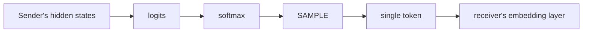
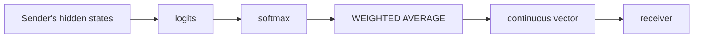

# Embedding-Space Communication

The idea that LLM agents can communicate by passing **continuous embedding vectors** rather than discrete natural language tokens. This bypasses the information bottleneck of token sampling, where a rich probability distribution over the entire vocabulary is collapsed into a single token choice.

## Why It Matters

Natural language is optimized for human comprehension, not for inter-model information transfer. The fundamental tension is between **interpretability** and **information density**:

- A vocabulary of 32,000 tokens means each sampled token carries at most ~15 bits of information ($\log_2(32000)$).
- But the model's *belief* at that position is a full probability distribution over all 32,000 tokens — a much richer signal. When the model is uncertain between "6" and "9" in an arithmetic step, the sampled token discards that uncertainty entirely. The receiving model sees only the winner, not the margin.

Embedding-space communication preserves this distributional information by transmitting the full weighted mixture of token embeddings. The receiver gets a **soft token** — a point in continuous embedding space that encodes the sender's confidence landscape.

## The Information Bottleneck

The core theoretical framing: standard LLM-to-LLM communication passes through a **discrete bottleneck**.

The sampling step is the bottleneck. Everything before it is continuous and information-rich. Everything after it is a single discrete choice. Embedding-space communication removes the bottleneck:

This is why [[cipher-multiagent-debate-embeddings|CIPHER]] draws an analogy to **Expected SARSA** vs. vanilla SARSA in RL ([[raw/pdf/arxiv-2310.06272.pdf|CIPHER §3.2]]): replacing a sampled value with its expectation reduces variance and preserves information.

### Quantifying the Loss

Consider a position where the model assigns probability 0.45 to token A and 0.40 to token B. Sampling selects one; the other's 40-45% probability mass is discarded. The embedding average, by contrast, produces a vector that is ~45% token A and ~40% token B — the receiver's model processes a blended representation that reflects the sender's genuine uncertainty. This matters most at **high-uncertainty positions**, which is why [[cipher-multiagent-debate-embeddings|CIPHER]]'s partial ablation (applying embedding communication only at uncertain steps) nearly matches full CIPHER performance.

## Approaches — A Spectrum of Depth

Embedding-space communication sits at one stage of a broader continuum. The canonical framing:

![[depth-spectrum]]

Within that spine, this concept focuses on stage 2 — **output embeddings** — and its relationship to the stages immediately above (tokens) and below (KV-cache, activations).

### Output Embedding Averages (the embedding-space stage)

- Introduced by [[cipher-multiagent-debate-embeddings|CIPHER (Pham et al., 2023)]].
- Each "token" transmitted is the expected embedding under the model's output distribution: emb(t) = Σ p(vocabᵢ) · emb(vocabᵢ) ([[raw/pdf/arxiv-2310.06272.pdf|CIPHER §3.1]]).
- Stays within the **convex hull** of the vocabulary's embedding space (see [The Convex Hull Constraint](#the-convex-hull-constraint) below), so the receiver can process it through its normal embedding layer.
- **Pros**: No architectural changes, works with any model sharing the same tokenizer, human-interpretable via nearest-neighbor decoding.
- **Cons**: Only captures output-layer information; deeper internal representations (see [[kv-cache-communication]], [[activation-communication]]) are still lost.

### Structure as an Orthogonal Axis

Depth is not the only dimension. [[thought-communication-multiagent|ThoughtComm (Zheng et al., 2025)]] adds **structure** on top of the depth spine: a sparsity-regularized autoencoder extracts **disentangled latent factors** from agent hidden states, then selectively routes them based on recovered [[thought-structure|shared/private structure]]. This is orthogonal to where on the depth axis the communication is tapped — it's about *how* the latent signal is organized before transmission, with identifiability guarantees via [[latent-variable-model]] theory. The cost is a learned autoencoder between sender and receiver.

### Embedding-Specific Methods at a Glance

The table below lists methods that either live at the output-embedding stage or add structure on top of the latent communication axis. For KV-cache and activation methods, see [[kv-cache-communication]] and [[activation-communication]] respectively.

| Method | What's shared | Compatibility requirement | Key paper |
| ------ | ------------- | ------------------------- | --------- |
| CIPHER | Soft token vectors (convex hull) | Shared tokenizer | [[cipher-multiagent-debate-embeddings\|CIPHER]] |
| Disentangled thoughts | Structured latent factors | Trained autoencoder | [[thought-communication-multiagent\|ThoughtComm]] |
| Vision-pathway injection | Encoded latent rollouts | VLMs + trained codec | [[vision-wormhole-heterogeneous\|Vision Wormhole]] |

## Key Trade-offs (Detailed)

| Dimension | Natural Language | Embedding Communication |
|-----------|-----------------|------------------------|
| Information per position | ~15 bits (1 of ~32K tokens) | Continuous (full distribution) |
| Interpretability | Human-readable | Requires nearest-neighbor decoding |
| Cross-model compatibility | Universal | Requires shared tokenizer or alignment |
| Determinism | Stochastic (sampling) | Deterministic (expectation) |
| Computational cost | Standard generation | Similar (no extra forward passes) |
| Bandwidth | Token IDs (compact) | Dense vectors (d-dimensional per position) |
| Error propagation | Errors are discrete and local | Errors are continuous and can compound |

## The Convex Hull Constraint

A subtle but important point: [[cipher-multiagent-debate-embeddings|CIPHER]]'s weighted averages are constrained to lie within the **convex hull** of the vocabulary embeddings. This means the communicated vectors are always "between" real tokens — never extrapolated outside the space of known embeddings. This is what allows the receiving model to process them without architectural modification; the inputs look like plausible (if slightly unusual) token embeddings.

However, this constraint also limits expressiveness. A vector that lies at the centroid of 30,000 tokens carries very little information — it's essentially noise. The information is concentrated when the distribution is **peaked** (few tokens with high probability), which is exactly the regime where natural language also works reasonably well. The greatest advantage of embedding communication comes at **intermediate uncertainty** — peaked enough to be informative, but spread enough that sampling would lose significant probability mass.

## Relationship to Latent-Space Reasoning

Embedding-space communication and [[latent-space-reasoning]] are two applications of the same principle — bypassing the discrete token bottleneck to preserve continuous information. [[coconut-reasoning-latent-space|Coconut]] applies it within a single model's reasoning loop; [[cipher-multiagent-debate-embeddings|CIPHER]] applies it between models in debate. Both exploit the fact that continuous representations can encode **superpositions** that discrete tokens cannot. See [[continuous-vs-discrete-representation]] for the unified theoretical framing.

## Relationship to Distributed Representations

Embedding-space communication connects to a deeper idea in neural network research: **distributed representations** encode more information than symbolic representations. This was a core insight of connectionism (Hinton, 1986) — that meaning is better captured by patterns of activation across many dimensions than by discrete symbols. LLMs operating in natural language are, in a sense, reverting to symbolic communication despite having rich distributed representations internally. Embedding-space communication re-enables distributed communication between models.

## Open Questions

- **Cross-tokenizer communication**: How to communicate between models with **different tokenizers** or embedding spaces? This is the major unsolved problem. Possible approaches include learned projection layers, shared latent spaces, or universal embedding alignment.
- **Information capacity bounds**: What is the theoretical **information capacity** of embedding communication vs. natural language? Is there a formal characterization of how much information the softmax bottleneck discards?
- **Open-ended generation**: Can these methods scale to **open-ended tasks** (summarization, creative writing, dialogue) beyond reasoning benchmarks with discrete answers?
- **Adversarial robustness**: Can a malicious agent craft embedding vectors that exploit the receiver's processing in ways that discrete tokens cannot?
- **Scaling behavior**: Does the advantage of embedding communication grow or shrink as models get larger and more capable? Larger models may be better at encoding information in discrete tokens, potentially narrowing the gap.
