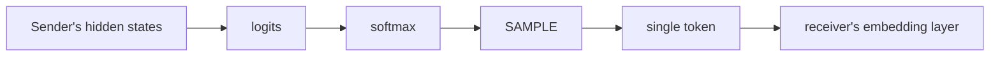
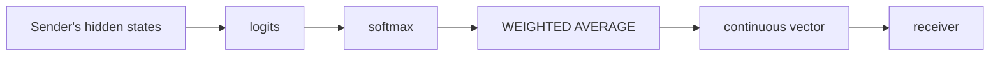

The core theoretical framing: standard LLM-to-LLM communication passes through a **discrete bottleneck**.

The sampling step is the bottleneck. Everything before it is continuous and information-rich. Everything after it is a single discrete choice. Embedding-space communication removes the bottleneck:

This is why [[cipher-multiagent-debate-embeddings|CIPHER]] draws an analogy to **Expected SARSA** vs. vanilla SARSA in RL ([[raw/pdf/arxiv-2310.06272.pdf|CIPHER §3.2]]): replacing a sampled value with its expectation reduces variance and preserves information.

### Quantifying the Loss

Consider a position where the model assigns probability 0.45 to token A and 0.40 to token B. Sampling selects one; the other's 40-45% probability mass is discarded. The embedding average, by contrast, produces a vector that is ~45% token A and ~40% token B — the receiver's model processes a blended representation that reflects the sender's genuine uncertainty. This matters most at **high-uncertainty positions**, which is why [[cipher-multiagent-debate-embeddings|CIPHER]]'s partial ablation (applying embedding communication only at uncertain steps) nearly matches full CIPHER performance.
