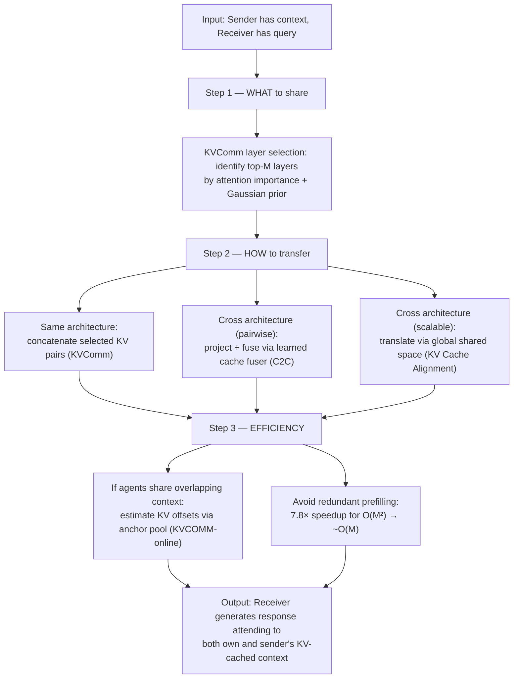

# KV-Cache Communication

A family of approaches to inter-agent communication where models share **key-value cache entries** from their transformer layers rather than generated text or embeddings. This allows agents to directly inject internal representations into each other's attention mechanism — the receiver attends to the sender's cached context as if it had processed that context itself.

Four papers in this collection address complementary dimensions of KV-cache communication:

| Paper | Dimension | Approach |
|-------|-----------|----------|
| [[kvcomm-kth-selective\|KVComm]] | **What to share** | Layer selection via attention importance + Gaussian prior |
| [[cache-to-cache-semantic-communication\|C2C]] | **How to fuse across architectures** | Learned pairwise neural fuser with gating |
| [[kv-cache-alignment-shared-space\|KV Cache Alignment]] | **How to scale to many models** | Global shared KV-cache space with per-model adapters |
| [[kvcomm-duke-online-reuse\|KVCOMM-online]] | **How to make it efficient** | Anchor-based offset estimation for cache reuse |

## Background: What the KV-Cache Is

In a transformer, each attention layer computes **keys (K)** and **values (V)** for every token in the context. During autoregressive generation, previously computed K and V vectors are cached to avoid redundant computation — this is the **KV-cache**.

The KV-cache has a specific structure:
- **Per layer**: Each of *L* transformer layers has its own KV-cache
- **Per head**: Within each layer, each of *H* attention heads has separate K and V vectors
- **Per position**: Each token position has a K-V pair per layer per head
- **Dimensionality**: Each token's full KV-cache is $2 \times L \times H \times d$ values ($d$ = head dimension)

For a 70B-parameter model (L=80, H=64, d=128), each token's full KV-cache is $2 \times 80 \times 64 \times 128 \approx 1.3\text{M}$ float values — orders of magnitude more information than the single embedding vector shared by [[cipher-multiagent-debate-embeddings|CIPHER]].

## Why KV Pairs Over Other Representations

[[kvcomm-kth-selective|KVComm]] provides the strongest empirical case for KV pairs as the optimal communication medium, by systematically comparing alternatives:

### vs. Natural Language (Tokens)

The standard [[multi-agent-debate]] approach. Natural language requires the sender to sequentially generate tokens (slow, lossy) and the receiver to parse them (ambiguous). KV-cache communication eliminates both steps — the sender only needs a single prefill pass, and the receiver integrates information through attention.

### vs. Output Embeddings ([[cipher-multiagent-debate-embeddings|CIPHER]])

[[cipher-multiagent-debate-embeddings|CIPHER]] shares weighted averages of output embeddings. This preserves output-level uncertainty but still requires sequential generation of embedding vectors. KV-cache communication provides **layer-specific representations** (not just the output layer) in a single forward pass.

### vs. Hidden States (Activations)

[[kvcomm-kth-selective|KVComm]]'s key finding: hidden states suffer from **information concentration bias** — the last token's hidden state dominates in later layers, making it the most critical for output but also the hardest to share without corrupting the receiver's own processing:
- **Replace** the receiver's last-token hidden state → destroys receiver's own context
- **Average** sender and receiver hidden states → dilutes both
- **Prepend** all tokens' hidden states → only works from early layers (minimal compute savings)

KV pairs avoid this dilemma because they integrate through **attention**, not by replacing hidden states. The receiver decides via attention weights how much to attend to the sender's information at each position — non-destructive by design.

### vs. Disentangled Thoughts ([[thought-communication-multiagent|ThoughtComm]])

[[thought-communication-multiagent|ThoughtComm]] adds **structure** (shared/private decomposition) but requires a trained autoencoder. KV-cache methods ([[kvcomm-kth-selective|KVComm]], KVCOMM-online) are training-free. [[cache-to-cache-semantic-communication|C2C]] requires training but provides cross-architecture compatibility that ThoughtComm doesn't address.

## The Three Design Dimensions

### Dimension 1: What to Share (Layer Selection)

Not all layers are equally informative. [[kvcomm-kth-selective|KVComm]]'s analysis reveals a **layer hierarchy** for communication:

| Layer depth | Content | Communication value |
|-------------|---------|-------------------|
| Early (1-10) | Surface patterns, syntactic features | Low — too shallow for semantic transfer |
| Middle (10-20) | Semantic abstractions, relational knowledge | **Highest** — most transferable |
| Late (20+) | Task-specific predictions | Medium — may conflict with receiver's specialization |

KVComm's selection strategy combines two signals:
1. **Attention importance scores**: Average attention weight assigned to context tokens per layer — layers where the model attends more heavily to context encode more salient relations
2. **Gaussian prior**: Centered on intermediate layers, encoding the prior that middle layers are most transferable

Result: **30% of layers** already outperforms full natural language debate and embedding communication ([[raw/pdf/arxiv-2510.03346.pdf|KVComm §4.2, Figure 3]]). **70% of layers** matches the upper bound (full context concatenation).

A remarkable finding: **non-contiguous layer selection** outperforms contiguous blocks — the most informative layers are scattered across the network, not clustered.

### Dimension 2: Cross-Architecture Fusion

[[kvcomm-kth-selective|KVComm]] requires sender and receiver to be the same model or fine-tuned variants (identical architecture). [[cache-to-cache-semantic-communication|C2C]] breaks this constraint with a **learned neural cache fuser** ([[raw/pdf/arxiv-2510.03215.pdf|C2C §3]]):

**The fuser pipeline**:
1. **Projection**: Maps sender KV-cache into receiver's representation space (handles different dimensions, different learned representations)
2. **Dynamic weighting**: Per-head modulation — different attention heads get different blending weights, adaptive to each input
3. **Learnable gating**: Per-layer Gumbel-sigmoid gate that learns which layers benefit from fusion (binary at inference)
4. **Residual integration**: Fused cache is **added** to receiver's cache, not replacing it — preserves receiver's own information

**Cross-model results**: Works across Qwen ↔ LLaMA ↔ Gemma, 0.6B ↔ 14B, general ↔ specialized models. Even enables a base model (can't follow instructions) to serve as Sharer to an instruction-tuned Receiver — bypassing the language interface entirely.

**Key oracle finding**: KV-cache enrichment improves accuracy at **constant cache size** — proving the benefit comes from richer semantics, not just more attention targets. Different models encode genuinely complementary information (limited overlap in correct-answer sets).

### Dimension 2b: Scalable Cross-Model via Shared Space

[[kv-cache-alignment-shared-space|KV Cache Alignment (Google DeepMind)]] takes a fundamentally different approach from [[cache-to-cache-semantic-communication|C2C]]'s pairwise fusers: learn a **global shared KV-cache representation space** (an "interlingua") with per-model adapters.

**Architecture**: Each model gets two cross-attention-based adapters (~¼ model size each):
- T[α→Ω]: Translate from model α's KV-cache into the shared space
- T[Ω→α]: Translate from the shared space into model α's KV-cache

**Key advantages over pairwise approaches**:
- **$O(N)$ adapters** instead of $O(N^2)$ fusers — linear scaling with pool size
- **Zero-shot extensibility**: Add a new model by training 2 adapters; untrained paths to/from existing models work zero-shot
- **Module portability**: Soft prompts learned on one model transfer to another via the shared space — a capability no other approach provides

**The self-improvement effect**: Passing a model's KV-cache through the shared space and back (cyclic: A → Ω → A) actually **improves** that model's performance ([[raw/pdf/arxiv-2601.06123.pdf|KV Alignment §4.3]]). The shared space acts as a feature sharpener — distilling the most transferable representations. This parallels C2C's effective rank increase and KVComm's finding that selective sharing can exceed the skyline.

**Trade-off vs. C2C**: The shared space may lose pair-specific fine-grained structure (it optimizes for universality, not pair-specific performance). C2C's per-pair fusers can capture richer pair-specific relationships. Current scale is also smaller (100M-400M vs. C2C's 0.6B-14B).

### Dimension 3: Efficiency (Cache Reuse)

[[kvcomm-duke-online-reuse|KVCOMM-online]] tackles the **$O(M^2)$ redundant prefilling** problem in multi-agent systems. When agents share overlapping text under different system prompts, the same text produces different KV-caches due to context dependence. KVCOMM estimates these **context-dependent offsets** rather than recomputing from scratch.

**Theoretical foundation**: Two propositions show that KV-cache offsets between embedding-similar tokens under different prefixes are **bounded and predictable**. If you know how token X shifts from prefix A to prefix B, you can estimate how similar token Y shifts.

**Anchor pool mechanism**:
- Stores representative offset patterns from prior examples
- At inference: matches new requests to anchors by embedding similarity, interpolates offsets
- Updated online — adapts to changing input distributions
- Handles RoPE positional shifts via de-rotation/re-rotation

**Results**: 70%+ cache reuse rate, up to **7.8× prefill speedup** in 5-agent settings ([[raw/pdf/arxiv-2510.12872.pdf|KVCOMM-online Table 3]]), <2.5% accuracy degradation.

## Combined Picture: The KV-Cache Communication Stack

The four papers are composable — they address orthogonal concerns:

## Relation to the Communication Spectrum

![[depth-spectrum]]

KV-cache communication occupies **stage 3** of this spine — one step deeper than output embeddings ([[embedding-space-communication|CIPHER-style methods]]) and one step shallower than [[activation-communication|hidden-state activation sharing]]. Its distinctive property among the five stages is that injection is **non-destructive**: the receiver attends to the sender's context through its own attention mechanism rather than overwriting its residual stream, which is exactly the dilemma [[kvcomm-kth-selective|KVComm]] identifies when comparing KV pairs to hidden-state replacement or averaging.

Within this stage-3 slot, the four papers above move along orthogonal axes layered on top of the depth spine: [[cache-to-cache-semantic-communication|C2C]] and [[kv-cache-alignment-shared-space|KV Cache Alignment]] push cross-architecture compatibility (normally lost as you move deeper), [[kvcomm-kth-selective|KVComm]]'s layer selection trades bandwidth for efficiency, and [[kvcomm-duke-online-reuse|KVCOMM-online]] attacks the prefill cost that grows with cache size. The depth–compatibility trade-off described in the embed is what makes each of these axes load-bearing rather than incidental.

## Open Questions

- **Layer selection + C2C fusion**: Can [[kvcomm-kth-selective|KVComm]]'s attention-based selection strategy improve [[cache-to-cache-semantic-communication|C2C]]'s gating mechanism, or vice versa?
- **Token-level selection**: KVComm selects layers; could token-level selection (which positions' KVs to share) further improve efficiency?
- **Multi-round KV communication**: All three papers evaluate single-round communication. How does KV-cache communication work in iterative debate settings?
- **Combination with [[thought-communication-multiagent|ThoughtComm]]**: Could disentangled thought extraction be applied to KV-caches specifically, combining ThoughtComm's structure with KV's attention-native integration?
- **Scaling to frontier models**: Most experiments use 0.6B-14B models. Do the layer selection patterns and fusion benefits hold at 70B+ scale?

## Emergent Theme: Latent Space Mediation as Regularization

A striking finding across multiple papers: passing KV-caches through an intermediate representation **improves** performance beyond the original model:
- [[kv-cache-alignment-shared-space|KV Cache Alignment]]: Cyclic translation (A → Ω → A) improves model A's language modeling
- [[cache-to-cache-semantic-communication|C2C]]: Fused cache has higher effective rank than either individual model's cache
- [[kvcomm-kth-selective|KVComm]]: Selective sharing sometimes exceeds the Skyline (full context concatenation)

This suggests that latent-space mediation — whether through a learned shared space, a neural fuser, or even simple layer selection — acts as a form of **beneficial regularization**, distilling the most transferable and task-relevant features while filtering noise. The parallels to how [[coconut-reasoning-latent-space|Coconut]]'s continuous thoughts learn more efficient representations than language CoT are notable.
