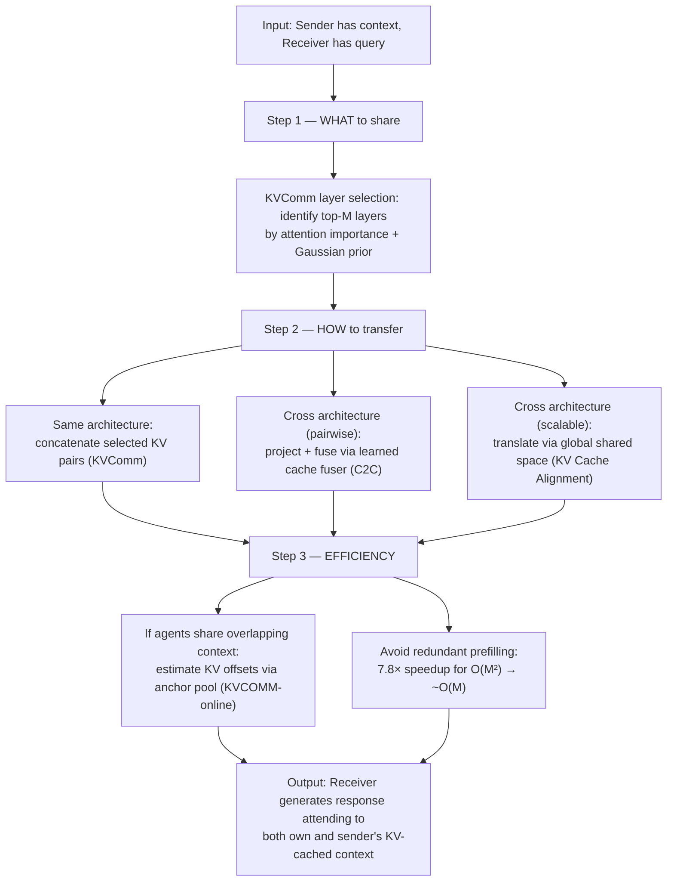

The four papers are composable — they address orthogonal concerns:

```mermaid
graph TD
    A["Input: Sender has context, Receiver has query"] --> B["Step 1 — WHAT to share"]
    B --> B1["KVComm layer selection: identify top-M layers<br>by attention importance + Gaussian prior"]
    B1 --> C["Step 2 — HOW to transfer"]
    C --> C1["Same architecture:<br>concatenate selected KV pairs (KVComm)"]
    C --> C2["Cross architecture (pairwise):<br>project + fuse via learned cache fuser (C2C)"]
    C --> C3["Cross architecture (scalable):<br>translate via global shared space (KV Cache Alignment)"]
    C1 --> D["Step 3 — EFFICIENCY"]
    C2 --> D
    C3 --> D
    D --> D1["If agents share overlapping context:<br>estimate KV offsets via anchor pool (KVCOMM-online)"]
    D --> D2["Avoid redundant prefilling:<br>7.8× speedup for O(M²) → ~O(M)"]
    D1 --> E["Output: Receiver generates response attending to<br>both own and sender's KV-cached context"]
    D2 --> E
```
