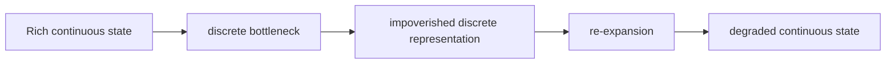
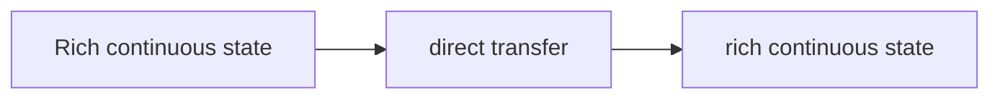

# Continuous vs. Discrete Representation

A unifying theoretical theme across this wiki: the tension between **continuous** (dense vector) and **discrete** (token/symbol) representations in LLM systems, and the information-theoretic consequences of moving between them.

## The Fundamental Trade-off

LLMs are internally continuous systems (dense vector representations in $\R^d$ at every layer) that are forced to interface with the world through a discrete bottleneck (token sampling). This creates a fundamental trade-off:

| Property | Discrete (tokens) | Continuous (vectors) |
|----------|-------------------|---------------------|
| Information density | ${\sim}\log_2(V)$ bits per position ($V$ = vocab size) | $d$ floating-point values per position |
| Expressiveness | One choice per position | Superpositions of choices |
| Composability | Symbolic, combinatorial | Geometric, algebraic |
| Interpretability | Human-readable | Requires probing/decoding |
| Universality | Any system can process text | Requires compatible architecture |
| Error properties | Discrete errors (wrong token) | Continuous errors (drift, distortion) |

## Where the Bottleneck Appears

The discrete bottleneck appears in multiple contexts within this wiki, and **the same principle applies in each**: bypassing the bottleneck by staying in continuous space preserves information and enables richer computation.

### Inter-Agent Communication
- **Discrete**: Agents exchange natural language messages. Each token collapses the sender's full belief distribution into one choice.
- **Continuous**: Agents exchange embedding vectors ([[embedding-space-communication|CIPHER]]), KV-cache entries ([[kv-cache-communication]]), or hidden-state activations ([[activation-communication]]).
- **Evidence**: [[cipher-multiagent-debate-embeddings|CIPHER]] shows 0.5-5.0% accuracy improvement from continuous communication in [[multi-agent-debate]].

### Intra-Agent Reasoning
- **Discrete**: The model reasons through chain-of-thought — discrete token sequences.
- **Continuous**: The model reasons through continuous thoughts ([[latent-space-reasoning|Coconut]]) — hidden-state feedback loops.
- **Evidence**: [[coconut-reasoning-latent-space|Coconut]] shows dramatic improvement on planning tasks (97.0% vs 77.5% on ProsQA) and emergent BFS from superposition.

### The Unifying Principle

Both cases are instances of the same information-theoretic phenomenon:

Removing the bottleneck:

The information lost at the discrete bottleneck includes:
- **Uncertainty**: The model's confidence distribution over alternatives (critical for [[temperature-diversity]] in debate)
- **Superposition**: Multiple simultaneous hypotheses (see [[#Superposition and Quantum Analogy|the superposition section below]]; critical for BFS in [[latent-space-reasoning]]; exploited by [[thought-structure|ThoughtComm's disentangled thoughts]])
- **Nuance**: Fine-grained distinctions between similar options (critical for reasoning at high-uncertainty positions)

## Theoretical Connections

### Information Theory

The discrete bottleneck is a lossy compression step. For a vocabulary of size $V$:
- **Maximum information per token**: $\log_2(V) \approx 15$ bits (for $V = 32{,}000$)
- **Information in the model's belief**: The full softmax distribution — up to $V \times 32$ bits (float32) = ~128 KB of raw probability data, or more practically, the effective information content of the distribution

The gap between these is enormous. Even if most of the distribution's mass is concentrated on a few tokens, the tail carries real information — particularly about what the model considered but rejected. This "rejected alternative" information is exactly what enables BFS in [[coconut-reasoning-latent-space|Coconut]] and richer communication in [[cipher-multiagent-debate-embeddings|CIPHER]].

More precisely, the information loss at the bottleneck can be quantified as the **KL divergence** between the model's full distribution and the degenerate distribution obtained after sampling:

$$D_\text{KL}(p \| \delta_{\hat{v}}) = -\sum_v p(v) \log \frac{\delta_{\hat{v}}(v)}{p(v)} = -\log p(\hat{v}) + H(p)$$

where $\hat{v}$ is the sampled token and $H(p)$ is the entropy of the original distribution. When the model is confident ($H(p) \approx 0$, $p(\hat{v}) \approx 1$), almost no information is lost. When the model is uncertain ($H(p)$ is large), the loss is dramatic — precisely the regime where [[temperature-diversity]] and [[latent-space-reasoning]] provide the most benefit.

### The Expected SARSA Analogy

[[cipher-multiagent-debate-embeddings|CIPHER]] draws an explicit analogy to reinforcement learning: Expected SARSA (using expected Q-values) outperforms vanilla SARSA (using sampled Q-values) because expectations are lower-variance estimates. The same principle applies:
- **Sampled token** (vanilla SARSA): High variance, information-lossy
- **Expected embedding** (Expected SARSA): Low variance, information-preserving

### Superposition and Quantum Analogy

![[superposition]]

[[superposition-coconut-theory|Zhu et al. (NeurIPS 2025)]] provide a **rigorous formalization** of this mechanism ([[raw/pdf/arxiv-2505.12514.pdf|Zhu et al. Theorem 1]]): each continuous thought is provably the normalized uniform mixture of all vertices reachable within $c$ BFS steps, so a 2-layer transformer with $D$ continuous thoughts solves graph reachability in $D$ steps vs. $O(n^2)$ for discrete CoT — a potentially **quadratic-to-linear speedup**. The quantum mechanics analogy is made mathematically precise: continuous thoughts are superposition states (weighted sums over multiple vertex embeddings), token sampling is measurement/collapse, and the answer token is a measurement that projects the superposition onto the correct candidate. The formalization proves this isn't just an analogy — it's the actual computational mechanism, and it ties superposition directly to the bandwidth-gap argument above: the rejected-alternative information the KL divergence quantifies is precisely the mixture weights that parallel BFS depends on.

### The Depth Bottleneck (Feng et al., NeurIPS 2023)

[[cot-expressivity-theory|Feng et al.]] prove that the discrete bottleneck isn't just about information density — it's about **computational expressivity** ([[raw/pdf/arxiv-2305.15408.pdf|Feng et al. Theorem 3.3]]). Bounded-depth transformers are limited to $\text{TC}^0$ (constant-depth threshold circuits). CoT breaks this barrier by adding effective depth. Continuous CoT breaks it further by adding superposition. The discrete-to-continuous shift is not incremental — it's a complexity-class transition.

### Connection to Distributed Representations

The continuous vs. discrete tension in LLM systems echoes the classic **localist vs. distributed** representation debate in neural network research (Hinton, 1986; Smolensky, 1988). Distributed representations (patterns of activation across many dimensions) are more expressive than localist representations (one unit per concept). LLMs operating in natural language are, in a sense, reverting to localist representation (one token per position) despite having rich distributed representations internally.

## Empirical Evidence: Compression and Accuracy Across Papers

The following table collects concrete numbers from papers in this wiki, showing the accuracy and efficiency consequences of moving between discrete and continuous representations:

| Paper | Task | Discrete method | Continuous method | Discrete accuracy | Continuous accuracy | Compression factor |
|-------|------|----------------|-------------------|-------------------|--------------------|--------------------|
| [[coconut-reasoning-latent-space\|Coconut]] | ProsQA (graph reach.) | Discrete CoT | Continuous thoughts | 77.5% | 97.0% | $O(n^2) \to O(D)$ steps |
| [[coconut-reasoning-latent-space\|Coconut]] | GSM8K | Discrete CoT | Continuous thoughts | 34.3% | 34.1% | ~1x (no gain) |
| [[cipher-multiagent-debate-embeddings\|CIPHER]] | Arithmetic | NL debate ($T=0.54,1.0$) | Embedding debate ($T=0.15,1.75$) | ~81% | ~85% | 15 bits $\to$ $d \times 32$ bits/pos |
| [[cipher-multiagent-debate-embeddings\|CIPHER]] | GSM8K | NL debate | Embedding debate | ~65% | ~66% | 15 bits $\to$ $d \times 32$ bits/pos |
| [[thought-communication-multiagent\|ThoughtComm]] | MATH (Qwen-3-1.7B) | Multiagent finetune (NL) | Disentangled thoughts | 75.8% | 93.0% | $n_z$ latent dims |
| [[thought-communication-multiagent\|ThoughtComm]] | MATH (Phi-4-mini) | Multiagent finetune (NL) | Disentangled thoughts | 60.2% | 74.6% | $n_z$ latent dims |
| [[superposition-coconut-theory\|Zhu et al.]] | Graph reachability | Discrete CoT (sequential) | Superposition (parallel BFS) | $O(n^2)$ steps | $D$ steps | Quadratic $\to$ linear |

Key patterns: (1) The continuous advantage is **largest on tasks requiring parallel exploration** (ProsQA, MATH) and **smallest on sequential arithmetic** (GSM8K), consistent with the superposition hypothesis. (2) The advantage scales with model weakness — smaller models (Qwen-3-0.6B, 1.7B) gain more from continuous communication than larger ones, likely because weaker models lose more information at the discrete bottleneck. (3) [[thought-communication-multiagent|ThoughtComm]]'s structured continuous approach consistently outperforms [[cipher-multiagent-debate-embeddings|CIPHER]]'s unstructured continuous approach, suggesting that structure matters beyond raw information preservation.

## The Compatibility Cost

The advantage of continuous representation comes with a **compatibility cost**: continuous representations are tightly coupled to the architecture that produced them.

| Level | What's needed for compatibility |
|-------|-------------------------------|
| Natural language | Nothing — universal |
| Output embeddings ([[cipher-multiagent-debate-embeddings|CIPHER]]) | Shared tokenizer |
| KV-cache | Compatible architecture (layers, heads, dimensions) |
| Hidden states ([[coconut-reasoning-latent-space|Coconut]], [[activation-communication|activation communication]]) | Same or closely related model weights |

This creates a design tension: **richer communication requires tighter coupling**. However, two foundational results suggest the compatibility cost may be **lower than assumed**:

- **[[platonic-representation-hypothesis|Platonic Representation Hypothesis]]** ([[raw/pdf/arxiv-2405.07987.pdf|Huh et al. §3]]): Models converge to similar representations as they scale. Larger models should be **more** compatible, not less.
- **[[relative-representations-zero-shot|Relative Representations]]**: Well-trained models' latent spaces are related by approximately angle-preserving transforms — linear projections are the exact correct tool to align them. Zero-shot stitching works across architectures.

The optimal point on the trade-off depends on the system:
- **Open multi-agent systems** (heterogeneous models): Linear projections may suffice (supported by Platonic Rep + Relative Rep)
- **Homogeneous multi-agent systems** (same model): Can exploit deep latent communication with no alignment needed
- **Single-model reasoning**: Can use the deepest representations ([[coconut-reasoning-latent-space|Coconut]])

## Cross-Cutting Connections

### Connection to [[thought-structure]]

[[thought-structure|Thought structure]] represents a **hybrid** approach to the continuous-discrete tension. The latent thoughts themselves are continuous vectors in $\R^{n_z}$, preserving the full information density of continuous space. But the routing decisions — the incidence matrix $B(J_f)$ and agreement scores $\sigma_j$ — are discrete. This design exploits the strengths of both: continuous content avoids the bottleneck, while discrete structure enables interpretable, selective routing. The [[latent-variable-model]]'s identifiability theorems guarantee that this discrete structure is not arbitrary but reflects genuine cognitive separation.

### Connection to [[latent-variable-model]]

The [[latent-variable-model]] framework provides the theoretical justification for working in continuous space: the identifiability theorems (Theorems 1-3 of [[thought-communication-multiagent|ThoughtComm]]) prove that continuous representations can be **meaningfully decomposed** into interpretable latent factors under sparsity assumptions. This addresses a fundamental concern about continuous representations — that they are opaque and uninterpretable. With identifiability, continuous representations become not just information-rich but also semantically transparent.

## Maps of Content

This concept appears in the following guided reading paths:
- [[theoretical-foundations|Theoretical Foundations]] — the theoretical pillars explaining why continuous representations outperform discrete tokens
- [[compression-information-theory|Compression & Information-Theoretic Bounds]] — how much bandwidth is enough for latent reasoning and communication

## Open Questions

- **Is there an optimal compression point?** Between full continuous (maximum information, minimum compatibility) and full discrete (minimum information, maximum compatibility), is there an intermediate representation that captures most of the information advantage with broad compatibility?
- **Learned compression**: Can models learn to communicate in a compressed continuous space that preserves the most task-relevant information while being compatible across architectures?
- **When does discrete win?** Are there tasks or settings where the structure imposed by discretization is actually helpful — e.g., for compositional generalization, symbolic reasoning, or error correction? The GSM8K results (where continuous and discrete perform nearly identically) suggest that sequential arithmetic may be one such domain.
- **Scaling effects**: As models grow larger and more capable, does the gap between continuous and discrete narrow (because larger models lose less in discretization) or widen (because larger hidden states carry even more information)? The [[thought-communication-multiagent|ThoughtComm]] results suggest it widens for smaller models but the trend for very large models remains untested.
- **Superposition capacity**: [[superposition-coconut-theory|Zhu et al.]] prove that continuous thoughts encode superpositions of $|V_c|$ vertices. Is there an upper bound on how many distinct hypotheses a single continuous vector of dimension $d$ can simultaneously represent before interference degrades the signal? This would determine the theoretical ceiling of the continuous advantage.
