# Communication Depth Spectrum

A guided reference for the 10 levels of inter-agent communication, ordered from shallowest (most compatible, most interpretable) to deepest (most information-dense, most restrictive). Each level represents a different point in the transformer stack where information is extracted and transmitted.

The organizing principle: **deeper communication carries more information but demands tighter architectural alignment**. ThoughtComm adds a perpendicular axis — **structure** — that imposes organization on what's communicated regardless of depth.

## Spectrum Overview

```mermaid
graph LR
    subgraph Shallow["Shallow · High Compatibility"]
        L0["**L0: Natural Language**<br>~15 bits/pos<br>Any architecture<br>*Du et al. 2023*"]
        L1["**L1: Embedding Avg**<br>Soft tokens<br>Shared tokenizer<br>*CIPHER 2023*"]
        L2["**L2: State Deltas**<br>Hidden-state diffs<br>Same model<br>*SDE 2025*"]
    end
    subgraph Medium["Medium Depth"]
        L3["**L3: Disentangled**<br>Shared/private factors<br>Trained AE<br>*ThoughtComm 2025*"]
        L4["**L4: Vision Pathway**<br>Latent rollouts<br>VLMs + codec<br>*Wormhole 2026*"]
    end
    subgraph KV["KV-Cache Level"]
        L5["**L5: KV-Cache Sel.**<br>Top-k layers<br>Same architecture<br>*KVComm 2026*"]
        L6["**L6: KV-Cache X-Arch**<br>Projected/fused KV<br>Learned fuser<br>*C2C / KV Align*"]
    end
    subgraph Deep["Deep · Restrictive"]
        L7["**L7: Activation Repl.**<br>Last-token residual<br>Cross-family works<br>*AC 2025*"]
        L8["**L8: Full Hidden-State**<br>All-position states<br>~40K bits/pos<br>*Interlat*"]
    end
    subgraph Unified["Unified"]
        L9["**L9: Full Working Mem**<br>KV + latent thoughts<br>471x compression<br>*LatentMAS 2025*"]
    end

    L0 --> L1 --> L2 --> L3 --> L4 --> L5 --> L6 --> L7 --> L8 --> L9

    style Shallow fill:#d5e8d4,stroke:#82b366
    style Medium fill:#fff2cc,stroke:#d6b656
    style KV fill:#ffe6cc,stroke:#d79b00
    style Deep fill:#f8cecc,stroke:#b85450
    style Unified fill:#e1d5e7,stroke:#9673a6
```

## The Spectrum

### Level 0: Natural Language (Baseline)
**What's shared**: Discrete tokens (sampled from softmax)
**Information density**: ${\sim}15$ bits/position ($\log_2 32\text{K}$ vocabulary)
**Compatibility**: Any model, any architecture
**Key paper**: [[multiagent-debate-du-et-al|Du et al. (2023)]] — the foundational debate protocol

The universal baseline. Every downstream method is measured against this. The core limitation: sampling collapses the model's full distributional belief into a single token, discarding all uncertainty information.

---

### Level 1: Output Embedding Averages
**What's shared**: Weighted average of token embeddings under softmax distribution
**Information density**: Medium (full distribution preserved)
**Compatibility**: Shared tokenizer required
**Key paper**: [[cipher-multiagent-debate-embeddings|CIPHER (Pham et al., 2023)]]

The shallowest continuous channel. Instead of sampling a token, compute $\text{emb}(t) = \sum_i p(\text{vocab}_i) \cdot \text{emb}(\text{vocab}_i)$. The receiver gets a **soft token** — a point in embedding space encoding the sender's confidence landscape. Constrained to the **convex hull** of vocabulary embeddings, so no architectural changes needed. Gains are strongest at positions of **intermediate uncertainty** where sampling would discard the most probability mass. See [[embedding-space-communication]] for the information bottleneck theory.

---

### Level 2: State Deltas
**What's shared**: Inter-token hidden-state differences ($h_{t+1} - h_t$)
**Information density**: Medium-High
**Compatibility**: Same model weights
**Key paper**: [[state-delta-trajectory|SDE (EMNLP 2025)]]

Rather than sharing raw hidden states, share the *change* between consecutive token positions. Deltas capture the **reasoning dynamics** — what computation the model performed at each step — and outperform raw states empirically. This is an important finding: the derivative of the hidden state carries more transferable information than the state itself. Applied as additive steering vectors at selected layers of the receiver.

---

### Level 3: Disentangled Latent Thoughts
**What's shared**: Structured latent factors (shared/private decomposition)
**Information density**: Medium-High
**Compatibility**: Trained autoencoder required
**Key paper**: [[thought-communication-multiagent|ThoughtComm (NeurIPS 2025)]]

Perpendicular to the depth axis — adds **structure** to communication. A sparsity-regularized autoencoder extracts disentangled factors from agent hidden states, decomposing them into shared (task-relevant, consensus) and private (agent-specific) components. An agreement routing mechanism selectively transmits based on inter-agent alignment scores. Provides [[latent-variable-model|identifiability guarantees]] that recovered factors correspond to true generative factors. Scales positively with debate rounds, unlike NL debate. See [[thought-structure]].

---

### Level 4: Vision-Pathway Injection
**What's shared**: Encoded latent rollouts via VLM image input pathway
**Information density**: Medium-High
**Compatibility**: VLMs + trained codec
**Key paper**: [[vision-wormhole-heterogeneous|Vision Wormhole (Purdue/CMU, 2026)]]

An architectural insight rather than an alignment technique. VLMs already have pathways designed to accept external continuous inputs (image encodings). Repurpose this pathway as a universal latent communication channel. Because different VLM families all have visual input pathways, this **sidesteps the cross-architecture compatibility problem entirely**. The sender encodes its reasoning rollout; the receiver processes it through its visual pathway as if it were an image.

---

### Level 5: KV-Cache (Selected Layers)
**What's shared**: Key-value pairs from top-k attention layers
**Information density**: High
**Compatibility**: Same architecture required
**Key paper**: [[kvcomm-kth-selective|KVComm (ICLR 2026)]]

Share the sender's cached attention keys and values, but only from the most informative layers. KVComm finds that **30% of layers** achieves performance comparable to sharing all layers — a significant bandwidth reduction. Layer selection uses attention importance scores with a Gaussian prior favoring upper layers. The receiver attends to the sender's cached context as if it had processed that context itself. See [[kv-cache-communication]].

---

### Level 6: KV-Cache (Cross-Architecture)
**What's shared**: Projected and fused KV pairs across different architectures
**Information density**: High
**Compatibility**: Learned fuser or shared space required
**Key papers**: [[cache-to-cache-semantic-communication|C2C (ICLR 2026)]], [[kv-cache-alignment-shared-space|KV Alignment (DeepMind, 2026)]]

Two approaches to the cross-architecture problem:
- **C2C**: Learned pairwise neural fuser with gating. Scales $O(N^2)$ — each model pair needs its own fuser.
- **KV Alignment**: Global shared KV-cache space (interlingua) with per-model adapters. Scales $O(N)$. Exhibits a **self-improvement effect**: cyclic translation (A → shared → A) improves A's performance, suggesting the shared space acts as a regularizer.

---

### Level 7: Single Activation Replacement
**What's shared**: Last-token residual stream activation at one layer
**Information density**: High
**Compatibility**: Roughly aligned embedding spaces (cross-family works)
**Key paper**: [[activation-communication-harvard|AC (ICML 2025)]]

Replace the receiver's last-token activation at layer ~26 ("enriched entity representations" layer) with the sender's. One partial + one full forward pass = **<¼ compute of NL debate**. Remarkably works cross-family (LLaMA ↔ Qwen ↔ Gemma) without learned projections, consistent with the [[platonic-representation-hypothesis|Platonic Representation Hypothesis]] — models converge to shared statistical structure. See [[activation-communication]].

---

### Level 8: Full Hidden-State Sequence
**What's shared**: All-position last-layer hidden states
**Information density**: Highest (${\sim}40\text{K}$ bits/position)
**Compatibility**: Trained communication adapter required
**Key paper**: [[interlat-latent-space-agents|Interlat]]

The maximum-bandwidth point-to-point channel. Transmit every position's last-layer hidden state from sender to receiver via a learned adapter. Achieves **2600× theoretical bandwidth** over text. Works cross-family (Qwen → LLaMA) with trained adapters. The trade-off: maximum information but maximum coupling.

---

### Level 9: KV-Cache + Latent Thoughts (Full Working Memory)
**What's shared**: Complete KV-cache including internally generated latent thoughts
**Information density**: Highest
**Compatibility**: Same architecture (homogeneous only)
**Key paper**: [[latentmas-collaboration|LatentMAS (2025)]]

The deepest level: share everything — not just the KV-cache from processing the input, but also the KV entries generated during **internal latent reasoning** (Coconut-style hidden-state feedback). The receiver gets the sender's complete working memory. Training-free via ridge regression alignment. $471.4\times$ theoretical compression over text. See [[unified-frameworks]].

---

## The Fundamental Trade-off

```mermaid
graph LR
    Compatible["**Compatible**<br>Interpretable<br>Low bandwidth"]
    L0["L0<br>NL"]
    L1["L1<br>Emb"]
    L2["L2<br>Delta"]
    L3["L3<br>Struct"]
    L4["L4<br>Vision"]
    L5["L5<br>KV-sel"]
    L6["L6<br>KV-x"]
    L7["L7<br>AC"]
    L8["L8<br>Full-HS"]
    L9["L9<br>KV+Lat"]
    Restrictive["**Restrictive**<br>Opaque<br>High bandwidth"]

    Compatible --- L0 --- L1 --- L2 --- L3 --- L4 --- L5 --- L6 --- L7 --- L8 --- L9 --- Restrictive

    style Compatible fill:#d5e8d4,stroke:#82b366
    style L0 fill:#d5e8d4,stroke:#82b366
    style L1 fill:#d5e8d4,stroke:#82b366
    style L2 fill:#d5e8d4,stroke:#82b366
    style L3 fill:#fff2cc,stroke:#d6b656
    style L4 fill:#fff2cc,stroke:#d6b656
    style L5 fill:#ffe6cc,stroke:#d79b00
    style L6 fill:#ffe6cc,stroke:#d79b00
    style L7 fill:#f8cecc,stroke:#b85450
    style L8 fill:#f8cecc,stroke:#b85450
    style L9 fill:#e1d5e7,stroke:#9673a6
    style Restrictive fill:#f8cecc,stroke:#b85450
```

The research frontier is about **bending this curve** — achieving high information density without requiring tight architectural coupling. Key strategies:
- **Learned shared spaces** (KV Alignment) reduce coupling at the KV-cache level
- **Vision pathways** (Wormhole) exploit existing cross-architecture interfaces
- **Relative representations** ([[relative-representations-zero-shot|Moschella et al.]]) suggest isometric latent spaces may enable zero-shot alignment

## Open Questions

- Where is the **optimal operating point** on this spectrum for practical multi-agent systems?
- Can the self-improvement effect (Level 6) be exploited as a deliberate training signal?
- Is there a universal continuous interface that achieves Level 8+ density with Level 0 compatibility?
- How does the optimal depth shift as models scale to frontier size?

## Related Pages

- [[embedding-space-communication]] — Detailed concept page with information bottleneck theory
- [[activation-communication]] — 5-paper synthesis at the activation level
- [[kv-cache-communication]] — 4 design dimensions for KV-cache approaches
- [[latent-communication]] — Parent MOC for all communication research
- [[continuous-vs-discrete-representation]] — The theoretical foundation
