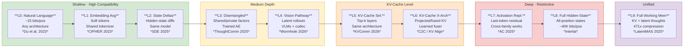

```mermaid
graph LR
    subgraph Shallow["Shallow · High Compatibility"]
        L0["**L0: Natural Language**<br>~15 bits/pos<br>Any architecture<br>*Du et al. 2023*"]
        L1["**L1: Embedding Avg**<br>Soft tokens<br>Shared tokenizer<br>*CIPHER 2023*"]
        L2["**L2: State Deltas**<br>Hidden-state diffs<br>Same model<br>*SDE 2025*"]
    end
    subgraph Medium["Medium Depth"]
        L3["**L3: Disentangled**<br>Shared/private factors<br>Trained AE<br>*ThoughtComm 2025*"]
        L4["**L4: Vision Pathway**<br>Latent rollouts<br>VLMs + codec<br>*Wormhole 2026*"]
    end
    subgraph KV["KV-Cache Level"]
        L5["**L5: KV-Cache Sel.**<br>Top-k layers<br>Same architecture<br>*KVComm 2026*"]
        L6["**L6: KV-Cache X-Arch**<br>Projected/fused KV<br>Learned fuser<br>*C2C / KV Align*"]
    end
    subgraph Deep["Deep · Restrictive"]
        L7["**L7: Activation Repl.**<br>Last-token residual<br>Cross-family works<br>*AC 2025*"]
        L8["**L8: Full Hidden-State**<br>All-position states<br>~40K bits/pos<br>*Interlat*"]
    end
    subgraph Unified["Unified"]
        L9["**L9: Full Working Mem**<br>KV + latent thoughts<br>471x compression<br>*LatentMAS 2025*"]
    end

    L0 --> L1 --> L2 --> L3 --> L4 --> L5 --> L6 --> L7 --> L8 --> L9

    style Shallow fill:#d5e8d4,stroke:#82b366
    style Medium fill:#fff2cc,stroke:#d6b656
    style KV fill:#ffe6cc,stroke:#d79b00
    style Deep fill:#f8cecc,stroke:#b85450
    style Unified fill:#e1d5e7,stroke:#9673a6
```
