```mermaid
graph LR
    Compatible["**Compatible**<br>Interpretable<br>Low bandwidth"]
    L0["L0<br>NL"]
    L1["L1<br>Emb"]
    L2["L2<br>Delta"]
    L3["L3<br>Struct"]
    L4["L4<br>Vision"]
    L5["L5<br>KV-sel"]
    L6["L6<br>KV-x"]
    L7["L7<br>AC"]
    L8["L8<br>Full-HS"]
    L9["L9<br>KV+Lat"]
    Restrictive["**Restrictive**<br>Opaque<br>High bandwidth"]

    Compatible --- L0 --- L1 --- L2 --- L3 --- L4 --- L5 --- L6 --- L7 --- L8 --- L9 --- Restrictive

    style Compatible fill:#d5e8d4,stroke:#82b366
    style L0 fill:#d5e8d4,stroke:#82b366
    style L1 fill:#d5e8d4,stroke:#82b366
    style L2 fill:#d5e8d4,stroke:#82b366
    style L3 fill:#fff2cc,stroke:#d6b656
    style L4 fill:#fff2cc,stroke:#d6b656
    style L5 fill:#ffe6cc,stroke:#d79b00
    style L6 fill:#ffe6cc,stroke:#d79b00
    style L7 fill:#f8cecc,stroke:#b85450
    style L8 fill:#f8cecc,stroke:#b85450
    style L9 fill:#e1d5e7,stroke:#9673a6
    style Restrictive fill:#f8cecc,stroke:#b85450
```

The research frontier is about **bending this curve** — achieving high information density without requiring tight architectural coupling. Key strategies:
- **Learned shared spaces** (KV Alignment) reduce coupling at the KV-cache level
- **Vision pathways** (Wormhole) exploit existing cross-architecture interfaces
- **Relative representations** ([[relative-representations-zero-shot|Moschella et al.]]) suggest isometric latent spaces may enable zero-shot alignment
