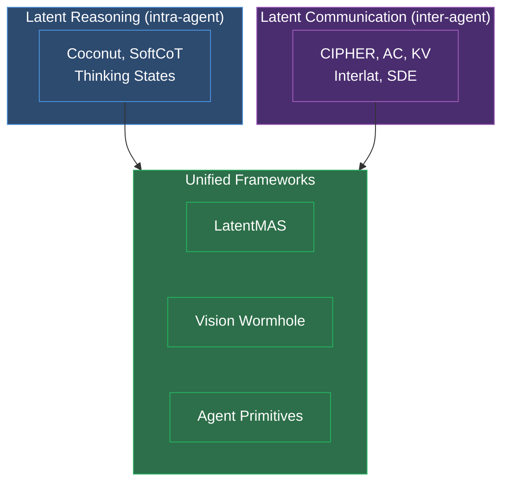

# Unified Frameworks

Systems that combine **latent reasoning within agents** and **latent communication between agents**. These represent the convergence point of the two main research threads — the hypothesis that intra-agent reasoning and inter-agent communication are instances of the same principle: bypassing discrete token bottlenecks to operate in continuous representation space.

## The Three Unified Systems

### LatentMAS — Training-Free Latent Collaboration
**[[latentmas-collaboration]]** (Princeton/UIUC/Stanford, 2025)

The first system to combine both. Agents reason internally via hidden-state feedback (like [[coconut-reasoning-latent-space|Coconut]]) and share their reasoning via KV-cache transfer. Uses ridge regression alignment (no training required). GSM8K: 95.2% vs 83.7% single agent, 4× faster than text-based MAS. Theoretical compression: 471.4× over text. **Limitation**: requires homogeneous architecture (same model family).

### Vision Wormhole — Heterogeneous Cross-Architecture
**[[vision-wormhole-heterogeneous]]** (Purdue/CMU, 2026)

Solves the heterogeneous architecture problem by repurposing VLM visual input pathways as a universal continuous channel. Different model families can communicate because the visual pathway is designed to accept external continuous inputs. This is an architectural insight rather than an alignment technique — it sidesteps the cross-architecture compatibility problem entirely.

### Agent Primitives — Composable Latent Operators
**[[agent-primitives-building-blocks]]** (UIUC, 2026)

Defines a library of composable operators (Review, Voting, Planning) that structure how agents share and aggregate KV-cache representations. Rather than ad-hoc multi-agent designs, provides reusable building blocks. The [[scaling-agent-systems|Scaling paper]] shows composable primitives outperform monolithic MAS designs.

## How They Connect

## Scaling and Design Principles

- **[[scaling-agent-systems]]** — Quantitative framework: 5 architectures, 180 configs. Key finding: scaling is task-contingent, not monotonic. Composable primitives > ad-hoc designs.
- **[[multiagent-debate-du-et-al]]** — Du et al.'s foundational debate protocol that all unified systems build upon.
- **[[multiagent-debate]]** — The debate paradigm: capability thresholds, architecture comparison, scaling principles.

## Meta & Applied

- **[[latentcompress-open-call]]** — LatentCompress project: 512-byte compression, bandwidth-accuracy curves, safety/auditability.
- **[[latentcompress-collaboration-strategy]]** — Strategy for engaging with the LatentCompress project.

## Connections

- Builds on [[latent-reasoning|latent reasoning]] and [[latent-communication|latent communication]]
- [[frontier-research-directions]] synthesizes 8 open directions from across all three themes
- The unified vision suggests a future where the distinction between "thinking" and "communicating" dissolves — both are just continuous representation flow
