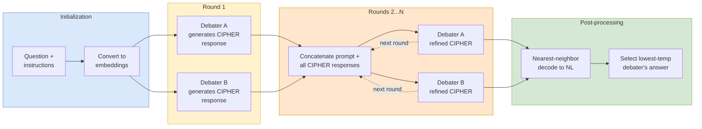

# Let Models Speak Ciphers: Multiagent Debate through Embeddings

## One-liner

![[cipher-multiagent-debate-embeddings/one-liner]]

## Summary

This paper introduces **CIPHER** (Communicative Inter-Model Protocol Through Embedding Representation), a protocol that replaces natural language with [[embedding-space-communication|embedding-space communication]] in [[multi-agent-debate]] settings. The core insight is that the token sampling step in standard LLM generation discards valuable information — the full probability distribution over the vocabulary is compressed into a single token. CIPHER bypasses sampling entirely, instead passing **weighted averages of all token embeddings** (weighted by softmax probabilities) between agents.

## Key Mechanism

At each generation step $t$, instead of sampling a token, CIPHER computes:

> $$\text{emb}(t) = \sum_i p(\text{vocab}_i) \cdot \text{emb}(\text{vocab}_i)$$

This weighted average stays within the convex hull of the tokenizer's embedding space, so the receiving model can process it as input.

**Stopping criterion:** Generation terminates when the nearest-neighbor embedding (over the vocabulary set) to the newly generated embedding is the EOS token, or when the maximum sequence length is reached. This replaces the standard "sampled token = EOS" check with a geometric proximity test in embedding space.

**Debate protocol (Algorithm 1):**

1. Convert question + instructions into embeddings via the tokenizer.
2. Each debater independently generates an initial CIPHER response (embedding sequence).
3. For each subsequent debate round, concatenate prompt embeddings with all debaters' CIPHER responses, then each debater generates a refined CIPHER response.
4. Post-processing: convert final embedding responses back to natural language via nearest-neighbor search, then aggregate. The response from the lowest-temperature debater is selected as the final answer.

## Experimental Setup

**Models tested:**
- **LLaMA2-70B** (Touvron et al., 2023b) — primary model, 4096-token context window
- **LLaMA-65B** (Touvron et al., 2023a) — shares tokenizer with LLaMA2, different embedding matrices
- **Falcon-40B-Instruct** (Penedo et al., 2023)
- **MPT-30B** (MosaicML, 2023)
- **WizardMath-70B-V1.0** (Luo et al., 2023)
- **LLaMA2-Chat-70B** — also tested in cross-model experiments

**Five benchmarks:**
1. **GSM8K** — grade school math word problems (Cobbe et al., 2021)
2. **Arithmetic** — mathematical expressions with six two-digit numbers using +, *, - (following Du et al., 2023)
3. **MMLU Formal Logic** — from the Humanities category (Hendrycks et al., 2020)
4. **MMLU High School Math** — from the STEM category
5. **MMLU Professional Psychology** — from the Social Science category

**Sampling and evaluation:** For large datasets (GSM8K, Professional Psychology, Arithmetic), temperatures were tuned on a validation set of 200 sampled questions, then evaluated on a separate test set of 200 questions. All debates used 3 rounds with 2 debaters (following Du et al., 2023). Each debate produces 5 responses per question for the debate methods; self-consistency baselines (Major@5) also use 5 responses for fair comparison.

**Prompting strategy:** Few-shot chain-of-thought (CoT) prompting combined with zero-shot instruction ("Let's think step by step"). GSM8K uses 3-shot examples for LLaMA/Falcon/MPT; WizardMath uses its own CoT prompt. MMLU datasets use 3-shot examples with step-by-step explanations. Debate round prompts instruct agents to incorporate other agents' solutions.

**Temperature selection:** Bayesian optimization (Nogueira, 2014) was used to select optimal temperature pairs for each method on each dataset. Hardware: 4x NVIDIA A100 SXM 80GB GPUs for LLaMA family debates.

**Baseline methods:**
- **Single Answer:** one LLM, one response
- **Self-Consistency (Major@5):** one LLM generates 5 independent responses, majority vote (Wang et al., 2023b)
- **Natural Language Debate (NLD):** multiagent debate using natural language communication (Du et al., 2023)

## Results: Identical-Model Debate (Table 1)

Debate accuracies (%) between two identical LLaMA family models at different temperatures, 3 rounds:

### LLaMA2-70B

| Method | GSM8K | H.S. Math | Psychology | Formal Logic | Arithmetic |
|---|---|---|---|---|---|
| Single Answer | 60.0±2.3 | 38.3±2.6 | 73.6±1.2 | 46.0±2.9 | 79.5±0.3 |
| Major@5 | 64.3±1.4 | 41.3±1.5 | 74.0±0.7 | 44.4±2.3 | 79.7±0.3 |
| NLD | 64.8±2.4 | 39.4±0.9 | 74.2±0.7 | 49.2±0.9 | 81.1±0.8 |
| **CIPHER** | **66.0±0.0** | **41.5±0.0** | **75.0±0.0** | **52.4±0.0** | **85.0±0.0** |

### LLaMA-65B

| Method | GSM8K | H.S. Math | Psychology | Formal Logic | Arithmetic |
|---|---|---|---|---|---|
| Single Answer | 50.8±1.6 | 33.8±1.8 | 68.8±1.5 | 43.5±2.7 | 27.6±1.1 |
| Major@5 | 52.7±3.3 | 36.7±0.7 | 70.5±0.4 | 46.8±2.1 | 29.8±0.9 |
| NLD | 51.7±1.4 | 36.7±0.9 | 70.0±2.0 | 46.0±1.7 | 30.4±0.4 |
| **CIPHER** | **52.9±0.0** | **38.5±0.0** | **70.9±0.0** | **50.8±0.0** | **33.0±0.0** |

Key observations: CIPHER achieves **zero variance** (deterministic embedding generation) while all baselines show 0.3–3.3% standard deviation from token sampling randomness. The largest gains are on Formal Logic (+3.2% over NLD for LLaMA2-70B) and Arithmetic (+3.9% over NLD for LLaMA2-70B).

## Results: Cross-Model Debate (Table 2)

Debates between LLaMA2-70B and LLaMA-65B (different models sharing a tokenizer but with distinct embedding matrices). Agreement = percentage of cases where both debaters produce the same final answer.

### Arithmetic

| | Round 1 | Round 2 | Round 3 |
|---|---|---|---|
| **NLD — LLaMA2-70B** | 73.0 | 69.0 | 72.0 |
| **NLD — LLaMA-65B** | 32.5 | 56.0 | 60.5 |
| **NLD — Agreement** | 31.5 | 61.5 | 77.5 |
| **CIPHER — LLaMA2-70B** | 73.5 | 70.0 | 74.5 |
| **CIPHER — LLaMA-65B** | 35.0 | 61.5 | 62.5 |
| **CIPHER — Agreement** | 34.5 | 69.0 | 78.0 |

### GSM8K

| | Round 1 | Round 2 | Round 3 |
|---|---|---|---|
| **NLD — LLaMA2-70B** | 61.0 | 58.8 | 61.8 |
| **NLD — LLaMA-65B** | 51.3 | 57.5 | 59.0 |
| **NLD — Agreement** | 51.5 | 77.5 | 88.8 |
| **CIPHER — LLaMA2-70B** | 61.5 | 64.3 | 64.8 |
| **CIPHER — LLaMA-65B** | 48.0 | 60.3 | 63.3 |
| **CIPHER — Agreement** | 44.0 | 70.3 | 83.8 |

Key observations: LLaMA-65B gains most dramatically — from 35.0% to 62.5% on Arithmetic via CIPHER. Cross-model CIPHER uses the receiver's embedding matrix for weighted averaging, ensuring outputs remain in the receiver's embedding space. CIPHER achieves higher per-debater accuracy than NLD despite slightly lower agreement rates in some rounds, suggesting CIPHER preserves individual model quality better.

## Results: Different LLMs (Figure 3)

All experiments on GSM8K dataset, 2-agent debate with 3 rounds. Approximate accuracies read from the bar chart (Figure 3):

| Model | Single Answer | NLD | CIPHER |
|---|---|---|---|
| WizardMath-70B | ~73% | ~75% | ~76% |
| LLaMA2-70B | ~60% | ~65% | ~66% |
| LLaMA2-Chat-70B | ~52% | ~55% | ~57% |
| LLaMA-65B | ~51% | ~52% | ~53% |
| Falcon-40B-Instruct | ~18% | ~20% | ~22% |
| MPT-30B | ~12% | ~15% | ~17% |

CIPHER provides an additional 0.5–3.5% boost over NLD across all models. Even weaker models (Falcon-40B, MPT-30B) benefit from CIPHER despite their low baseline accuracy.

**Optimal temperatures for different models on GSM8K (Table 5):**

| Model | Single Answer | NLD | CIPHER |
|---|---|---|---|
| LLaMA2-70B | 0.15 | (0.10, 0.20) | (0.22, 0.60) |
| LLaMA2-Chat-70B | 0.15 | (0.20, 0.40) | (0.25, 0.65) |
| LLaMA-65B | 0.20 | (0.10, 0.20) | (0.25, 0.85) |
| Falcon-40B-Instruct | 0.40 | (0.20, 0.40) | (0.25, 0.65) |
| MPT-30B | 0.45 | (0.35, 0.62) | (0.23, 0.64) |
| WizardMath-70B | 0.00 | (0.15, 0.35) | (0.26, 0.69) |

## Extended Scale Experiments (Figure 4)

### Number of Rounds (Figure 4a)

2 LLaMA2-70B debaters on Arithmetic dataset. Approximate values from the plot:

| Rounds | CIPHER | NLD |
|---|---|---|
| 1 | ~79% | ~79% |
| 2 | ~82% | ~78% |
| 3 | ~85% | ~81% |
| 4 | ~84% | ~82% |
| 5 | ~84% | ~82% |
| 6 | ~85% | ~83% |

Both methods show diminishing returns beyond round 3. CIPHER maintains a consistent ~2-3% advantage at every round count.

**Temperatures for extended rounds (Table 6):** NLD uses (0.013, 1.072); CIPHER uses (0.498, 1.725).

### Number of Debaters (Figure 4b)

LLaMA2-70B on GSM8K dataset, 3 rounds. Approximate values from the plot:

| Debaters | CIPHER | NLD |
|---|---|---|
| 2 | ~66% | ~65% |
| 3 | ~70% | ~68% |
| 4 | ~72% | ~70% |

More debaters help both methods, with CIPHER maintaining its edge.

**Temperatures for debater scaling (Table 7):**

| Debaters | NLD | CIPHER |
|---|---|---|
| 2 | (0.100, 0.500) | (0.250, 0.600) |
| 3 | (0.300, 0.500, 0.700) | (0.001, 0.725, 1.067) |
| 4 | (0.442, 0.176, 0.745, 0.539) | (0.641, 0.464, 0.507, 0.202) |

## Temperature Sensitivity (Figure 5 — Contour Plots)

2D contour plots show accuracy over all pairs of (temperature 1, temperature 2) for 2 LLaMA2-70B debaters. Three datasets analyzed: Arithmetic, GSM8K, Professional Psychology.

**NLD (top row of Figure 5):**
- Optimal performance occurs with both temperatures below 1.0.
- Higher temperatures cause LLMs to produce nonsensical natural language, harming the stronger debater.
- On Arithmetic: NLD optimal region clusters around temperatures (0.5–1.0, 0.5–1.0), peak ~81%.
- On GSM8K: NLD optimal region around (0.1–0.4, 0.2–0.8), peak ~65%.
- On Psychology: NLD optimal region around (0.0–0.4, 0.4–0.8), peak ~75%.

**CIPHER (bottom row of Figure 5):**
- Optimal regions appear on the **left side** of charts — low temperature 1 paired with high temperature 2.
- Temperature 1 (the agent whose response is used as final answer) should be low; temperature 2 can go well above 1.0.
- On Arithmetic: CIPHER peaks at ~85% with temperatures around (0.15, 1.75). The high-temperature agent's uniform distribution complements the confident low-temperature agent.
- On GSM8K: CIPHER peaks at ~66% with temperatures around (0.2, 0.9).
- On Psychology: CIPHER peaks at ~75% with temperatures around (0.1, 0.2) — more compact optimal region.

**Specific optimal temperature pairs (from Table 3):**

| Dataset | NLD temps | CIPHER temps |
|---|---|---|
| GSM8K (LLaMA2-70B) | (0.10, 0.20) | (0.22, 0.60) |
| H.S. Math | (0.30, 0.49) | (0.10, 0.82) |
| Psychology | (0.01, 0.51) | (0.10, 0.20) |
| Formal Logic | (0.10, 0.20) | (0.10, 0.20) |
| Arithmetic | (0.54, 1.00) | (0.15, 1.75) |

The Arithmetic result is most striking: CIPHER's optimal second temperature (1.75) is far above 1.0, which would produce gibberish in natural language but creates information-rich embeddings in CIPHER.

## Ablation: Partial CIPHER (Figure 6)

Tested on LLaMA2-70B pairs on the Arithmetic dataset. CIPHER is invoked only at token positions where the model exhibits high uncertainty, with greedy sampling used elsewhere.

**Two uncertainty measures:**
- **Max probability:** $U(t) = 1 - \max_i p(i)$ — high when the model is not confident in any single token
- **Entropy:** $U(t) = -\sum_i p(i) \log p(i)$ — high when probability is spread across many tokens

**Two reversed variants** invoke CIPHER when uncertainty is *low* ($U(t) \leq$ threshold):
- **Max reversed** and **Entropy reversed**

**Results across three temperature pairs:**

At temperature pair (0.15, 1.75):
- **Full CIPHER:** ~85%
- **Max (partial):** closely matches full CIPHER (~84-85%)
- **Entropy (partial):** closely matches full CIPHER (~84-85%)
- **Max reversed:** dramatic drop to ~50-55%
- **Entropy reversed:** dramatic drop to ~50-55%

At temperature pair (0.20, 0.90):
- **Full CIPHER:** ~82%
- **Max/Entropy (partial):** closely track full CIPHER
- **Max reversed/Entropy reversed:** drop to ~65-70%

At temperature pair (0.25, 0.60):
- **Full CIPHER:** ~80%
- **Max/Entropy (partial):** closely track full CIPHER
- **Max reversed/Entropy reversed:** drop to ~70-72%

The pattern is consistent: applying CIPHER at high-uncertainty positions captures nearly all the benefit, while applying it only at low-uncertainty positions (reversed) causes dramatic performance degradation. This confirms that CIPHER's advantage comes specifically from **preserving information during uncertain generation steps** — exactly the moments when token sampling loses the most information.

## Performance Bounds (Figure 8)

Upper and lower bounds of 2-agent CIPHER debate on GSM8K:

**LLaMA2-7B:** Random debater → 11.3%, Misalignment debater → 15.0%, Single Answer → 17.5%, CIPHER → (not reported separately), Expert debater → (higher). Debate can be **detrimental** for low-capacity models when paired with bad debaters.

**LLaMA2-70B:** Random debater → 52.3%, Misalignment debater → 59.2%, Single Answer → 61.5%, CIPHER → 63.3% (with normal debater), Expert debater → 68.0% (upper bound when one debater always gives ground truth), and Expert upper bound reaches 87.8%. A more powerful model is robust against bad debaters — even random/misaligned feedback causes only modest degradation.

## Limitations

- Requires models to **share a tokenizer**. Cross-tokenizer communication is flagged as an open problem. Different tokenizers use fundamentally different text segmentation strategies, making embedding alignment across tokenizer boundaries challenging.
- For models sharing a tokenizer but with different embedding matrices (e.g., LLaMA-65B vs LLaMA2-70B), a mapping is maintained: the sender generates using the receiver's embeddings. This works because both models index the same vocabulary, just with different learned vectors.
- Not yet tested on open-ended generation tasks (only reasoning benchmarks with discrete answers).
- The authors note that LLMs are only trained to intake embeddings of natural language tokens, so vectors outside the convex hull of the embedding space may not be interpretable — CIPHER's weighted average stays within this hull by construction.

## Theoretical Connection

The authors draw an analogy to **Expected SARSA** in reinforcement learning. The autoregressive generation process is framed as a Markov decision process: at step *t*, the state is the previously generated response, the action space is the vocabulary set V, the policy is the softmax distribution p(t), and the reward is tied to response accuracy. CIPHER computes expectations over all possible tokens (like Expected SARSA computing expectations over all next actions), while natural language generation probabilistically samples a single token (like vanilla SARSA). Expected SARSA is known to significantly outperform vanilla SARSA (Van Seijen et al., 2009), providing theoretical grounding for why CIPHER outperforms NLD.

## Significance

This is the **foundational paper** for latent-space inter-agent communication. It establishes that LLMs can communicate more effectively by bypassing the natural language bottleneck, opening a research direction pursued by the subsequent [[kv-cache-communication]] and [[latent-space-reasoning]] lines of work. [[coconut-reasoning-latent-space|Coconut]] later applies the same discrete-bottleneck insight to intra-model reasoning, and both are instances of the [[continuous-vs-discrete-representation|continuous vs. discrete trade-off]]. Notably, Coconut explicitly cites CIPHER as related work exploring continuous space for multi-agent communication.

## Source Materials

- [[raw/pdf/arxiv-2310.06272.pdf|PDF]] ([[raw/latex/arxiv-2310.06272.tar.gz|LaTeX source]])
