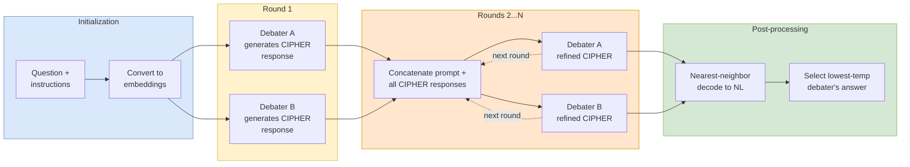

At each generation step $t$, instead of sampling a token, CIPHER computes:

> $$\text{emb}(t) = \sum_i p(\text{vocab}_i) \cdot \text{emb}(\text{vocab}_i)$$

This weighted average stays within the convex hull of the tokenizer's embedding space, so the receiving model can process it as input.

**Stopping criterion:** Generation terminates when the nearest-neighbor embedding (over the vocabulary set) to the newly generated embedding is the EOS token, or when the maximum sequence length is reached. This replaces the standard "sampled token = EOS" check with a geometric proximity test in embedding space.

**Debate protocol (Algorithm 1):**

1. Convert question + instructions into embeddings via the tokenizer.
2. Each debater independently generates an initial CIPHER response (embedding sequence).
3. For each subsequent debate round, concatenate prompt embeddings with all debaters' CIPHER responses, then each debater generates a refined CIPHER response.
4. Post-processing: convert final embedding responses back to natural language via nearest-neighbor search, then aggregate. The response from the lowest-temperature debater is selected as the final answer.
