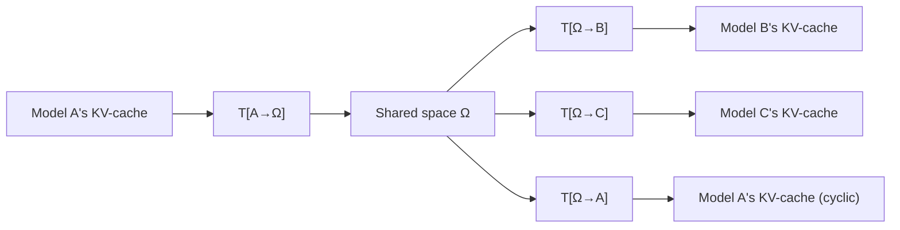

# Latent Space Communication via K-V Cache Alignment

## Summary

This paper, from [[google-deepmind|Google DeepMind]], proposes learning a **global shared KV-cache representation space** that any model in a pool can read from and write to. Each model is augmented with two adapters: one to translate its KV-cache **into** the shared space (T[α→Ω]) and one to translate **from** the shared space into its own latent space (T[Ω→α]). Inspired by the **interlingua** concept from machine translation — a single shared representation that mediates between all language pairs — this creates a universal "language" for [[kv-cache-communication]] that scales linearly with the number of models.

## Core Architecture

### The Interlingua Approach

Where [[cache-to-cache-semantic-communication|C2C]] learns a separate fuser per model pair (O(N²) fusers for N models), this paper learns **per-model adapters** into/out of a single shared space (O(N) adapters). Once a model translates its KV-cache into the shared space, that representation can be translated into any other model's space — including models added later.

### Translator Architecture

The adapter is a multi-layer transformer with **cross-attention**:

1. **Input transformation**: Layer-normalization → linear projection → GELU activation. Separate parameters for Key and Value caches. For mapping into the shared space, reshapes from model-specific dimensions (L_α × D_α) to shared dimensions (S × D_Ω). No forced 1-to-1 layer correspondence — the shared space is **not layer-wise demarcated**; the output adapters learn to reconstruct layer structure.

2. **Cross-attention (main workhorse)**: At each layer, the previous layer's output generates the Query; the corresponding input KV-cache layer provides Key and Value for cross-attention. This hierarchical cross-attention models the **sequential generative process** that produced the KV-cache in the first place.

3. **Output transformation**: Concatenate cross-attention outputs across layers → linear projection → reshape to target model's dimensions.

Each adapter is approximately **¼ the size** of the base model. Parameters are shared between Key and Value cache processing in the cross-attention, but separate in the input/output transformations.

### Shared-Space Projection Details

The shared space $\Omega$ has fixed dimensions $(S, D_\Omega)$ independent of any individual model's layer count $L_\alpha$ or hidden dimension $D_\alpha$. The input transformation reshapes from $(L_\alpha, D_\alpha)$ to $(S, D_\Omega)$ — this is a **many-to-many** layer mapping, not a 1-to-1 correspondence. The shared space is deliberately not layer-wise demarcated: information from all source layers is mixed into $S$ shared slots, and the output adapter must reconstruct layer structure for the target model. This design choice means the shared space captures **semantic content** rather than architectural structure, which is what enables cross-architecture transfer even when models have different layer counts (e.g., 4 vs. 16 layers in the size experiments).

The cross-attention mechanism within the adapter operates hierarchically: at each adapter layer $l$, the query comes from the previous adapter layer's output, while the key and value come from the corresponding layer $l$ of the input KV-cache. This mirrors the sequential generative process that produced the KV-cache: early adapter layers attend to early model layers (surface features), and later adapter layers attend to later model layers (semantic features), preserving the processing hierarchy.

### Training

Two loss functions explored:

**Suffix language modeling loss** (primary): Given text of length T, use the first s tokens' KV-cache as prefix. Translate this prefix through the shared space (source → Ω → target). The target model then generates the remaining T-s tokens, trained with standard cross-entropy. This loss doesn't require shared vocabularies — source and target operate on disjoint text sections.

**Reconstruction loss** (auxiliary, found unnecessary): Directly minimize ‖T[Ω→β](T[α→Ω](KV_α)) - KV_β‖². Found to be unnecessary when the suffix LM loss is available — the task objective provides better signal than explicit reconstruction.

All base models are **frozen** throughout — only adapters are trained.

## Key Experimental Results

### Experiments with Gemma-2 models (100M-400M parameters)

**Setting 1 — Same trajectory, different checkpoints**: Two checkpoints from the same training run (early and late). Translating prefixes through the shared space improves **both** models' performance beyond their baselines. The shared space **sharpens** KV-cache features.

**Setting 2 — Same origin, different fine-tuning**: Russian expert and Spanish expert branched from the same parent. The shared space successfully mediates between their divergent latent spaces. Cross-lingual prefix translation works — Spanish prefix KV → shared space → Russian model generates Russian suffix.

**Setting 3 — Different random initialization**: Three models trained on identical data but with different seeds. Despite zero trajectory overlap, the shared space enables effective translation. This demonstrates that the shared space captures **task-relevant structure** that transcends model-specific parameterizations.

**Setting 4 — Different model sizes**: A 400M model (16 layers) and a 100M model (4 layers). Despite the 4× layer difference, the adapters successfully learn the mapping. The weaker 100M model benefits from 400M model's translated prefix KV-cache.

### The Self-Improvement Effect

A remarkable finding: passing a model's own KV-cache through the shared space and back (cyclic: A → Ω → A) **improves** that model's language modeling performance. The shared space acts as a **regularizer or feature sharpener** — it distills the most transferable features of the KV-cache, filtering noise.

This parallels [[kvcomm-selective-kv-sharing|KVComm]]'s finding that selective KV sharing sometimes exceeds the Skyline (full context) — less can be more when the selection/transformation acts as beneficial regularization.

### Zero-Shot Extensibility

When a 4th model is added to a pool of 3:
- Only adapters for the new model are trained (using paths to/from 2 of the 3 existing models)
- The **untrained** paths (new model ↔ 3rd existing model) work zero-shot with only mild performance degradation
- This proves the shared space is genuinely **global** — not segmented by model pair. Cache blocks from different models become interchangeable once translated into the shared space.

### Module Portability

The shared space enables **zero-shot transfer of learned skills** between models:
- Soft prompts (prefix-tuning) learned on Model A for a specific task
- Translated through shared space to Model B's KV-cache space
- Model B can perform the task **without any task-specific training**

Evaluated on a prompt recovery meta-learning task with ~6K training tasks and 200 eval tasks. Performance approaches the upper bound of learning soft prompts directly on the target model. This has implications for:
- **Compute amortization**: Learn a skill once, deploy across all models in the pool
- **Data privacy**: Only one model needs exposure to task data; the skill transfers via the shared space

## Ablations

### Adapter architecture matters
| Architecture | Parameters | Performance |
|-------------|-----------|-------------|
| Identity mapping (no learned params) | 0 | Poor — even same-architecture models can't share KV directly |
| Linear mapping | 269M-806M | Matches base model (supports the "approximately linear" latent space hypothesis) |
| Cross-attention translator | 238M-645M | Exceeds base model, scales consistently with size |

The linear mapping result aligns with Moschella et al. (2022) — latent spaces of models trained on similar distributions are approximately related by linear transformations. But the cross-attention architecture is more parameter-efficient and scales better.

### Training paths
Not all pairwise paths need to be seen during training. Even training on 1 of 9 possible paths (in a 3-model pool) produces reasonable zero-shot generalization to unseen paths. Some stochasticity in path selection is beneficial for generalization.

## Comparison to Other KV-Cache Approaches

| Property | [[kvcomm-selective-kv-sharing\|KVComm]] | [[cache-to-cache-semantic-communication\|C2C]] | **This paper** |
|----------|---------|-----|------------|
| Training required | No | Per-pair fuser | Per-model adapters |
| Cross-architecture | No (same family only) | Yes (learned fuser) | Yes (shared space) |
| Scaling with N models | N/A | O(N²) fusers | **O(N) adapters** |
| Extensibility | N/A | Train new fuser per pair | Add 2 adapters, existing frozen |
| Module portability | No | No | **Yes (soft prompts transfer)** |
| Self-improvement | Via regularization effect | Via semantic enrichment | **Via shared space sharpening** |
| Experiment scale | 3B-8B models | 0.6B-14B models | 100M-400M models (smaller scale) |

### Comparison with KVComm's Selective Approach

[[kvcomm-selective-kv-sharing|KVComm]] and this paper represent fundamentally different philosophies for KV-cache communication. KVComm asks "**which** layers to share?" and uses a Gaussian-prior selection score to identify the most informative KV subset from a sender. This paper asks "**how** to translate?" and learns a universal representation that any model can read/write. The approaches are potentially complementary: one could apply KVComm's layer selection *before* translating into the shared space, transmitting only the most informative layers and reducing adapter input dimensionality.

A key architectural difference: KVComm operates **training-free** within the same model family (same architecture, same vocabulary), while this paper requires per-model adapter training but works **cross-architecture**. KVComm's layer selection assumes sender and receiver share the same layer semantics — layer 15 of Model A means roughly the same thing as layer 15 of Model B. The shared space approach makes no such assumption, which is why it handles the 4-layer ↔ 16-layer setting that KVComm cannot address.

### Cross-Architecture Implications

The successful 100M ↔ 400M communication (4 vs. 16 layers) is a proof of concept for cross-architecture KV-cache sharing, but it also reveals the challenges. The shared space must learn to abstract away not just different hidden dimensions but fundamentally different processing depths. The 4-layer model compresses all its computation into a shallow stack; the 16-layer model distributes processing across a deep hierarchy. The adapters must learn to "decompress" shallow representations into deep-format KV-caches and vice versa.

This connects to [[relative-representations-zero-shot|Moschella et al. (2022)]]'s finding that cross-architecture stitching degrades with architectural distance. The shared space approach handles this better than zero-shot stitching because the adapters are trained, but the training cost scales with architectural diversity in the pool. A pool containing only LLaMA variants would need simpler adapters than one spanning LLaMA, Gemma, and Qwen families.

## Limitations

- **Small scale**: All experiments on Gemma-2 100M-400M. Whether the shared space approach scales to frontier-size models (7B+) is unvalidated.
- **Same vocabulary assumed**: The suffix LM loss works across vocabularies, but experiments are conducted with shared vocabularies. Cross-vocabulary communication is theoretically possible but not demonstrated.
- **Adapter overhead**: Each model needs ~¼ of its parameter count in adapter parameters. For frontier models, this could be substantial.
- **Single-direction communication**: Experiments are prefix → shared space → target for suffix generation. Iterative multi-round debate via the shared space is not explored.

## Significance for the Wiki

This paper completes the [[kv-cache-communication]] picture by introducing the **scalable shared space** approach — a fundamentally different architecture from pairwise methods. The interlingua analogy is powerful: just as a universal interlingua would eliminate the need for O(N²) translation pairs between N languages, a shared KV-cache space eliminates the need for O(N²) cross-model adapters.

The module portability finding opens a new direction not explored by other papers in this collection: **skill transfer** between models via latent space, going beyond just communication to knowledge sharing.

The self-improvement effect (cyclic translation improves the original model) connects to [[cache-to-cache-semantic-communication|C2C]]'s effective rank increase and [[kvcomm-selective-kv-sharing|KVComm]]'s finding that selective sharing can exceed the skyline — all suggesting that latent-space mediation acts as a form of beneficial regularization.

## Source Materials

- [[raw/pdf/arxiv-2601.06123.pdf|PDF]] ([[raw/latex/arxiv-2601.06123.tar.gz|LaTeX source]])
