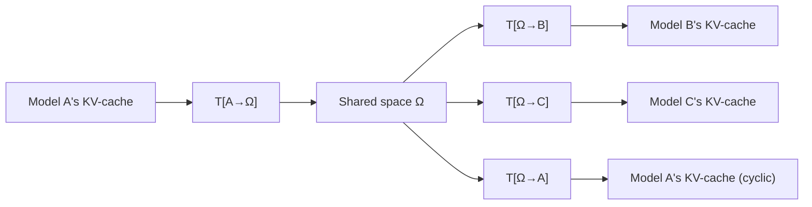

### The Interlingua Approach

Where [[cache-to-cache-semantic-communication|C2C]] learns a separate fuser per model pair (O(N²) fusers for N models), this paper learns **per-model adapters** into/out of a single shared space (O(N) adapters). Once a model translates its KV-cache into the shared space, that representation can be translated into any other model's space — including models added later.

### Translator Architecture

The adapter is a multi-layer transformer with **cross-attention**:

1. **Input transformation**: Layer-normalization → linear projection → GELU activation. Separate parameters for Key and Value caches. For mapping into the shared space, reshapes from model-specific dimensions (L_α × D_α) to shared dimensions (S × D_Ω). No forced 1-to-1 layer correspondence — the shared space is **not layer-wise demarcated**; the output adapters learn to reconstruct layer structure.

2. **Cross-attention (main workhorse)**: At each layer, the previous layer's output generates the Query; the corresponding input KV-cache layer provides Key and Value for cross-attention. This hierarchical cross-attention models the **sequential generative process** that produced the KV-cache in the first place.

3. **Output transformation**: Concatenate cross-attention outputs across layers → linear projection → reshape to target model's dimensions.

Each adapter is approximately **¼ the size** of the base model. Parameters are shared between Key and Value cache processing in the cross-attention, but separate in the input/output transformations.

### Shared-Space Projection Details

The shared space $\Omega$ has fixed dimensions $(S, D_\Omega)$ independent of any individual model's layer count $L_\alpha$ or hidden dimension $D_\alpha$. The input transformation reshapes from $(L_\alpha, D_\alpha)$ to $(S, D_\Omega)$ — this is a **many-to-many** layer mapping, not a 1-to-1 correspondence. The shared space is deliberately not layer-wise demarcated: information from all source layers is mixed into $S$ shared slots, and the output adapter must reconstruct layer structure for the target model. This design choice means the shared space captures **semantic content** rather than architectural structure, which is what enables cross-architecture transfer even when models have different layer counts (e.g., 4 vs. 16 layers in the size experiments).

The cross-attention mechanism within the adapter operates hierarchically: at each adapter layer $l$, the query comes from the previous adapter layer's output, while the key and value come from the corresponding layer $l$ of the input KV-cache. This mirrors the sequential generative process that produced the KV-cache: early adapter layers attend to early model layers (surface features), and later adapter layers attend to later model layers (semantic features), preserving the processing hierarchy.

### Training

Two loss functions explored:

**Suffix language modeling loss** (primary): Given text of length T, use the first s tokens' KV-cache as prefix. Translate this prefix through the shared space (source → Ω → target). The target model then generates the remaining T-s tokens, trained with standard cross-entropy. This loss doesn't require shared vocabularies — source and target operate on disjoint text sections.

**Reconstruction loss** (auxiliary, found unnecessary): Directly minimize ‖T[Ω→β](T[α→Ω](KV_α)) - KV_β‖². Found to be unnecessary when the suffix LM loss is available — the task objective provides better signal than explicit reconstruction.

All base models are **frozen** throughout — only adapters are trained.
