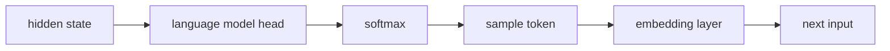
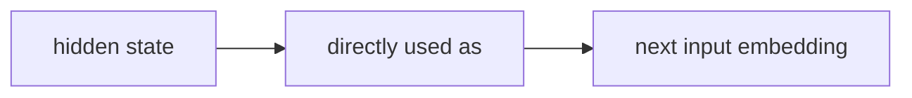

# Training Large Language Models to Reason in a Continuous Latent Space

## Summary

This paper introduces **Coconut** (Chain of Continuous Thought), a paradigm that allows LLMs to reason in continuous latent space rather than through discrete natural language tokens. Instead of generating a chain-of-thought as text, the model feeds its **last hidden state** directly back as the next input embedding, bypassing the token decoding and re-encoding steps entirely. The model alternates between "language mode" (standard autoregressive generation) and "latent mode" (hidden-state feedback loop), controlled by special `<bot>` and `<eot>` tokens.

This is a foundational paper for [[latent-space-reasoning]] — the intra-model counterpart to [[embedding-space-communication|inter-model latent communication]].

## Core Mechanism

> [!diagram|left]
> ```mermaid
> graph LR
>     IN["**Input Prompt**<br>Token embeddings"]
>     TF["**Transformer**<br>Full forward pass<br>All N layers"]
>     HS["**Last-Layer Hidden State**<br>Continuous vector"]
>     DEC{{"K steps done?"}}
>     FB["**Feed Back**<br>Use hidden state directly as<br>next input embedding<br>(no decoding!)"]
>     OUT["**Decode**<br>Standard softmax<br>→ text tokens"]
> 
>     IN --> TF --> HS --> DEC
>     DEC -->|"Yes"| OUT
>     DEC -->|"No"| FB
>     FB -.->|"continuous thought loop"| TF
> 
>     style IN fill:#dae8fc,stroke:#6c8ebf
>     style TF fill:#f5f5f5,stroke:#666666
>     style HS fill:#fff2cc,stroke:#d6b656
>     style DEC fill:#ffe6cc,stroke:#d79b00
>     style FB fill:#d5e8d4,stroke:#82b366
>     style OUT fill:#e1d5e7,stroke:#9673a6
> ```

> [!notation|right]
> | Label | Notation |
> |---|---|
> | Token embeddings | $x_1, \ldots, x_T$ |
> | Continuous vector | $h_t \in \R^d$ |
> | Feed back hidden state | $h_t$ used directly as next input embedding at position $t+1$ |
> | K steps | Number of continuous thought iterations |

### The Continuous Thought Loop

In standard CoT, the reasoning pipeline is:



In Coconut, during latent mode:



The last hidden state $h_t$ (after the final layer norm) serves as the "continuous thought" — a $d$-dimensional vector representing the current reasoning state. This vector is fed back as the input embedding for position $t+1$, creating a **recurrent loop** within the transformer's forward pass. Each continuous thought requires a separate forward pass through the full transformer stack.

### Mode Switching

- `<bot>` (beginning of thought): Switches from language mode to latent mode. Inserted immediately after the question tokens.
- `<eot>` (end of thought): Switches back to language mode. The model then generates the remaining reasoning chain (if any) and the answer in natural language.
- Two strategies for `<eot>` placement: (a) a trained binary classifier on latent thoughts, or (b) fixed-length padding. Both work comparably; the paper uses fixed-length for simplicity.

### Training Procedure: Multi-Stage Curriculum

Coconut **cannot learn latent reasoning from scratch** — this is a key finding. The model requires a carefully designed curriculum that progressively replaces language reasoning steps with continuous thoughts:

1. **Stage 0 (initial)**: Train on standard CoT data — full language reasoning chains.
2. **Stage k**: Replace the first k language reasoning steps with k × c continuous thoughts (c is a hyperparameter controlling how many latent steps replace one language step). Mask the loss on questions and latent thoughts.
3. **Final stage**: All language reasoning steps are replaced. The model reasons entirely in latent space, outputting only the final answer.

The optimizer state is **reset** between stages (following Deng et al., 2024). The loss function is standard negative log-likelihood on the remaining text tokens only — continuous thoughts are not supervised to compress the removed language steps, but to **facilitate prediction of future reasoning**. This is a crucial distinction: the model is free to learn representations that are better than language for reasoning.

## The BFS Discovery: Emergent Breadth-First Search

The paper's most striking finding: continuous thoughts can **encode multiple alternative reasoning paths simultaneously**, enabling emergent breadth-first search (BFS).

### How It Works

In a [[latent-space-reasoning|latent reasoning]] step, the continuous thought is not committed to a single next token — it's a dense vector that can represent a **superposition** of possible continuations. When probed (by forcing the model to decode to language after intermediate latent thoughts), the model reveals:

1. **First continuous thought**: Probability mass is spread across multiple candidate next steps (e.g., 4 possible paths with probabilities 0.33, 0.28, 0.22, 0.17). The model is exploring broadly.
2. **Second continuous thought**: Probability mass concentrates — the model narrows to 1-2 strong candidates (e.g., one path at 0.87). The model has evaluated and pruned.
3. **Subsequent thoughts**: Further narrowing until a single path is selected.

This is in sharp contrast to CoT, which commits to one path at the first token and **cannot backtrack**. If CoT makes a wrong turn (e.g., follows a dead-end edge in a graph), it either hallucinates non-existent connections or reaches an irrelevant conclusion.

### The Height–Confidence Relationship

The paper provides a theoretical explanation for why BFS emerges: nodes **closer to the goal** (lower "height" in the reasoning graph) are inherently easier to evaluate. The model's value estimates are more accurate for near-terminal nodes than for early-stage nodes. Therefore, it's advantageous to **delay commitment** — keep multiple paths alive until they're close enough to the goal that the model can confidently distinguish correct from incorrect.

This is formalized by measuring the correlation between a node's height (shortest distance to any leaf) and the accuracy of the model's probability estimates. Nodes with lower height receive more accurate and decisive evaluations. Nodes with greater height show ambiguous probability distributions — exactly the positions where premature commitment (as in CoT) causes errors.

### Connection to Search Algorithms

| Property | CoT | Coconut |
|----------|-----|---------|
| Search strategy | Greedy / DFS (one path, no backtracking) | Emergent BFS (multiple paths, progressive narrowing) |
| Commitment | Immediate (first token locks in direction) | Deferred (continuous thoughts maintain options) |
| Error recovery | Cannot backtrack; hallucinates or fails | Prunes incorrect paths through evaluation |
| Representation | Discrete tokens (one choice per step) | Continuous vectors (superposition of choices) |

The paper notes that this BFS behavior is **not explicitly trained** — it emerges from the latent space's ability to represent superpositions. Prior work (Tree of Thoughts, etc.) required explicit search algorithms bolted on; Coconut achieves similar behavior implicitly.

### Empirical Critique by Cui et al. (2026)

[[latent-reasoning-supervision-analysis|Cui et al. (2026)]] subjected Coconut's BFS claim to the first systematic empirical test and **partially falsified it**. Their findings:

1. **Capacity confirmed**: Coconut's latent vectors do encode multiple candidate trajectories. Pass@100 over 100 stochastic latent–text rollouts is 69-82% on GPT-2, vs. 44-62% for explicit reasoning at the same prefix lengths — a 20+ point latent advantage.
2. **BFS expansion falsified**: When the number of latent prefix steps increases from 1 to 5, the average number of distinct next-step predictions **decreases** from 18.75 to 15.84. True BFS would *expand* the frontier; Coconut's process **prunes** it. The latent reasoning loop exhibits implicit pruning, not breadth-first exploration.
3. **Amplification fails**: Coconut's majority-vote accuracy (39-44%) is **3-4 points lower** than explicit reasoning's. The larger candidate pool is not being concentrated on the correct answer.
4. **Inference collapse**: Coconut's stage-wise curriculum produces a degenerate inference mode where reducing latent steps below the final-stage maximum causes the model to skip remaining textual reasoning entirely. This breaks any clean ablation of "use $k$ latent steps at inference."
5. **Improved Coconut**: Cui et al. propose a data-mixing fix to the stage-wise curriculum — at training stage $k$, sample from earlier stage $i$ ($i \leq k$) with proportion $(i+1)$. This restores stable behavior under varied inference latent lengths and improves GPT-2 GSM8K-Aug accuracy from **34.09% → 41.06%** (and GSM8K-Aug-NL from 24.90% → 33.48%) — the first published improvement to Coconut's training scheme.

The implication is significant: Coconut's most celebrated finding (emergent BFS) is **partially true and partially overstated**. The latent state has the *capacity* for multi-path exploration, but the iterative training dynamics produce *pruning*, not expansion. The [[frontier-research-directions|frontier-scale superposition reasoning agenda]] needs to factor this in: scaling Coconut alone will not produce BFS at frontier scale; the optimization process also has to be redesigned.

## Experimental Results

All experiments use **GPT-2** as the base model — this is a small-scale proof of concept, not a demonstration at frontier scale.

### Main Results

| Dataset | CoT Acc. | Coconut Acc. | CoT Tokens | Coconut Tokens |
|---------|----------|--------------|------------|----------------|
| GSM8k (math) | 42.9% | 34.1% | 25.0 | 8.2 |
| ProntoQA (logic) | 98.8% | 99.8% | 92.5 | 9.0 |
| ProsQA (planning) | 77.5% | 97.0% | 49.4 | 14.2 |

Key observations:
- **ProsQA** (the paper's new DAG-based logical reasoning dataset, which demands planning and search): Coconut dramatically outperforms CoT (97.0% vs 77.5%). This is the task where BFS matters most.
- **ProntoQA** (simpler logical reasoning): Coconut matches CoT (~99.8%) with 10× fewer tokens.
- **GSM8k** (math): Coconut underperforms CoT (34.1% vs 42.9%) but with 3× fewer tokens. Math requires complex contextual understanding that benefits from the full expressiveness of language chains.

### Efficiency–Accuracy Trade-off

The critical comparison is not raw accuracy but the **Pareto frontier** of accuracy vs. tokens generated. When CoT models have their reasoning chains progressively shortened (via iCoT internalization), accuracy drops steeply. When Coconut replaces language steps with continuous thoughts, accuracy drops much more gradually. Coconut achieves better accuracy at every token budget below full CoT.

### Ablation Results

| Variant | GSM8k | ProntoQA | ProsQA |
|---------|-------|----------|--------|
| **Coconut (full)** | **34.1%** | **99.8%** | **97.0%** |
| w/o curriculum (direct training in final stage) | 14.4% | 52.4% | 76.1% |
| w/o thought (curriculum but no latent thoughts) | 21.6% | 99.9% | 95.5% |
| Pause as thought (learnable pause tokens) | 24.1% | 100.0% | 96.6% |
| Pause token baseline (Goyal et al.) | 16.4% | 77.7% | 75.9% |
| iCoT baseline (Deng et al.) | 30.0% | 99.8% | 98.2% |
| No-CoT baseline | 16.5% | 93.8% | 76.7% |

Critical findings:
- **Curriculum is essential**: Without it, Coconut collapses to near No-CoT performance. The model cannot learn latent reasoning from scratch with gradient descent alone.
- **Continuous thoughts > pause tokens**: On GSM8k, Coconut (34.1%) significantly outperforms pause-as-thought (24.1%), confirming that the hidden-state feedback carries real information beyond just providing extra compute.
- **The c hyperparameter matters**: Increasing c (latent thoughts per language step) from 0→1→2 steadily improves performance, validating that chaining more continuous thoughts scales reasoning ability.

### Decoding Continuous Thoughts

When a continuous thought is decoded to its nearest-neighbor tokens, the results are interpretable and often correspond to **intermediate variables** in the computation. For math problems, decoded thoughts reveal intermediate calculation results. This suggests the continuous thoughts are learning compressed but meaningful reasoning representations, not arbitrary vectors.

## ProsQA: A New Benchmark for Planning

The paper introduces **ProsQA** (Proof with Search Question-Answering), a logical reasoning dataset built on directed acyclic graphs (DAGs):

- ~23 nodes, ~36 edges per graph
- Average shortest path length: 3.8 steps
- ~1.6 shortest paths on average (multiple valid routes)
- Binary questions: "Is [Entity] a [Concept A] or [Concept B]?"
- Key challenge: **distractor branches** — the DAG structure creates many plausible-looking wrong paths

ProsQA is specifically designed to test planning ability — a model must navigate a graph with many dead ends, requiring look-ahead or backtracking. This is exactly where CoT's greedy nature fails and Coconut's emergent BFS excels.

## Theoretical Foundations

### Why Language Is Not Optimal for Reasoning

The paper opens with a neuroscience argument: human brain imaging studies (Amalric & Dehaene 2019; Monti et al. 2007, 2009, 2012; Fedorenko et al. 2011, 2024) consistently show that **the language network remains largely inactive during reasoning tasks**. Language is optimized for communication, not computation. Forcing LLMs to reason in language space imposes an artificial constraint.

### Compute Allocation Problem

In CoT, every token gets roughly the same compute budget (one forward pass). But reasoning difficulty varies enormously across token positions:
- Most tokens are for **fluency** ("Let's", "we", "therefore") — trivially predicted, no reasoning needed.
- A few critical tokens encode the **actual reasoning steps** — these may require complex planning and deserve far more compute.

Coconut addresses this: in latent mode, each continuous thought gets a full forward pass dedicated to reasoning, with no compute wasted on fluency tokens.

### Connection to Expressivity Theory

Feng et al. (2023) showed that CoT increases the **effective depth** of transformers by looping outputs back as inputs. Coconut preserves this property — each continuous thought adds an effective transformer depth — while removing the information bottleneck of passing through the discrete token layer.

## Limitations

- **Scale**: All experiments on GPT-2. Whether the BFS behavior persists at frontier model scale is unknown.
- **Task scope**: Strong results on logical reasoning and planning, weaker on math (GSM8k). Not tested on open-ended generation, NLU, or coding.
- **Training cost**: The multi-stage curriculum adds complexity. Each stage requires separate training with optimizer resets. n latent thoughts require n+1 sequential forward passes per sample.
- **Cannot learn from scratch**: The dependency on language CoT data for curriculum bootstrapping is a fundamental limitation — you need good language reasoning chains before you can train latent reasoning.
- **Parallelism challenges**: Sequential forward passes for continuous thoughts cannot be parallelized, creating a training efficiency bottleneck.

## Significance for the Wiki

Coconut establishes [[latent-space-reasoning]] as a viable paradigm and reveals that continuous representations can encode **superpositions of reasoning paths** — a property that discrete tokens fundamentally cannot. It shifts the "latent space advantage" from the inter-agent communication context of [[cipher-multiagent-debate-embeddings|CIPHER]] to single-model reasoning, suggesting a unified principle: **the discrete token bottleneck is harmful wherever it appears — between models or within a model's own reasoning**.

The BFS emergence result connects to broader themes about what [[continuous-vs-discrete-representation|continuous representations can do that discrete ones cannot]], and the training curriculum challenge connects to the open question of how models learn to operate in latent space at all.

## Source Materials

- [[raw/pdf/arxiv-2412.06769.pdf|PDF]] ([[raw/latex/arxiv-2412.06769.tar.gz|LaTeX source]])
