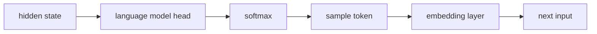
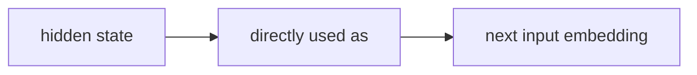

> [!diagram|left]
> ```mermaid
> graph LR
>     IN["**Input Prompt**<br>Token embeddings"]
>     TF["**Transformer**<br>Full forward pass<br>All N layers"]
>     HS["**Last-Layer Hidden State**<br>Continuous vector"]
>     DEC{{"K steps done?"}}
>     FB["**Feed Back**<br>Use hidden state directly as<br>next input embedding<br>(no decoding!)"]
>     OUT["**Decode**<br>Standard softmax<br>→ text tokens"]
> 
>     IN --> TF --> HS --> DEC
>     DEC -->|"Yes"| OUT
>     DEC -->|"No"| FB
>     FB -.->|"continuous thought loop"| TF
> 
>     style IN fill:#dae8fc,stroke:#6c8ebf
>     style TF fill:#f5f5f5,stroke:#666666
>     style HS fill:#fff2cc,stroke:#d6b656
>     style DEC fill:#ffe6cc,stroke:#d79b00
>     style FB fill:#d5e8d4,stroke:#82b366
>     style OUT fill:#e1d5e7,stroke:#9673a6
> ```

> [!notation|right]
> | Label | Notation |
> |---|---|
> | Token embeddings | $x_1, \ldots, x_T$ |
> | Continuous vector | $h_t \in \R^d$ |
> | Feed back hidden state | $h_t$ used directly as next input embedding at position $t+1$ |
> | K steps | Number of continuous thought iterations |

### The Continuous Thought Loop

In standard CoT, the reasoning pipeline is:



In Coconut, during latent mode:



The last hidden state $h_t$ (after the final layer norm) serves as the "continuous thought" — a $d$-dimensional vector representing the current reasoning state. This vector is fed back as the input embedding for position $t+1$, creating a **recurrent loop** within the transformer's forward pass. Each continuous thought requires a separate forward pass through the full transformer stack.

### Mode Switching

- `<bot>` (beginning of thought): Switches from language mode to latent mode. Inserted immediately after the question tokens.
- `<eot>` (end of thought): Switches back to language mode. The model then generates the remaining reasoning chain (if any) and the answer in natural language.
- Two strategies for `<eot>` placement: (a) a trained binary classifier on latent thoughts, or (b) fixed-length padding. Both work comparably; the paper uses fixed-length for simplicity.

### Training Procedure: Multi-Stage Curriculum

Coconut **cannot learn latent reasoning from scratch** — this is a key finding. The model requires a carefully designed curriculum that progressively replaces language reasoning steps with continuous thoughts:

1. **Stage 0 (initial)**: Train on standard CoT data — full language reasoning chains.
2. **Stage k**: Replace the first k language reasoning steps with k × c continuous thoughts (c is a hyperparameter controlling how many latent steps replace one language step). Mask the loss on questions and latent thoughts.
3. **Final stage**: All language reasoning steps are replaced. The model reasons entirely in latent space, outputting only the final answer.

The optimizer state is **reset** between stages (following Deng et al., 2024). The loss function is standard negative log-likelihood on the remaining text tokens only — continuous thoughts are not supervised to compress the removed language steps, but to **facilitate prediction of future reasoning**. This is a crucial distinction: the model is free to learn representations that are better than language for reasoning.
