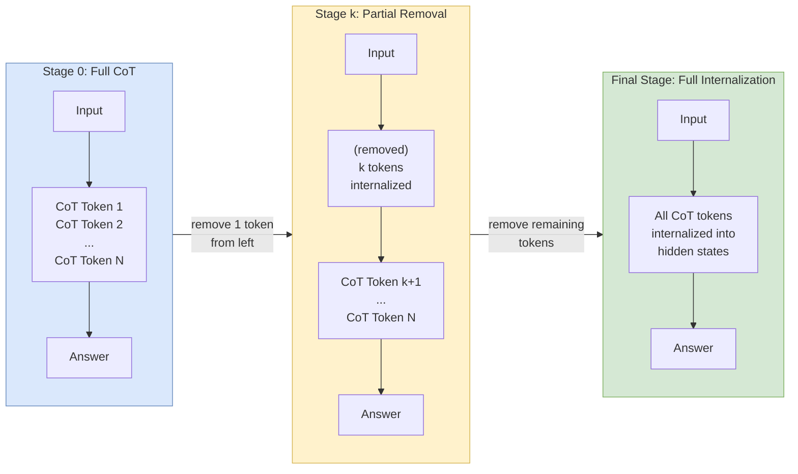

# From Explicit CoT to Implicit CoT: Learning to Internalize CoT Step by Step (iCoT)

## Summary

**iCoT-SI** (Stepwise Internalization) progressively removes explicit chain-of-thought tokens from a trained model, one token at a time from the left, forcing the model to compress reasoning into its hidden states. This paper directly inspired [[coconut-reasoning-latent-space|Coconut]]'s multi-stage curriculum — Coconut's key innovation was replacing the removed tokens with continuous latent thoughts rather than simply deleting them.

## Core Mechanism

Starting from a model trained on explicit CoT:
1. **Stage 0**: Full CoT training (input → CoT tokens → answer)
2. **Stage 1**: Remove the **first** CoT token; finetune on remaining CoT + answer
3. **Stage k**: Remove k tokens from the left; finetune
4. **Final stage**: All CoT tokens removed; model predicts answer directly from input

### The Linear Removal Schedule

The number of tokens removed at training step t follows:

> s(t) = δ × t / T

Where T is total steps per epoch and δ controls removal rate (δ=8 for multiplication, δ=1 or 8 for GSM8K). Once s(t) exceeds the actual CoT length, all tokens are removed.

### Removal Smoothing

A stochastic offset is added: s*(t) = s(t) + o, where o is drawn from $P(o) \propto \exp(-\lambda o)$ with **λ=4**. This means ~98% of the time o=0, but ~2% probability of removing one extra token. This brief exposure to "future" removal levels smooths the curriculum and prevents catastrophic accuracy drops at stage transitions. **Without smoothing**: accuracy drops to zero around the 50-token removal mark and never recovers.

### Optimizer Reset

AdamW's second-order gradient estimates are **reset** whenever an additional CoT token is removed. Without this, stale gradient statistics from the previous stage cause training to collapse permanently around step 100. Both techniques — smoothing and optimizer reset — were adopted directly by [[coconut-reasoning-latent-space|Coconut]].

### Left-Side Removal (Critical Design Choice)

Tokens are removed from the **left** (beginning) of the CoT, not the right. Right-side removal performs "significantly worse" — the model fails around s(t)=100 removals. Hypothesis: early CoT tokens (problem setup, initial reasoning) can be internalized across all input positions. Late CoT tokens (near the answer) depend on earlier tokens already being internalized, creating a harder optimization problem.

## Key Results

### Multiplication (GPT-2 Small, 117M parameters)

| Task | No CoT | iCoT-KD | **iCoT-SI** | Explicit CoT | Speed ratio |
|------|--------|---------|-------------|-------------|-------------|
| 4×4 | 0.29 | 0.97 | **1.00** | 1.00 | 1.02× |
| 5×5 | 0.01 | 0.10 | **0.95** | 1.00 | 1.00× |
| 7×7 | 0.00 | — | **0.95** | 1.00 | 1.00× |
| 9×9 | 0.00 | — | **0.99** | 1.00 | 1.00× |

- Standard No-CoT cannot solve beyond 4×4 multiplication
- iCoT-SI solves **9×9 multiplication** with 99% accuracy and **11× faster** than explicit CoT (speed 1.00 vs 0.09, because explicit CoT for 9×9 requires 246 intermediate tokens)
- iCoT-KD (the prior knowledge distillation approach) caps at 10% on 5×5 — iCoT-SI is dramatically more effective

### GSM8K (All Model Sizes)

| Model | No CoT | iCoT-KD | **iCoT-SI** | Explicit CoT |
|-------|--------|---------|-------------|-------------|
| GPT-2 Small (117M) | 0.13 | 0.20 | **0.30** | 0.41 |
| GPT-2 Medium (355M) | 0.17 | 0.22 | **0.35** | 0.44 |
| Phi-3 (3.8B) | 0.28 | — | **0.31** | 0.74 |
| Mistral 7B | 0.38 | — | **0.51** | 0.68 |
| GPT-4 (5-shot, no FT) | — | — | — | 0.91 (CoT) / 0.44 (no CoT) |

- Mistral 7B with iCoT-SI: **51% on GSM8K without any visible reasoning** — surpasses GPT-4's 44% no-CoT baseline
- The accuracy gap vs explicit CoT narrows with model size: 11pp gap at 117M → 17pp at 7B (though Phi-3 shows a wider gap, suggesting architecture matters)

### CoT Token Statistics

| Task | Median CoT Tokens | Train Size |
|------|-------------------|------------|
| 4×4 mult | 46 | 808K |
| 5×5 mult | 74 | 808K |
| 7×7 mult | 148 | 808K |
| 9×9 mult | 246 | 808K |
| GSM8K | 19-24 | 378K |

The 246-token CoT for 9×9 multiplication being fully internalized into zero visible tokens is the paper's most impressive result.

## Ablation Findings

### Aggressive Schedules Fail
δ=16 (twice the standard δ=8) causes **complete training collapse** — the model never converges. The curriculum must be gradual enough for the model to adapt at each stage.

### Seed Sensitivity on 9×9
Two runs with identical hyperparameters but different random seeds: one succeeds (99% accuracy), the other fails completely. The training landscape for implicit reasoning is highly non-convex, and the curriculum only finds good solutions from certain initializations.

### Partial Internalization (Intermediate Checkpoints)
On 11×11 multiplication (too hard for full internalization), intermediate checkpoints achieve **>70% accuracy at 4× the speed of explicit CoT**. This demonstrates that even when full internalization fails, the method provides a practical accuracy-speed trade-off.

## Connection to Coconut

| Design choice | iCoT | Coconut |
|--------------|------|---------|
| What happens to removed tokens | Deleted (model must internalize into existing hidden states) | **Replaced with continuous latent thoughts** (model gets dedicated reasoning medium) |
| Reasoning medium after removal | Implicit (hidden states only, fixed depth) | Explicit continuous vectors (each adds effective depth via [[cot-expressivity-theory|depth extension]]) |
| Recurrence | None — limited to model's fixed depth | Yes — each latent thought is a full forward pass |
| Superposition | Cannot encode (implicit, fixed architecture) | **Enabled** — continuous vectors support [[superposition-coconut-theory|proven BFS via superposition]] |
| Curriculum | Progressive left-side token removal | Progressive token-to-latent replacement |
| Optimizer reset | Yes (critical) | Yes (adopted from iCoT) |
| Removal smoothing | Yes (λ=4) | Not explicitly reported |
| Capacity ceiling | Fails on 11×11+ multiplication | Handles ProsQA (97.0%) requiring search |

iCoT's capacity ceiling — inability to fully internalize long reasoning chains because hidden-state compression is bounded by fixed model depth — is exactly what motivated Coconut to provide an explicit continuous thought space. [[cot-expressivity-theory|Feng et al.]] prove that effective depth is the key bottleneck; iCoT cannot add depth (it only uses existing hidden states), while Coconut adds depth via the latent feedback loop.

## Curriculum Design Details

### Why Left-Side Removal Works: The Compression Hierarchy

The paper's most important design choice is removing tokens from the **left** (beginning) of the CoT rather than the right. The underlying reasoning connects to how information flows through chains:

**Early CoT tokens** (problem setup, initial reasoning) encode context-setting information that the model can plausibly reconstruct from the input question alone. Removing these asks the model to internalize information it already has access to via its encoding of the question.

**Late CoT tokens** (near the answer) encode specific conclusions that depend on earlier steps. Right-side removal creates **orphaned context** — intermediate results pointing to a conclusion the model must produce from nothing. Right-side removal fails at ~100 tokens because this orphaned-context problem becomes intractable.

### The Optimizer Reset Mechanism

When CoT tokens are removed at stage transitions, AdamW's second-order gradient estimates ($v_t$ and $m_t$) become **stale**: they reflect the previous stage's optimization landscape. Without resetting, training **collapses permanently** around step 100 — the model enters a local minimum the stale momentum cannot escape. This finding was **directly adopted by** [[coconut-reasoning-latent-space|Coconut]], revealing that each stage of internalization is a qualitatively different optimization problem.

### The Removal Smoothing Distribution

The stochastic offset $o \sim P(o) \propto \exp(-\lambda o)$ with $\lambda = 4$ gives $P(o=0) \approx 0.982$, $P(o=1) \approx 0.018$. So ~2% of training examples briefly expose the model to the next stage's difficulty. Without this lookahead, accuracy drops to **zero** at ~50 tokens removed and never recovers — the transition is too abrupt.

## Connection to Coconut's Later Work (Detailed)

iCoT is the **direct ancestor** of [[coconut-reasoning-latent-space|Coconut]]. The progression represents a precise scientific advancement:

**The insight iCoT provides**: When CoT tokens are removed, the model must internalize reasoning into existing hidden states. iCoT proves this is possible (99% on 9x9 multiplication) but reveals a **capacity ceiling** — the model's fixed depth limits how much can be compressed. 11x11 multiplication exceeds this capacity.

**Coconut's innovation over iCoT**: Instead of deleting CoT tokens, Coconut **replaces** them with continuous latent thoughts — each a full forward pass that adds effective depth beyond the architectural limit. This directly addresses iCoT's capacity ceiling. The expressivity gap is measurable: on ProsQA (requiring search), Coconut achieves 97.0% where iCoT's approach (no recurrence, fixed depth) would be limited by the $\text{TC}^0$ barrier [[cot-expressivity-theory|Feng et al.]] identify.

**The Phi-3 anomaly**: iCoT's Phi-3 (3.8B) shows a **wider** gap vs. explicit CoT than GPT-2 Medium (355M), despite 10x more parameters. This suggests **architecture matters more than scale** for internalization. The finding has implications for Coconut: hidden-state quality varies across architectures, so continuous thoughts may benefit different architectures differently.

## Failure Mode Analysis

### Aggressive Schedule Collapse ($\delta = 16$)

Doubling the removal rate causes **complete training collapse**: accuracy drops to near-zero early and stays there. The model needs a minimum number of training steps at each difficulty level to reorganize internal representations. Once the model falls behind the curriculum, it cannot catch up — the failure is catastrophic, not gradual.

### Seed Sensitivity on 9x9 Multiplication

Two identical runs with different random seeds produce 99% vs. complete failure. The optimization landscape for implicit reasoning is **highly non-convex** with many poor local minima. Reliable deployment requires multiple runs and best-checkpoint selection, significantly increasing effective training cost.

### 11x11 Multiplication: The Capacity Wall

Full internalization fails at 11x11 (~370-token CoT chains). However, intermediate checkpoints at partial internalization achieve **>70% accuracy at 4x the speed** of explicit CoT. The model handles early reasoning implicitly and hard late reasoning explicitly — a practical accuracy-speed trade-off that anticipates [[thinking-states-latent-reasoning|Thinking States]]'s chunk-level design where reasoning alternates between compressed states and explicit text.

## Limitations

- Accuracy gap vs explicit CoT persists across all scales — iCoT's best (Mistral 7B, 51% GSM8K) falls 17pp short of explicit CoT (68%)
- Training instability: aggressive schedules collapse; sensitive to random seeds requiring multiple runs
- Loss of interpretability — no visible reasoning steps (unlike [[thinking-states-latent-reasoning|Thinking States]] which preserves NL thoughts at chunk boundaries)
- Only tested on multiplication and GSM8K due to compute constraints. Tasks requiring search ([[coconut-reasoning-latent-space|Coconut]]'s ProsQA) are untested.
- High training cost: each removal stage requires finetuning; cost scales linearly with CoT length (246 stages for 9x9 multiplication)
- No recurrence — limited to model's fixed depth, which [[cot-expressivity-theory|Feng et al.]] prove is the fundamental bottleneck. This ceiling motivated Coconut's latent feedback loop.
- The [[softcot-efficient-reasoning|SoftCoT]] [[catastrophic-forgetting]] finding raises concerns: iCoT modifies model weights, which may damage instruction-tuned capabilities at larger scale.

## Source Materials

- [[raw/pdf/arxiv-2405.14838.pdf|PDF]] (`raw/latex/arxiv-2405.14838/`)
