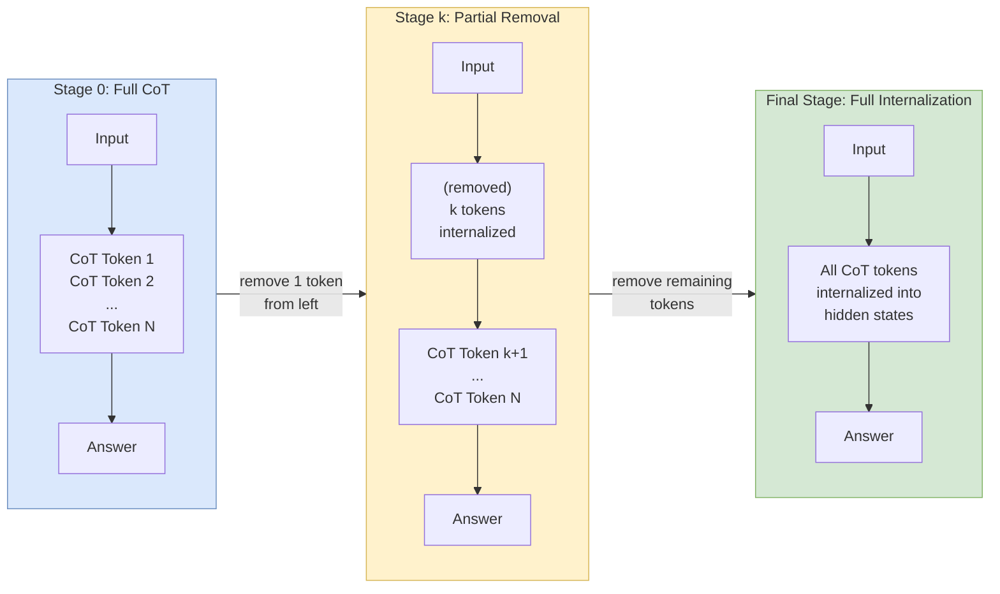

Starting from a model trained on explicit CoT:
1. **Stage 0**: Full CoT training (input → CoT tokens → answer)
2. **Stage 1**: Remove the **first** CoT token; finetune on remaining CoT + answer
3. **Stage k**: Remove k tokens from the left; finetune
4. **Final stage**: All CoT tokens removed; model predicts answer directly from input

### The Linear Removal Schedule

The number of tokens removed at training step t follows:

> s(t) = δ × t / T

Where T is total steps per epoch and δ controls removal rate (δ=8 for multiplication, δ=1 or 8 for GSM8K). Once s(t) exceeds the actual CoT length, all tokens are removed.

### Removal Smoothing

A stochastic offset is added: s*(t) = s(t) + o, where o is drawn from $P(o) \propto \exp(-\lambda o)$ with **λ=4**. This means ~98% of the time o=0, but ~2% probability of removing one extra token. This brief exposure to "future" removal levels smooths the curriculum and prevents catastrophic accuracy drops at stage transitions. **Without smoothing**: accuracy drops to zero around the 50-token removal mark and never recovers.

### Optimizer Reset

AdamW's second-order gradient estimates are **reset** whenever an additional CoT token is removed. Without this, stale gradient statistics from the previous stage cause training to collapse permanently around step 100. Both techniques — smoothing and optimizer reset — were adopted directly by [[coconut-reasoning-latent-space|Coconut]].

### Left-Side Removal (Critical Design Choice)

Tokens are removed from the **left** (beginning) of the CoT, not the right. Right-side removal performs "significantly worse" — the model fails around s(t)=100 removals. Hypothesis: early CoT tokens (problem setup, initial reasoning) can be internalized across all input positions. Late CoT tokens (near the answer) depend on earlier tokens already being internalized, creating a harder optimization problem.
