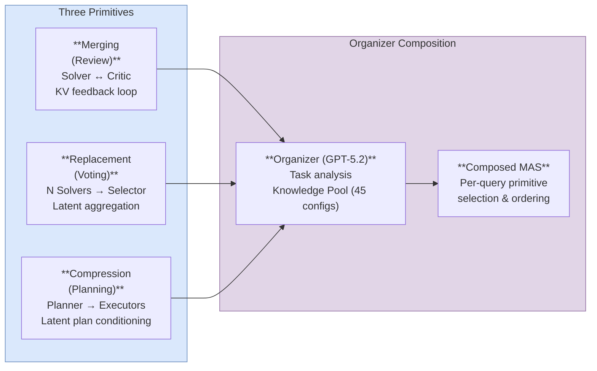

# Agent Primitives: Reusable Latent Building Blocks for Multi-Agent Systems

## One-liner

![[agent-primitives-building-blocks/one-liner]]

## Summary

**Agent Primitives** decomposes multi-agent system architectures into three reusable computation patterns — **Review** (iterative critique), **Voting and Selection** (consensus), and **Planning and Execution** (decomposition) — all operating in latent space via [[kv-cache-communication|KV-cache concatenation]]. An **Organizer** agent (GPT-5.2) automatically selects and composes primitives per query, guided by a **Knowledge Pool** of 45 previously observed MAS configurations. The analogy: primitives are to MAS what residual blocks and attention heads are to neural networks — composable, reusable functional units.

## The Three Primitives

| Primitive | Pattern | Latent implementation |
|-----------|---------|----------------------|
| **Review** | Solver -> Critic -> Solver (iterative) | Solver produces KV cache -> Critic consumes and produces feedback KV -> loops back |
| **Voting** | N parallel Solvers -> Selector | N independent KV caches -> latent-space aggregation/selection |
| **Planning** | Planner -> Executor(s) | Planner KV cache -> Executor(s) condition on latent plan |

All inter-agent communication via **KV cache concatenation** with **RoPE positional re-encoding** (critical — without it, LLaMA-based models collapse: AIME25 56.7% -> 26.7%, HumanEval+ 85.3% -> 31.1%).

### Review Primitive (Step by Step)

The Review primitive instantiates two agents: a **Solver A** and a **Critic B**, connected through a latent feedback channel.

1. Given an input prompt, **Solver A** produces an initial latent representation as a KV cache, exposing its intermediate reasoning state.
2. This KV cache is directly consumed by **Critic B**, which generates corrective feedback — identifying errors, inconsistencies, or missing reasoning steps. The Critic does not revise or complete the solution; it only provides evaluative signals.
3. The Critic's modified latent representation (feedback KV cache) is fed back to Solver A.
4. Solver A performs a subsequent refinement of its internal computation, conditioned on the feedback.
5. This defines a **latent feedback loop** that can execute for multiple iterations. In practice, **two rounds** are used.
6. A **stopping condition** derived from intermediate latent states governs adaptive depth of refinement.

The Solver prompt instructs it to "identify errors, inconsistencies, or missing reasoning, and incorporate feedback from other internal agents." The Critic prompt constrains it to "provide targeted feedback that helps guide further improvement, but you must not revise, rewrite, or complete the solution yourself."

### Voting and Selection Primitive (Step by Step)

Instantiated with a set of **parallel Solver agents** and a **Selector** module.

1. Given an input prompt, each Solver agent A_i **independently** produces a KV cache — each exposes a diverse intermediate reasoning state for the same task.
2. Solvers rely only on the input query and their own reasoning; they do not coordinate or see each other's outputs.
3. Rather than text-level majority voting, the **Selector operates directly in latent space**, performing voting and selection over the set of KV-cache representations.
4. The aggregated latent representation produces the final output.
5. In practice: **3 Solvers + 1 Selector** (4 agents total).

### Planning and Execution Primitive (Step by Step)

Instantiated with a **Planner agent P** and **Executor agents E**.

1. Given an input prompt, the **Planner** produces a latent plan — a KV cache encoding a structured decomposition of the task into intermediate steps or subgoals.
2. The latent plan serves as an explicit internal representation that conditions subsequent computation.
3. **Executor agents** consume the latent plan and perform task-specific reasoning conditioned on this representation, generating the final output.
4. In practice: **1 Planner + 3 Executors** (4 agents total).

The Planner prompt: "analyze the input task and construct a structured plan that decomposes the task into intermediate steps or subgoals. Focus on outlining what needs to be done rather than performing the task itself. Do not produce the final solution."

## KV-Cache Concatenation: Formal Details

### Input-Output Alignment Assumption (Equation 2)

The key assumption is that the Transformer decoder conditions future token generation exclusively on its accumulated key-value states, not the discrete token sequence:

> $$p(y \mid Z_A, x^B_{1:n_B}) \approx p(y \mid s_A, x^B_{1:n_B})$$

where $Z_A$ is the KV cache produced by agent A after processing sequence $s_A$. This approximation holds **when both agents share the same model parameters and positional encoding scheme**. The paper restricts all experiments to same-model configurations for this reason.

### Concatenation Mechanism

For agent A with KV cache $Z^A_{T_A}$ and agent B with system prompt KV cache $Z^B_{n_B}$, the combined cache at each layer $l$ is:

- $\tilde{K}^{B,l} = [K^{B,l}_{n_B};\; K^{A,l}_{T_A}]$
- $\tilde{V}^{B,l} = [V^{B,l}_{n_B};\; V^{A,l}_{T_A}]$

Agent B then decodes conditioned on this combined cache, without any natural language communication from A.

### RoPE Positional Re-encoding

Modern LLMs use **Rotary Positional Encoding (RoPE)** where positional information is encoded through position-dependent rotations: $\text{RoPE}(K_t) = R(t) \cdot K_t$, where $R(t)$ is a deterministic block-diagonal rotation operator with 2D rotation angles linear in $t$.

When KV caches are concatenated, the combined cache is treated as a single continuous sequence:
- Agent B's system prompt occupies positions $1$ to $n_B$
- Agent A's KV cache occupies positions $1$ to $T_A$

To preserve RoPE semantics, agent A's KV states are **re-indexed by offset $n_B$**: for each layer $l$ and position $t \in \{1,\ldots,T_A\}$, apply $\text{RoPE}(K^{A,l}_t) \to R(t + n_B) \cdot K^{A,l}_t$.

**Why LLaMA breaks without re-encoding**: LLaMA-based models are extremely sensitive to positional encoding misalignment. Without re-encoding, on DeepSeek-R1-Distill-Llama-70B the primitives-based MAS drops from 56.7% to 26.7% on AIME25, from 85.3% to 31.1% on HumanEval+, and from 81.9% to 36.6% on MedQA. Qwen3 models are more resilient — drops of only 1-13 pp — suggesting different architectural sensitivity to positional encoding consistency.

## The Organizer

The Organizer is an LLM (default: **GPT-5.2**) that automates MAS construction. It does not solve the task itself.

### Selection Process

Given an input query, the Organizer:
1. Analyzes task requirements and complexity
2. Retrieves relevant entries from the Knowledge Pool based on the input query
3. Abstracts retrieved MAS systems into primitive compositions, replacing task-specific agents with corresponding Agent Primitives
4. Determines (i) which primitive types to instantiate and (ii) their execution structure / composition order
5. Outputs a primitive composition plan specifying instantiated primitives and their composition in code

The number of agents is **not fixed** — it is determined per query by the Organizer (unlike baselines which use 4 agents).

### Knowledge Pool

The Knowledge Pool stores **45 MAS structures** collected from 5 existing MAS frameworks:
- **Multi-Agent Debate** (Du et al., 2023)
- **DyLAN** (Liu et al., 2024)
- **Self-Refine** (Madaan et al., 2023)
- **AFlow** (Zhang et al., 2024a)
- **MAS-GPT** (Ye et al., 2025)

Each entry associates a query pattern with a corresponding system-level reasoning strategy. The Organizer uses these as structural guidance, not as direct reuse of full agent-level designs.

## Full Results

### Benchmarks and Models

**8 benchmarks** across 3 categories:
- Math: AIME24, AIME25, MATH, GSM8K
- Code: HumanEval+, MBPP+
- Q&A: MedQA, GPQA-Diamond

**5 models**: Qwen3-4B, Qwen3-8B, Qwen3-14B, DeepSeek-R1-Distill-Qwen-32B, DeepSeek-R1-Distill-Llama-70B

### Primitives-based MAS vs. Single Agent (all 5 models, averages)

| Model | Single Avg | Primitives Avg | Gain |
|-------|-----------|---------------|------|
| Qwen3-4B | 55.7% | 69.6% | **+13.9%** |
| Qwen3-8B | 58.8% | 75.3% | **+16.5%** |
| Qwen3-14B | 65.5% | 77.6% | **+12.0%** |
| DeepSeek-R1-Distill-Qwen-32B | 71.0% | 77.6% | **+6.6%** |
| DeepSeek-R1-Distill-Llama-70B | 70.1% | 76.4% | **+6.3%** |

### Qwen3-8B Full Benchmark Breakdown

| Method | AIME25 | AIME24 | MATH | GSM8K | HumanEval+ | MBPP+ | MedQA | GPQA | Avg |
|--------|--------|--------|------|-------|-------------|-------|-------|------|-----|
| Single | 46.7 | 50.0 | 60.8 | 81.1 | 74.4 | 64.8 | 53.0 | 39.9 | 58.8 |
| TextMAS | 53.3 | 53.3 | 61.4 | 92.3 | 80.5 | 69.5 | 75.0 | 43.4 | 66.1 |
| LatentMAS | 53.3 | 56.7 | 62.6 | 93.8 | 80.5 | 74.6 | 75.3 | 45.5 | 67.8 |
| Review | 60.0 | 63.3 | 61.0 | 93.2 | 78.6 | 70.6 | 64.2 | 48.9 | 67.5 |
| Voting | 66.7 | 70.0 | 61.4 | 91.8 | 81.0 | 74.3 | 70.3 | 55.0 | 71.3 |
| Planning | 66.7 | 63.3 | 60.8 | 93.2 | 78.6 | 75.9 | 67.0 | 51.0 | 69.6 |
| **Primitives MAS** | **73.3** | **76.7** | **63.7** | **94.2** | **82.3** | **75.9** | **76.7** | **59.6** | **75.3** |

### DeepSeek-R1-Distill-Llama-70B Full Breakdown

| Method | AIME25 | AIME24 | MATH | GSM8K | HumanEval+ | MBPP+ | MedQA | GPQA | Avg |
|--------|--------|--------|------|-------|-------------|-------|-------|------|-----|
| Single | 50.0 | 70.0 | 69.6 | 92.4 | 82.3 | 66.4 | 64.5 | 65.2 | 70.1 |
| TextMAS | 53.3 | 70.0 | 72.8 | 93.2 | 82.3 | 68.8 | 77.8 | 65.7 | 73.0 |
| LatentMAS | 40.0 | 43.3 | 78.6 | 78.6 | 73.2 | 55.6 | 68.6 | 41.9 | 60.0 |
| **Primitives MAS** | **56.7** | **76.7** | **79.3** | **93.8** | **85.3** | **70.6** | **81.9** | **66.7** | **76.4** |

**LatentMAS catastrophically fails on LLaMA**: average drops from 70.1% to 60.0% (-10.1 pp). AIME24 drops from 70.0% to 43.3% (-26.7 pp), GSM8K from 92.4% to 78.6% (-13.8 pp), GPQA from 65.2% to 41.9% (-23.3 pp).

### vs. TextMAS and LatentMAS (Summary)

- **TextMAS**: only +2.4% to +7.3% average gain with high variance across tasks and models due to NL communication reliance
- **LatentMAS**: competitive on Qwen-based models (especially math) but catastrophically fails on LLaMA-based backbones (-10.1% on DeepSeek-R1-Distill-Llama-70B). Uses aggressive chunking ($m=40$) causing instability.
- **Primitives-based MAS**: stable across all model families, +6.3% to +16.5% average gain

### vs. 10 Existing MAS Methods (Llama-3-70B-Instruct)

| Method | MATH | GSM8K | HumanEval+ | GPQA |
|--------|------|-------|-------------|------|
| Single | 50.6 | 92.4 | 75.8 | 36.7 |
| Chain-of-Thought | 53.2 | 92.8 | 77.0 | 35.3 |
| Self-Consistency | 61.6 | 95.0 | 75.8 | 37.2 |
| LLM-Debate | 61.4 | 91.6 | 74.5 | 34.4 |
| Self-Refine | 58.5 | 90.8 | 62.7 | 38.3 |
| Quality-Diversity | 60.5 | 93.0 | 70.2 | 33.6 |
| SPP | 51.7 | 92.8 | 73.3 | 35.1 |
| AgentVerse | 55.6 | 93.4 | 73.9 | 40.2 |
| GPTSwarm | 55.4 | 93.2 | 73.9 | 36.5 |
| DyLAN | 59.6 | 91.2 | 75.8 | 36.0 |
| MAS-GPT | 68.7 | 93.4 | 78.9 | 37.6 |
| **Primitives MAS** | **72.4** | **93.8** | **82.3** | **53.2** |

Primitives-based MAS is best on **all 4 benchmarks**. The GPQA advantage is particularly striking: 53.2% vs. next-best 40.2% (AgentVerse), a +13.0 pp margin.

## Communication Robustness Experiments

### Noise Injection (GSM8K, Qwen3-8B)

100 correctly-solved GSM8K instances, reasoning traces truncated to 6,000 tokens, passed to a second Qwen3-8B. Unrelated GSM8K reasoning sentences injected as noise.

| Noise sentences | 0 | 1 | 3 | 10 | 25 |
|----------------|---|---|---|----|----|
| Natural Language | 100% | 91% | 73% | 47% | 40% |
| KV Cache | 100% | 100% | 100% | **93%** | **77%** |

At 10 injected noise sentences, **KV-cache retains 93% accuracy vs. 47% for natural language** (a 46 pp gap). Even at extreme noise (25 sentences), KV-cache still achieves 77% vs. 40%.

### Long-Context Task Injection (InfiniteBench En.QA, 351 examples, Qwen3-8B)

Auxiliary instruction injected at beginning/mid/end of long context. Two metrics: accuracy on the original QA task, and compliance with the injected instruction.

| Method | Acc (no inj.) | Acc (begin) | Acc (mid) | Acc (end) | Compliance (begin) | Compliance (mid) | Compliance (end) |
|--------|--------------|-------------|-----------|-----------|-------------------|------------------|-------------------|
| Natural Language | 51.6% | 51.3% | 51.0% | 50.4% | 82.9% | **15.6%** | 100.0% |
| KV Cache | **61.3%** | **61.0%** | **60.4%** | **61.3%** | **88.9%** | **73.3%** | 100.0% |

KV-cache achieves **73.3% mid-context compliance vs. 15.6% for NL** — a 57.7 pp gap. Both methods achieve 100% compliance at end position. KV-cache also has ~10 pp higher baseline accuracy (61.3% vs. 51.6%).

## Ablation Studies

### Organizer Model Choice

| Model backbone | Organizer | AIME25 | HumanEval+ | MedQA |
|---------------|-----------|--------|------------|-------|
| Qwen3-8B | GPT-5.2 | 73.3% | 82.3% | 76.7% |
| Qwen3-8B | Claude-4 | 73.3% | 81.1% | 76.2% |
| Qwen3-8B | Random | 66.7% | 77.4% | 70.6% |
| DS-R1-Llama-70B | GPT-5.2 | 56.7% | 85.3% | 81.9% |
| DS-R1-Llama-70B | Claude-4 | 56.7% | 83.5% | 81.9% |
| DS-R1-Llama-70B | Random | 50.0% | 78.6% | 69.5% |

GPT-5.2 and Claude-4 yield very similar results (within 0-2 pp). Random selection drops 5-7% on Qwen3-8B and up to **12.4%** on Llama-70B (MedQA). The benefit comes from **problem-aware structure selection**, not a specific Organizer model.

### Knowledge Pool Removal

| Model backbone | Knowledge Pool | AIME25 | HumanEval+ | MedQA |
|---------------|---------------|--------|------------|-------|
| Qwen3-8B | with | 73.3% | 82.3% | 76.7% |
| Qwen3-8B | without | 63.3% (-10.0) | 77.4% (-4.9) | 71.6% (-5.1) |
| DS-R1-Llama-70B | with | 56.7% | 85.3% | 81.9% |
| DS-R1-Llama-70B | without | 50.0% (-6.7) | 73.4% (-11.9) | 75.9% (-6.0) |

Removing the Knowledge Pool causes **5-12% degradation** depending on task and model. Worst case: HumanEval+ on Llama-70B drops 11.9 pp.

### RoPE Removal Impact Per Model

**Qwen3-8B** (moderate degradation):

| Method | AIME25 w/ | w/o | HumanEval+ w/ | w/o | MedQA w/ | w/o |
|--------|-----------|-----|---------------|-----|----------|-----|
| Review | 60.0 | 56.7 (-3.3) | 78.6 | 73.8 (-4.8) | 64.2 | 61.5 (-2.7) |
| Voting | 66.7 | 60.0 (-6.7) | 81.0 | 79.9 (-1.1) | 70.3 | 66.8 (-3.5) |
| Planning | 66.7 | 56.7 (-10.0) | 78.6 | 78.0 (-0.6) | 67.0 | 65.2 (-1.8) |
| Primitives MAS | 73.3 | 60.0 (-13.3) | 82.3 | 81.1 (-1.2) | 76.7 | 74.0 (-2.7) |

**DeepSeek-R1-Distill-Llama-70B** (catastrophic degradation):

| Method | AIME25 w/ | w/o | HumanEval+ w/ | w/o | MedQA w/ | w/o |
|--------|-----------|-----|---------------|-----|----------|-----|
| Review | 50.0 | 16.7 (-33.3) | 82.3 | 22.6 (-59.7) | 72.9 | 31.4 (-41.5) |
| Voting | 56.7 | 26.7 (-30.0) | 82.9 | 29.9 (-53.0) | 77.8 | 34.7 (-43.1) |
| Planning | 50.0 | 23.3 (-26.7) | 82.3 | 24.4 (-57.9) | 74.0 | 30.5 (-43.5) |
| Primitives MAS | 56.7 | 26.7 (-30.0) | 85.3 | 31.1 (-54.2) | 81.9 | 36.6 (-45.3) |

Without RoPE, LLaMA-based models lose **30-60 pp** across all methods. Qwen loses only **1-13 pp**. This is the most dramatic finding in the paper.

### Single vs. Composed Primitives

No single primitive dominates across tasks. Composing multiple primitives into a unified MAS yields **3.5-7.0% additional improvement** over the strongest individual primitive. For example on Qwen3-8B: best single primitive averages 71.3% (Voting) while composed MAS achieves 75.3%.

## Efficiency Numbers

### Token Usage (averages across 8 benchmarks)

| Model | Single | TextMAS | LatentMAS | Primitives MAS |
|-------|--------|---------|-----------|----------------|
| Qwen3-4B | 5,238 | 14,343 (+174.0%) | 3,280 (-37.4%) | 3,350 (-36.0%) |
| Qwen3-8B | 5,411 | 14,923 (+175.8%) | 3,457 (-36.1%) | 3,558 (-34.3%) |
| Qwen3-14B | 4,572 | 13,752 (+200.8%) | 4,330 (-5.3%) | 4,221 (-7.7%) |
| DS-R1-Qwen-32B | 4,854 | 11,396 (+134.8%) | 4,028 (-17.0%) | 4,195 (-13.6%) |
| DS-R1-Llama-70B | 5,268 | 16,268 (+208.7%) | 4,533 (-14.0%) | 4,922 (-6.6%) |

TextMAS uses **2-3x more tokens** than single agent. Primitives MAS uses **fewer tokens than single agent** on smaller models and comparable tokens on larger ones. LatentMAS is slightly more token-efficient but at the cost of stability.

### Inference Latency (averages across 8 benchmarks, seconds per query)

| Model | Single | TextMAS | Primitives MAS |
|-------|--------|---------|----------------|
| Qwen3-4B | 448 | 2,365 (+428%) | 692 (+54.5%) |
| Qwen3-8B | 571 | 2,915 (+411%) | 871 (+52.5%) |
| Qwen3-14B | 1,138 | 5,134 (+351%) | 1,634 (+43.6%) |
| DS-R1-Qwen-32B | 1,456 | 4,570 (+214%) | 1,511 (+3.8%) |

Primitives MAS introduces **~1.3-1.6x latency overhead** vs. single agent, while TextMAS introduces **~3.5-5.3x overhead**. On the larger DeepSeek-R1-Distill-Qwen-32B, the overhead is only 3.8%.

## Primitives Composition Diagram

## Limitations

- **Homogeneous architecture requirement**: The input-output alignment assumption (Equation 2) restricts all agents to identical model parameters and positional encoding. Cross-architecture agent teams (e.g., Qwen + LLaMA) are explicitly excluded, unlike [[vision-wormhole-heterogeneous|Vision Wormhole]] or [[cache-to-cache-semantic-communication|C2C]] which handle heterogeneous configurations.
- **Organizer overhead**: The Organizer (GPT-5.2 or Claude-4) adds a separate LLM call before task execution begins, introducing latency and cost. The ablation shows random selection drops 5-12%, confirming the Organizer is load-bearing, but the paper does not quantify the Organizer's own token/latency cost.
- **Knowledge Pool maintenance burden**: The 45 MAS configurations are manually curated from 5 existing frameworks. As new MAS designs emerge, the Knowledge Pool requires human curation to stay current. No automated mechanism for updating or expanding the pool is proposed.
- **No cross-architecture evaluation**: All 5 tested models are from two families (Qwen3, DeepSeek-R1-Distill). No experiments with GPT, Claude, Gemini, or Gemma family models, limiting generalizability claims.
- **LLaMA fragility unresolved**: While the paper documents the catastrophic RoPE sensitivity of LLaMA-based models (30-60 pp drops without re-encoding), it does not propose a fix beyond careful re-encoding. Whether this fragility extends to other LLaMA derivatives or newer LLaMA versions is untested.

## Connections

- **[[kv-cache-communication]]**: Agent Primitives use KV-cache not just for transmission but to implement the computation structure itself. The RoPE re-encoding finding is a critical implementation detail for any KV-cache concatenation approach. The formal input-output alignment assumption (Equation 2) establishes the theoretical foundation.
- **[[latentmas-collaboration|LatentMAS]]**: Both use KV-cache transfer, but LatentMAS uses aggressive chunking ($m=40$) that causes instability on LLaMA (-10.1% average). Agent Primitives are more conservative and stable. LatentMAS is slightly more token-efficient but at the cost of backbone-dependent catastrophic failures.
- **[[scaling-agent-systems|Scaling Agent Systems]]**: Agent Primitives' composable design addresses the task-architecture mismatch problem — the Organizer selects the right primitive composition per task, with the Knowledge Pool providing structural guidance from 45 prior MAS designs across 5 frameworks.
- **[[multi-agent-debate]]**: Multi-Agent Debate is one of the 5 frameworks contributing to the Knowledge Pool. The Voting primitive generalizes the debate-then-select pattern into latent space.
- **[[cache-to-cache-semantic-communication|Cache-to-Cache]]**: Both use KV-cache projection for inter-model communication, but Agent Primitives restrict to same-model settings to satisfy the input-output alignment assumption.

## Source Materials

- [[raw/pdf/arxiv-2602.03695.pdf|PDF]] ([[raw/latex/arxiv-2602.03695.tar.gz|LaTeX source]])
