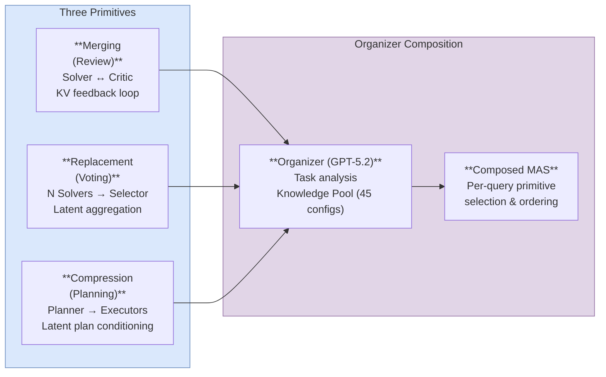

```mermaid
graph LR
    subgraph Primitives["Three Primitives"]
        M["**Merging<br>(Review)**<br>Solver ↔ Critic<br>KV feedback loop"]
        R["**Replacement<br>(Voting)**<br>N Solvers → Selector<br>Latent aggregation"]
        C["**Compression<br>(Planning)**<br>Planner → Executors<br>Latent plan conditioning"]
    end

    subgraph Composition["Organizer Composition"]
        O["**Organizer (GPT-5.2)**<br>Task analysis<br>Knowledge Pool (45 configs)"]
        P["**Composed MAS**<br>Per-query primitive<br>selection & ordering"]
    end

    M --> O
    R --> O
    C --> O
    O --> P

    style Primitives fill:#dae8fc,stroke:#6c8ebf
    style Composition fill:#e1d5e7,stroke:#9673a6
```
