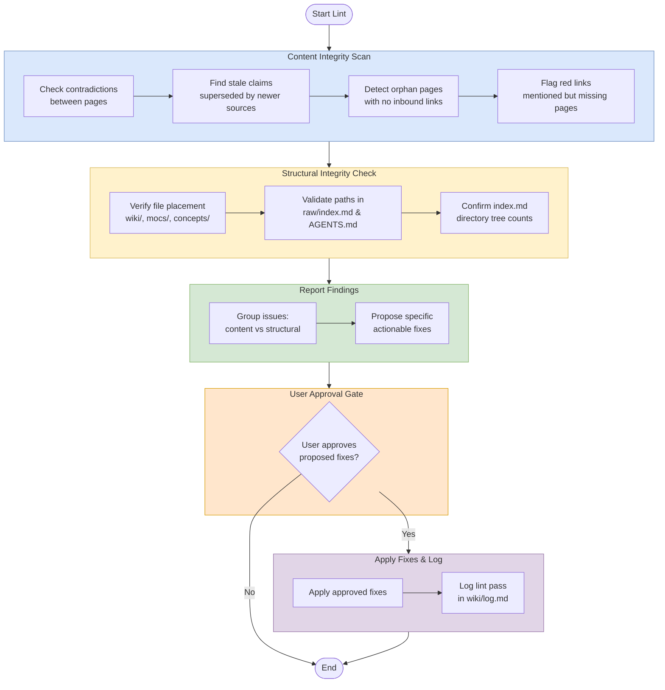

# Lint (Health Check)

## Purpose
Run a health check across the wiki to find content drift, broken references, and structural inconsistencies before they spread.

## When To Use
Use this workflow when you need to audit the wiki for quality issues, especially after refactors, new ingests, bulk edits, or navigation changes.

## Trigger Phrases
- `lint`
- `health check`
- `scan for issues`
- `check the wiki`
- `find broken links`
- `review for drift`

## Do Not Use When
- You only need to answer a question from the wiki. Use `workflows/query/query.md`.
- You are adding new source material. Use `workflows/create/ingest.md`.
- You are deepening existing pages rather than checking integrity. Use `workflows/enrich/expand.md`.
- You are performing a broader full-wiki pass. Use `workflows/audit/review.md`.

## Required Context
- Current `wiki/` structure and recent edits.
- `wiki/index.md`.
- Relevant MOCs in `wiki/mocs/`.
- `raw/index.md`.
- `AGENTS.md` workflow and path references.

## Procedure
1. Scan all wiki pages for content integrity issues:
   - Contradictions between pages.
   - Stale claims superseded by newer sources.
   - Orphan pages with no inbound links.
   - Mentioned but non-existent pages.
   - Missing cross-references.
   - Gaps worth investigating.
2. Verify structural integrity:
   - All wiki pages live under `wiki/`, not the vault root.
   - MOC files live at `wiki/mocs/*.md`.
   - Concepts live in `wiki/concepts/`.
   - Full-path wiki-links in `raw/index.md` match actual file locations.
   - `wiki/index.md` directory tree counts match actual page counts (sources, entities, MOCs, analyses, concepts).
   - `AGENTS.md` Current MOCs list matches the actual `wiki/mocs/*.md` files.
   - No stale path references remain in `AGENTS.md`, `README.md`, or index files after reorganizations.
   - Mermaid node labels use ` ` for line breaks, not `\n` (which renders literally in Obsidian).
3. Run the [stale count sweep](../_shared/procedures/stale-count-sweep.md) — catches the regression class where prose counts drift after ingests. Follow every sub-rule in the fragment (authoritative count method, grep patterns, common-offender re-verification, log.md exclusion, non-paper count sweep). When complete, return here and continue with step 4.
4. **Checklist sync check** (catches drift between `raw/index.md` and `raw/checklist.md`, the URL audit trail). The checklist tracks arXiv papers only; non-arXiv sources (e.g., the latentcompress GitHub project) are intentionally excluded, so the row count must be compared against the *Canonical PDFs* count in `raw/index.md`'s summary table, **not** the total unique source pages count.
   - Count the canonical PDF rows in `raw/index.md` (the "Canonical PDFs" table, excluding the venue-duplicate section and any non-arXiv rows).
   - Count the data rows in `raw/checklist.md` (the markdown table, excluding the header and separator rows).
   - Confirm the two counts match. If they do not, flag the delta.
   - Grep `raw/checklist.md` for `reference/pdf/` and `reference/latex/`. Zero matches are required — these are stale historical paths from a directory move and must be rewritten to `raw/pdf/...` / `raw/latex/...`.
   - For each canonical PDF arxiv ID in `raw/index.md`, confirm a matching row exists in `raw/checklist.md` (match by arxiv ID in either the "Original refs from list" column or the "Local PDF" path). Flag any arxiv IDs present in `raw/index.md` but missing from `raw/checklist.md`, and any rows in `raw/checklist.md` whose arxiv ID is not in `raw/index.md`.
5. Run the **Redundancy & Dead-Reference Audit** (see section below). This is a four-class sub-pass that catches phantom raw assets, source-page ↔ raw asset bijection breaks, slug collisions, and MOC/concept overlap.
6. **Terminology drift scan.** Grep for the drift variants enumerated in [glossary](../_shared/glossary.md) and add them to the findings list. Do not silently rewrite — drift variants surface as findings so the user sees the pattern.
7. Report findings and suggest fixes.
8. Apply fixes only after user approval.
9. Log the lint pass in `wiki/log.md`.

## Redundancy & Dead-Reference Audit

A focused sub-pass that catches the four classes of bug found in the 2026-04-08 audit. Run all four checks; report each class separately.

### A. Phantom raw asset references

Every `source_file:`, `latex_source:`, and `venue_pdfs:` value, plus every `[[raw/...|...]]` body link, must point to an actual file on disk.

1. `Glob raw/pdf/*` and `Glob raw/latex/*` to enumerate what exists.
2. `Grep -n 'source_file:|latex_source:|venue_pdfs:' wiki/sources/` to enumerate frontmatter claims.
3. `Grep -n '\[\[raw/' wiki` to enumerate body-link claims.
4. Diff: any path referenced but not present is a phantom. Fix by either (a) re-acquiring the file, or (b) deleting the reference and updating `raw/index.md` and the summary table.

### B. Source-page ↔ raw asset bijection

The wiki's invariant: every `arxiv:` ID in `wiki/sources/**/*.md` maps 1:1 to a PDF in `raw/pdf/`, and vice versa. Exceptions: pages with no `arxiv:` field (external projects, GitHub-only sources).

1. `Grep -n '^arxiv:' wiki/sources` → list of ingested arXiv IDs.
2. `Glob raw/pdf/arxiv-*.pdf` → list of stored PDFs.
3. Diff. An ID in (1) but not (2) means a missing download. A PDF in (2) but not (1) means an unreferenced raw asset (potentially redundant).
4. Cross-check the same against `raw/index.md`'s "Canonical PDFs" table — any row that no longer matches a source page is stale.

### C. Slug collisions and naming ambiguity

When two source pages share a leading filename token (e.g., `kvcomm-*`, `coconut-*`), readers can't disambiguate without opening both. Flag any cluster of 2+ files in the same `wiki/sources/**/` directory whose slugs share the first token.

1. `Glob wiki/sources/**/*.md` and group basenames by their first hyphenated token.
2. For any group with size ≥ 2 from different papers, suggest a hybrid rename: `<technique>-<institution>-<distinguisher>.md` (e.g., `kvcomm-kth-selective.md` vs `kvcomm-duke-online-reuse.md`).
3. Renames are bulk operations — run [bulk source rename](../_shared/procedures/bulk-source-rename.md) for each rename. The fragment owns the `git mv` + `sed` + verify sequence and is the only context where `sed` is the blessed tool.

### D. MOC and concept overlap

Two MOCs are redundant when one defers to the other for its primary content. Two concept pages are redundant when their bullet lists overlap by more than ~50%.

1. `Grep -n 'see \*\*\[\[|see the full' wiki/mocs/` — explicit deferrals are a smell.
2. For any MOC whose body section is duplicated in another MOC, propose collapsing it to the unique scaffolding (cross-cutting concepts, key entities, theoretical foundations) and adding a one-line pointer to the canonical source.
3. For concept-page overlap, prefer keeping the synthesis page and folding the duplicate into a section anchor.

## Completion Checklist
- All items in [`../_shared/checklists/base.md`](../_shared/checklists/base.md) hold.
- All items in [`../_shared/checklists/audit-additions.md`](../_shared/checklists/audit-additions.md) hold.
- Findings are grouped by content vs structural issues.
- Proposed fixes are specific and actionable.
- Terminology drift findings (if any) are in the report.

## Related Workflows
- `workflows/query/query.md`
- `workflows/create/ingest.md`
- `workflows/enrich/expand.md`
- `workflows/audit/review.md`
- `workflows/create/batch-ingest.md`
