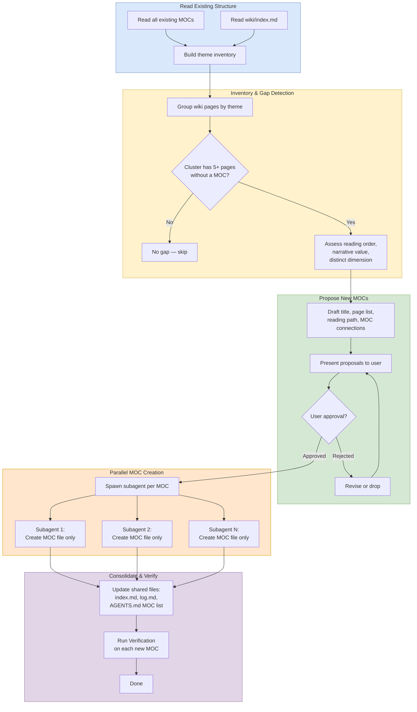

# MOC Gap Analysis

## Purpose
Structured review of MOC coverage to identify and fill navigation gaps.

Use this workflow when the goal is to discover missing reading paths, not to deepen individual pages.

## When To Use
- The wiki has grown and navigation feels fragmented.
- You need to decide whether a new MOC would add real value.
- You are checking for themes with enough pages to justify a guided path.
- You want to prioritize cross-cutting structure over local page edits.

## Trigger Phrases
Use this workflow when the task sounds like:
- "find MOC gaps"
- "review MOC coverage"
- "identify missing MOCs"
- "add a new MOC"
- "check if a theme needs its own reading path"
- "organize navigation paths"

## Do Not Use When
- The task is about fixing one page, one link, or one source summary.
- The user wants content expansion rather than navigation design.
- The user already named the exact MOC file to create or edit.
- The request is for a full wiki review, lint pass, or enrichment audit instead.

## Required Context
- Read all existing MOCs.
- Read `wiki/index.md`.
- Inventory wiki pages by theme.
- Use the current vault structure as the source of truth.

## Procedure
1. Read all existing MOCs and `wiki/index.md`.
2. Inventory all wiki pages by theme.
3. Identify clusters of 5+ pages that share a coherent theme but lack a dedicated MOC.
4. Focus especially on cross-cutting themes that span existing MOC boundaries, such as "cross-architecture compatibility" across communication and unified frameworks.
5. For each gap, assess:
   - Does the cluster have a natural reading order?
   - Would a narrative reading path add value beyond existing MOCs?
   - Is it a distinct dimension, such as a constraint axis, rather than a subset of an existing MOC?
6. Propose specific MOCs with:
   - title
   - pages to include
   - reading path outline
   - connections to existing MOCs
7. Get user approval, then create.
8. **If creating 2+ MOCs, dispatch them under the parallel subagent protocol.** Run [parallel subagent protocol](../_shared/procedures/parallel-subagent-protocol.md) in full, then return here and continue with step 9. The fragment owns scope boundaries (each subagent creates only its own MOC file), the canonical coordinator-only file enumeration, and the report-not-edit instruction. For a single MOC, skip the parallel dispatch and create the file directly.
9. **Spot-check the agent output.** Run [spot check agent output](../_shared/procedures/spot-check-agent-output.md), then return here and continue with step 10. Skipped if step 8 was skipped (single-MOC case).
10. **Consolidate the coordinator-only files.** Run [update index and assets](../_shared/procedures/update-index-and-assets.md) — the fragment's directory-tree update covers the new MOC count, and the entry-list update covers the new MOC's row. The `AGENTS.md` Current MOCs list sync is part of the fragment's verification step.
11. Run `workflows/audit/verification.md` on each new MOC.
12. **Commit and push.** Run [commit and push](../_shared/procedures/commit-and-push.md) in full.

## Completion Checklist
- All items in [`../_shared/checklists/base.md`](../_shared/checklists/base.md) hold.
- All items in [`../_shared/checklists/audit-additions.md`](../_shared/checklists/audit-additions.md) hold (this is a navigation audit even though it produces new MOC files — the audit additions cover the parallel-subagent and spot-check discipline).
- MOC gaps are identified and prioritized.
- Each created MOC has a clear title and reading path with the ordering principle stated in the header.
- Verification has been run on each created MOC.

## Related Workflows
- `workflows/audit/verification.md`
- `workflows/enrich/enrich.md`
- `workflows/audit/review.md`
- `workflows/audit/schema-self-audit.md`
