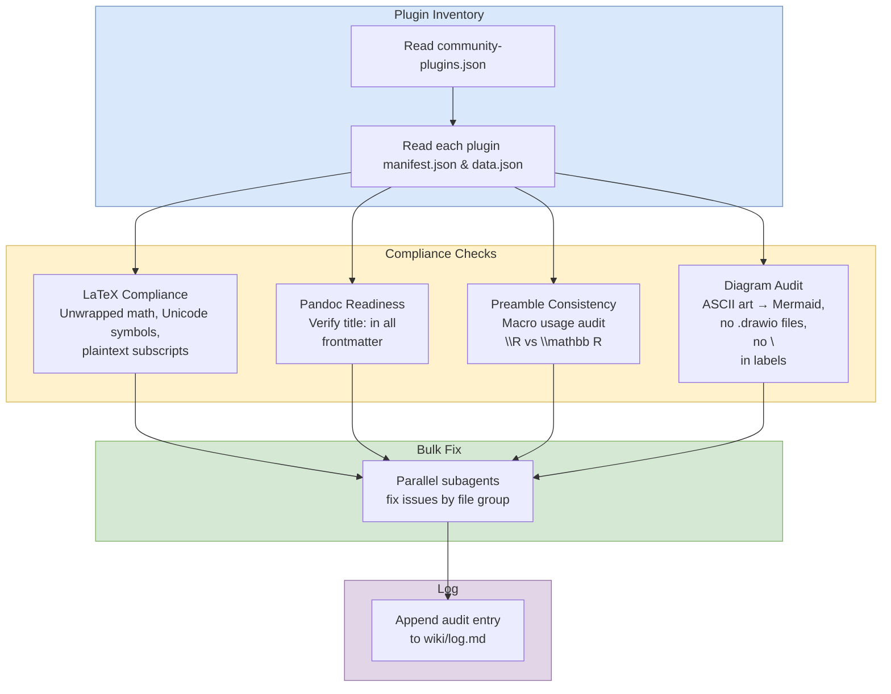

# Plugin Audit

## Purpose
Periodic check that Obsidian plugins are configured correctly and all wiki pages comply with plugin requirements.

Use this workflow to catch rendering, formatting, or plugin-compatibility drift after setup changes or content additions.

## When To Use
- A new Obsidian plugin was installed or updated.
- Rendering looks wrong or inconsistent.
- Math, diagrams, or export formatting may have drifted.
- You want a systematic plugin compliance pass across the wiki.

## Trigger Phrases
Use this workflow when the task sounds like:
- "audit plugins"
- "check Obsidian plugins"
- "verify plugin compatibility"
- "scan for math/rendering issues"
- "check pandoc readiness"
- "check diagrams"

## Do Not Use When
- The task is about a single page edit.
- You only need to fix one formula, one diagram, or one frontmatter field.
- The request is a broader wiki review or enrichment pass.
- No plugin-related change or rendering issue is involved.

## Required Context
- Read `.obsidian/community-plugins.json`.
- Read each plugin's `manifest.json` and `data.json`.
- Scan all wiki pages for compliance issues.
- Treat the vault's current file state as the source of truth.

## Procedure
1. Inventory plugins by reading `.obsidian/community-plugins.json` and each plugin's `manifest.json` and `data.json`.
2. For each plugin, check compliance:
   - LaTeX Suite / Extended MathJax: scan all wiki pages for unwrapped math, Unicode math symbols such as `∈`, `ℝ`, and `≈`, plaintext subscripts like `h_T`, or expressions outside `$...$` delimiters. Convert any found.
   - Pandoc: run [verify frontmatter completeness](../_shared/procedures/verify-frontmatter-completeness.md) on a sample of pages, then return here. The universal-minimum check covers the `title:` requirement; the fragment is the canonical schema.
   - Preamble: check that macros in `preamble.sty` are used consistently, with no raw `\mathbb{R}` when `\R` is available.
   - Diagrams: check for ASCII art in code blocks that should be Mermaid. Check for `.drawio` files, which should not exist. Check for `\n` inside Mermaid node labels — replace with ` `. Check for math notation (subscripts, superscripts, LaTeX-like expressions) in Mermaid node labels — these should use the side-by-side notation pattern (`[!diagram|left]` + `[!notation|right]` callouts) per AGENTS.md §Diagram Maintenance rule 6.
3. **Bulk fix any issues found using parallel subagents.** Run [parallel subagent protocol](../_shared/procedures/parallel-subagent-protocol.md) in full, then return here and continue with step 4. The fragment owns scope boundaries (one agent per file group) and the canonical coordinator-only file enumeration.
4. Run [update index and assets](../_shared/procedures/update-index-and-assets.md) if any files were added or moved, then return here and continue with step 5.
5. Run the [stale count sweep](../_shared/procedures/stale-count-sweep.md) if page counts changed, then return here and continue with step 6.
6. Run [spot check agent output](../_shared/procedures/spot-check-agent-output.md) on the parallel fixes, then return here and continue with step 7.
7. Log the audit in `wiki/log.md`.

## Completion Checklist
- All items in [`../_shared/checklists/base.md`](../_shared/checklists/base.md) hold.
- All items in [`../_shared/checklists/audit-additions.md`](../_shared/checklists/audit-additions.md) hold.
- Plugin inventory has been checked.
- Math, frontmatter, diagram, and preamble compliance have been scanned.
- Any fixes are grouped by file family, not mixed across unrelated files.

## Related Workflows
- `workflows/audit/review.md`
- `workflows/audit/lint.md`
- `workflows/audit/enrichment-audit.md`
- `workflows/audit/schema-self-audit.md`
