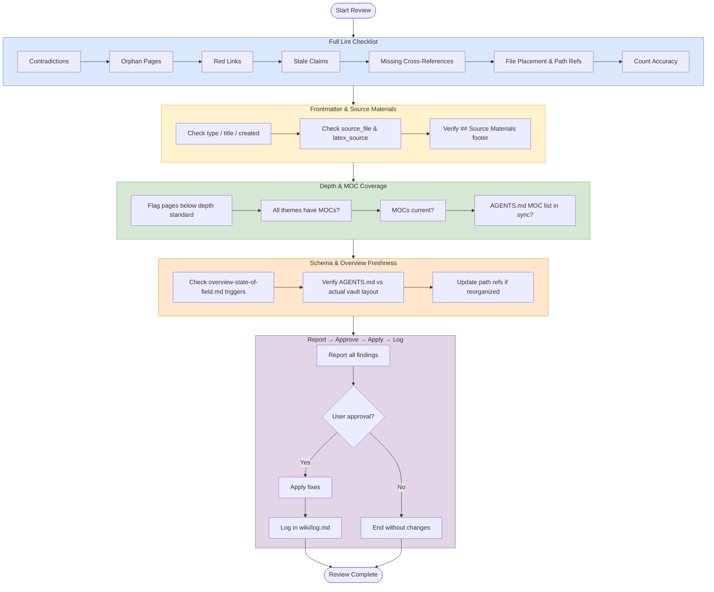

# Review Workflow

## Purpose
Run a comprehensive wiki once-over that combines lint, enrich, and expand checks.

## When To Use
Use this workflow for periodic maintenance or after large batch ingests when the wiki may have drifted.

## Trigger Phrases
Common triggers include:
- `review the wiki`
- `full review`
- `once-over`
- `check the whole vault`
- `audit the schema`

## Do Not Use When
- The task is only answering a question. Use `Query`.
- The task is only adding new source content. Use `Ingest` or `Batch Ingest`.
- The task is only improving structure or navigation. Use `Enrich`.
- The task is only deepening existing pages. Use `Expand`.
- The task is specifically a health check without the broader pass. Use `Lint`.

## Required Context
- Compare the current vault state against `AGENTS.md`, `README.md`, `wiki/index.md`, and `raw/index.md`.
- Check both content integrity and structural integrity.
- Use the current MOC list and path conventions as validation targets.

## Procedure
1. Run [`workflows/audit/lint.md`](lint.md) end-to-end (this includes the terminology drift scan), then return here and continue with step 2.
2. **Spot-check frontmatter completeness on a sample of pages.** Run [verify frontmatter completeness](../_shared/procedures/verify-frontmatter-completeness.md) on the sample, then return here. The fragment is the canonical schema; the per-type field lists live there, not here.
3. Verify all source pages have the `## Source Materials` footer.
4. Identify pages below the depth standard (source pages: under 130 lines; concept pages: under 120 lines; entity pages: under 50 lines; analysis pages: under 100 lines — per [enrichment-audit.md](enrichment-audit.md) Phase 1) and flag them for expansion.
5. Check MOC coverage:
   - all major themes have MOCs
   - MOCs are current
   - the `AGENTS.md` MOC list is in sync
6. Check whether `overview-state-of-field.md` needs updating using the documented triggers.
7. Verify `AGENTS.md` directory structure, path conventions, and workflow steps still match the actual vault layout.
8. If the vault was reorganized, ensure all path references across `AGENTS.md`, `README.md`, index files, and `raw/index.md` are updated.
9. Report all findings.
10. Apply fixes only with user approval.
11. Log the review in `wiki/log.md`.

## Completion Checklist
- All items in [`../_shared/checklists/base.md`](../_shared/checklists/base.md) hold.
- All items in [`../_shared/checklists/audit-additions.md`](../_shared/checklists/audit-additions.md) hold.
- Lint findings are reported.
- Frontmatter and source-material coverage are checked.
- Depth gaps are identified.
- MOC coverage and overview freshness are checked.
- Schema and path consistency are verified.
- Terminology drift findings (if any) are in the report.

## Related Workflows
- `Lint` for a narrower health check.
- `Enrich` for structural improvements without broad review.
- `Expand` for depth work on existing pages.
- `Ingest` and `Batch Ingest` for source-driven updates.
- `MOC Gap Analysis` for focused navigation coverage work.
- `workflows/audit/schema-self-audit.md` for schema-vs-vault consistency checks.
- `workflows/audit/plugin-audit.md` for plugin-specific audits.
