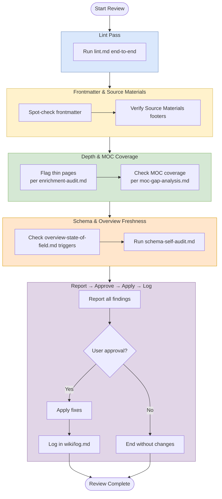

# Review Workflow

## Purpose
Run a comprehensive wiki once-over that combines lint, enrich, and expand checks.

## When To Use
Use this workflow for periodic maintenance or after large batch ingests when the wiki may have drifted.

## Trigger Phrases
Common triggers include:
- `review the wiki`
- `full review`
- `once-over`
- `check the whole vault`
- `audit the schema`

## Do Not Use When
- The task is only answering a question. Use `workflows/query/query.md`.
- The task is only adding new source content. Use `workflows/create/ingest.md` or `workflows/create/batch-ingest.md`.
- The task is only improving structure or navigation. Use `workflows/enrich/enrich.md`.
- The task is only deepening existing pages. Use `workflows/enrich/expand.md`.
- The task is specifically a health check without the broader pass. Use `workflows/audit/lint.md`.

## Required Context
- Compare the current vault state against `AGENTS.md`, `README.md`, `wiki/index.md`, and `raw/index.md`.
- Check both content integrity and structural integrity.
- Use the current MOC list and path conventions as validation targets.

## Procedure
1. Run [`workflows/audit/lint.md`](lint.md) end-to-end (this includes the terminology drift scan), then return here and continue with step 2.
2. **Spot-check frontmatter completeness on a sample of pages.** Run [verify frontmatter completeness](../_shared/procedures/verify-frontmatter-completeness.md) on the sample, then return here. The fragment is the canonical schema; the per-type field lists live there, not here.
3. Verify all source pages have the `## Source Materials` footer.
4. **Flag thin pages.** Apply the per-type depth thresholds from [enrichment-audit.md](enrichment-audit.md) Phase 1 and flag pages below standard for expansion.
5. **Check MOC coverage.** Run the quick-scan from [moc-gap-analysis.md](moc-gap-analysis.md) — themes without MOCs, stale MOCs, `AGENTS.md` MOC list out of sync. Flag gaps; do not create MOCs here.
6. Check whether `overview-state-of-field.md` needs updating using the documented triggers.
7. **Schema and path consistency.** Run [schema-self-audit.md](schema-self-audit.md) in full (directory structure, path conventions, vault layout drift), then return here and continue with step 8.
8. Report all findings.
9. Apply fixes only with user approval.
10. Log the review in `wiki/log.md`.

## Completion Checklist
- All items in [`../_shared/checklists/base.md`](../_shared/checklists/base.md) hold.
- All items in [`../_shared/checklists/audit-additions.md`](../_shared/checklists/audit-additions.md) hold.
- Lint pass completed (includes terminology drift scan).
- Frontmatter and source-material coverage are checked.
- Depth gaps are identified.
- MOC coverage and overview freshness are checked.
- Schema-self-audit passed.

## Related Workflows

- `workflows/audit/lint.md` — narrower health check that review subsumes.
- `workflows/enrich/enrich.md` — structural improvements without broad review.
- `workflows/enrich/expand.md` — depth work on existing pages.
- `workflows/create/ingest.md` — source-driven updates that review validates.
