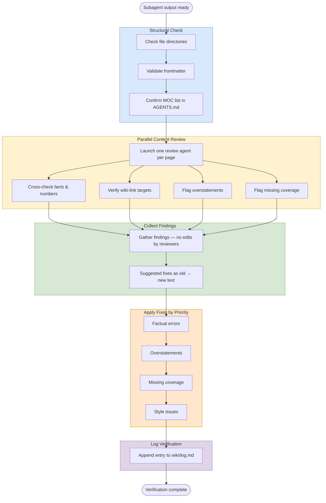

# Verification

## Purpose
Quality-assurance pass for work done by parallel subagents. Use it to catch structural mistakes, factual drift, and missing coverage before fixes are merged into shared files.

## When To Use
- After batch ingests.
- After batch MOC creation.
- After batch expansions.
- After any other parallel subagent workflow that creates or edits pages in isolation.

## Trigger Phrases
- `verify the subagents`
- `run verification`
- `quality check the batch output`
- `review the parallel work`

## Do Not Use When
- No parallel subagents were involved.
- You only need a quick single-file sanity check.
- You are still deciding what to create or edit.
- The task is purely structural planning with no page output yet.

## Required Context
- The list of created or edited files.
- The workflow that produced them.
- The source pages or reference files each output depends on.
- Any shared files that must not be edited by subagents.

## Procedure
1. Treat subagent output as suspect until checked. Subagents work in isolation and commonly make mistakes such as wrong file paths, imprecise claims, numbers off by small amounts, or conflated findings from different papers.
2. Run the **structural check** directly as the coordinator:
   - Confirm files are in the correct directories, such as `wiki/` rather than the vault root, and the correct `sources/` subdirectory when relevant.
   - Run [verify frontmatter completeness](../_shared/procedures/verify-frontmatter-completeness.md) on each created page, then return here. The fragment is the canonical schema; per-type field lists live there.
   - Confirm `AGENTS.md`'s Current MOCs list matches the actual `wiki/mocs/*.md` files.
3. **Spot-check the agent output as a lightweight first pass.** Run [spot check agent output](../_shared/procedures/spot-check-agent-output.md), then return here and continue with step 4. If the spot check finds 0–1 issues, the heavyweight per-page review in step 4 may still find more — run it. If the spot check finds 2+ issues, the parallel phase's output is suspect at scale and step 4 is mandatory before any consolidation downstream.
4. **Run the content accuracy check in parallel**, one read-only review subagent per created page. Dispatch the review agents under [parallel subagent protocol](../_shared/procedures/parallel-subagent-protocol.md), then return here and continue with step 5. Verification's review agents are a special case — they read pages and return findings, never edit; the protocol fragment documents this special case in its invariants. Each review agent's task:
   - Read the created page and every source page it references.
   - Cross-check author names, venues, years, specific numbers, and method descriptions.
   - Verify `[[wiki-links]]` targets exist and match the described content.
   - Flag overstatements, including editorial synthesis presented as direct findings, cherry-picked peak numbers without context, or conflated findings from different papers.
   - Flag missing coverage, including relevant pages that should have been included but were not.
   - Return findings only, with suggested fixes written as exact `old -> new` text where possible.
5. Collect review findings only; do not let review agents make edits.
6. Apply fixes in priority order: factual errors, overstatements, missing coverage, then style.
7. Log the verification pass in `wiki/log.md`.

## Completion Checklist
- All items in [`../_shared/checklists/base.md`](../_shared/checklists/base.md) hold.
- All items in [`../_shared/checklists/audit-additions.md`](../_shared/checklists/audit-additions.md) hold.
- Structural checks are clean.
- Review agents have read the created pages and their source references.
- All reported errors have been prioritized and fixed.
- The spot check passed (or escalated to the full per-page review, which then completed).

## Related Workflows
- `workflows/create/batch-ingest.md`
- `workflows/audit/moc-gap-analysis.md`
- `workflows/enrich/enrich.md`
- `workflows/enrich/expand.md`
- `workflows/create/synthesize.md`
