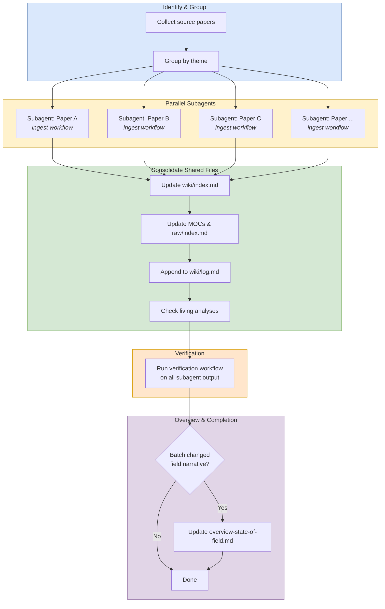

# Batch Ingest

## Purpose

Use this workflow to ingest `3+` sources in parallel, keep per-paper work isolated, and consolidate shared wiki state only after all subagents finish.

## When To Use

- Multiple papers or source files need to be ingested in one session.
- The work can be split cleanly by paper or theme.
- Throughput matters more than doing everything sequentially.

## Trigger Phrases

- `batch ingest`
- `ingest these papers`
- `process these sources in parallel`
- `handle multiple papers`
- `run a parallel ingest`

## Do Not Use When

- There are only `1-2` sources. Use `workflows/ingest.md` instead.
- The task is only to answer a question, review existing pages, or do a lint pass.
- The sources cannot be safely partitioned without multiple agents editing the same files.

## Required Context

- The full list of papers or source files to ingest.
- Any theme grouping that helps assign work cleanly.
- Awareness that shared files are off-limits for subagents: `wiki/index.md`, `wiki/log.md`, MOCs, `AGENTS.md`, `raw/index.md`, and `wiki/overview-state-of-field.md`.

## Procedure

1. Identify every paper to ingest and group them by theme when that reduces overlap.
2. Launch parallel subagents, one per paper, and give each agent a narrow prompt:
   - Own only its assigned source page and any directly related concept or entity pages.
   - Use the full `Ingest` workflow for that one paper.
   - Do not edit shared files.
   - Preserve factual accuracy, source citations, and file-path conventions.
3. Keep the subagent prompt explicit about scope boundaries.
   - Example instruction: "Refactor only the pages for `paper X`; do not touch shared indexes or MOCs."
   - Example instruction: "If you need a shared file, report it instead of editing it."
4. After all subagents complete, consolidate shared files yourself:
   - Update `wiki/index.md` with all new pages and verify directory tree counts.
   - Update relevant MOCs with new reading-path entries.
   - Update `raw/index.md` with new assets.
   - Append all log entries to `wiki/log.md` in chronological order.
   - Check living analyses: `contradictions.md`, `open-questions.md`, and `benchmark-overlap.md`.
5. Run the `Verification` workflow on all subagent output.
6. Update `wiki/overview-state-of-field.md` if the batch materially changes the field picture.

## Completion Checklist

- Every source was assigned to exactly one subagent.
- No subagent touched shared files.
- Shared indexes and logs were consolidated after all agents finished.
- Verification was run on the final output.
- The overview page was updated only if the batch changed the field narrative.

## Related Workflows

- `workflows/ingest.md` for a single-source ingest.
- `workflows/verification.md` for post-subagent QA.
- `workflows/enrich.md` for structural cleanup after ingest.
- `workflows/synthesize.md` for new cross-cutting analysis pages.
