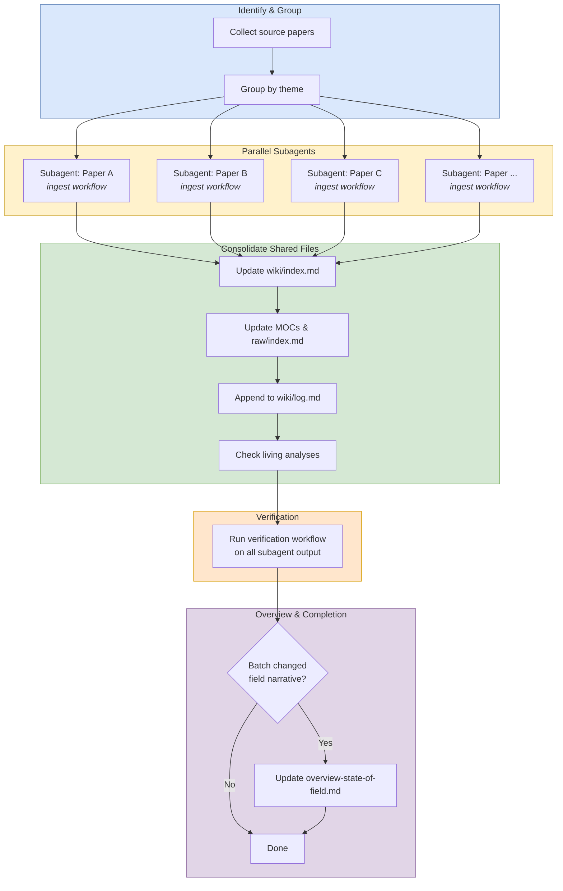

# Batch Ingest

## Purpose

Use this workflow to ingest `3+` sources in parallel, keep per-paper work isolated, and consolidate shared wiki state only after all subagents finish.

## When To Use

- Multiple papers or source files need to be ingested in one session.
- The work can be split cleanly by paper or theme.
- Throughput matters more than doing everything sequentially.

## Trigger Phrases

- `batch ingest`
- `ingest these papers`
- `process these sources in parallel`
- `handle multiple papers`
- `run a parallel ingest`

## Do Not Use When

- There are only `1-2` sources. Use `workflows/create/ingest.md` instead.
- The task is only to answer a question, review existing pages, or do a lint pass.
- The sources cannot be safely partitioned without multiple agents editing the same files.

## Required Context

- The full list of papers or source files to ingest.
- Any theme grouping that helps assign work cleanly.
- The canonical list of coordinator-only files that subagents must not edit, in [`../_shared/rules/shared-file-off-limits.md`](../_shared/rules/shared-file-off-limits.md).

## Procedure

1. Identify every paper to ingest and group them by theme when that reduces overlap.
2. **Dispatch the parallel subagents under the protocol.** Run [parallel subagent protocol](../_shared/procedures/parallel-subagent-protocol.md) in full, then return here and continue with step 3. The fragment owns: per-agent scope boundaries, the canonical coordinator-only file enumeration, the report-not-edit instruction, and the dispatch contract. Each subagent's task is "run `workflows/create/ingest.md` end-to-end on paper X" — the protocol fragment's invariants ensure the per-paper work stays isolated.
3. **Spot-check the agent output.** Run [spot check agent output](../_shared/procedures/spot-check-agent-output.md), then return here and continue with step 4. If the spot check escalates (2+ issues across the sample), pause and run `workflows/audit/verification.md` in full before consolidation.
4. **Consolidate the coordinator-only files** that subagents could not touch:
   - Run [update index and assets](../_shared/procedures/update-index-and-assets.md) once for the whole batch (the fragment's count step uses the post-batch filesystem, so it produces correct counts in one pass).
   - Run [moc update](../_shared/procedures/moc-update.md) once per affected MOC (one call per reading path that gained an entry, not one call per ingested paper).
   - Run [stale count sweep](../_shared/procedures/stale-count-sweep.md) — the count drift from a multi-paper batch is the highest-leverage place for the sweep.
   - Run [living analyses review](../_shared/procedures/living-analyses-review.md) — every numbered direction in `frontier-research-directions.md` and every numbered tension in `contradictions.md` must be reviewed individually, even though the new pages came from different agents.
   - Append a single chronological-order entry per paper to `wiki/log.md`.
5. Run the `Verification` workflow on all subagent output. The spot check in step 3 is the lightweight first pass; verification is the heavyweight per-page review.
6. Update `wiki/overview-state-of-field.md` if the batch materially changes the field picture.
7. **Commit and push.** Run [commit and push](../_shared/procedures/commit-and-push.md) in full. The fragment owns the research-vs-workflow split, the explicit-path staging discipline, the `Co-Authored-By` trailer requirement, and the feature-branch + PR rule for any workflow file changes.

## Completion Checklist

- All items in [`../_shared/checklists/base.md`](../_shared/checklists/base.md) hold.
- All items in [`../_shared/checklists/ingest-additions.md`](../_shared/checklists/ingest-additions.md) hold (each ingested paper must satisfy them, even though the per-paper work was done by a subagent).
- Every source was assigned to exactly one subagent.
- The spot check passed (or the escalation to full verification was performed before consolidation).
- The overview page was updated only if the batch changed the field narrative.

## Related Workflows

- `workflows/create/ingest.md` for a single-source ingest.
- `workflows/audit/verification.md` for post-subagent QA.
- `workflows/enrich/enrich.md` for structural cleanup after ingest.
- `workflows/create/synthesize.md` for new cross-cutting analysis pages.
