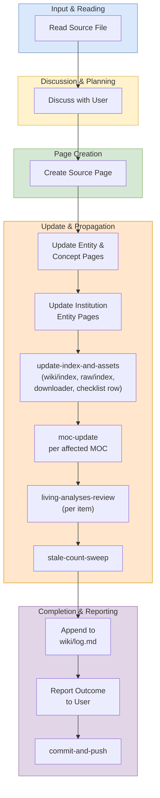

# Ingest Workflow

## Purpose

Use this workflow when adding a new source paper or document from `raw/` into the wiki system.

## When To Use

Use this workflow when the task is to onboard a new source file, generate or update wiki pages from that source, and propagate the change through indexes, MOCs, logs, and related analysis pages.

## Trigger Phrases

Choose this workflow when the user says things like:

- `ingest a paper`
- `add a new source`
- `process this PDF`
- `turn this document into wiki pages`
- `summarize a new source`

## Do Not Use When

Do not use this workflow when the task is only to answer a question, run a lint or review pass, expand existing pages, or create synthesis without introducing a new source.

## Required Context

- The source file in `raw/`
- The target wiki theme or subdirectory, if known
- Any emphasis the user wants preserved in the summary
- Whether the source has a LaTeX archive, duplicate venue PDFs, or arXiv metadata

## Procedure

1. Read the source file in `raw/`.
2. Discuss key takeaways with the user. Ask what to emphasize if unclear.
3. **Pick a slug that disambiguates by default.** Before creating the file, `Glob wiki/sources/**/*.md` and check whether the leading hyphen-token of your candidate slug already exists (e.g., another `kvcomm-*` or `coconut-*`). If it does, use the hybrid form `<technique>-<institution>-<distinguisher>.md` so collisions never accumulate.
4. Create a source page in the appropriate `wiki/sources/` subdirectory. Follow the "Adding a new source under this convention" section in [`../_shared/procedures/source-partials.md`](../_shared/procedures/source-partials.md), then return here and continue with step 5.
   - **Conditional `venue_pdfs:`**: only list a venue PDF when the file is actually present in `raw/pdf/` — verify each path with `Glob` before writing the frontmatter. Phantom `venue_pdfs:` entries propagate into `raw/index.md` and break lint passes weeks later. (This invariant is repeated inline because losing it in delegation has bitten previous ingests; the fragment also enforces it.)
5. For each significant entity or concept mentioned:
   - If a page exists, update it with new information and cite the new source.
   - If no page exists, create one with `title:` in frontmatter.
6. For each institution involved, update or create the entity page following the [entity-partials](../_shared/procedures/entity-partials.md) procedure. For existing entities, add rows to the timeline and researchers partials. For new entities, follow the "Adding a new entity under this convention" checklist in the same procedure. Then return here and continue with step 7.
7. **Sync indexes and assets.** Run [update index and assets](../_shared/procedures/update-index-and-assets.md) in full, then return here and continue with step 8.
8. **Update relevant MOC reading paths.** For each MOC whose theme the new source touches, run [moc update](../_shared/procedures/moc-update.md), then return here and continue with step 9.
9. **Review living analyses per-item.** Run the [living analyses review](../_shared/procedures/living-analyses-review.md) in full, then return here and continue with step 10.
10. **Mandatory:** Run the [stale count sweep](../_shared/procedures/stale-count-sweep.md) in full, then return here and continue with step 11.
11. Append an entry to `wiki/log.md`.
12. Report the outcome to the user: pages created, pages updated, and any contradictions found.
13. **Commit and push.** Run [commit and push](../_shared/procedures/commit-and-push.md) in full.

## Completion Checklist

- All items in [`../_shared/checklists/base.md`](../_shared/checklists/base.md) hold.
- All items in [`../_shared/checklists/ingest-additions.md`](../_shared/checklists/ingest-additions.md) hold.

## Related Workflows

- `workflows/create/batch-ingest.md` — parallel variant for 3+ papers.
- `workflows/audit/lint.md` — validates links introduced by ingest.
- `workflows/enrich/enrich.md` — structural cleanup triggered after ingest.
- `workflows/audit/gap-analysis.md` — proactive counterpart that finds papers to ingest.

