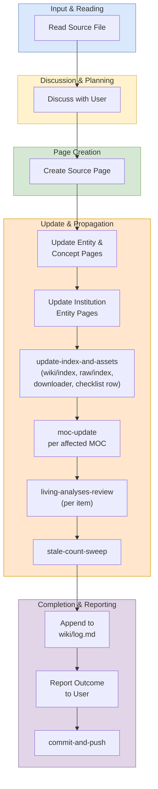

# Ingest Workflow

## Purpose

Use this workflow when adding a new source paper or document from `raw/` into the wiki system.

## When To Use

Use this workflow when the task is to onboard a new source file, generate or update wiki pages from that source, and propagate the change through indexes, MOCs, logs, and related analysis pages.

## Trigger Phrases

Choose this workflow when the user says things like:

- `ingest a paper`
- `add a new source`
- `process this PDF`
- `turn this document into wiki pages`
- `summarize a new source`

## Do Not Use When

Do not use this workflow when the task is only to answer a question, run a lint or review pass, expand existing pages, or create synthesis without introducing a new source.

## Required Context

- The source file in `raw/`
- The target wiki theme or subdirectory, if known
- Any emphasis the user wants preserved in the summary
- Whether the source has a LaTeX archive, duplicate venue PDFs, or arXiv metadata

## Procedure

1. Read the source file in `raw/`.
2. Discuss key takeaways with the user. Ask what to emphasize if unclear.
3. **Pick a slug that disambiguates by default.** Before creating the file, `Glob wiki/sources/**/*.md` and check whether the leading hyphen-token of your candidate slug already exists (e.g., another `kvcomm-*` or `coconut-*`). If it does, use the hybrid form `<technique>-<institution>-<distinguisher>.md` so collisions never accumulate.
4. Create a source page in the appropriate `wiki/sources/` subdirectory. Source pages use the **partial structure** defined in [`../_shared/procedures/source-partials.md`](../_shared/procedures/source-partials.md): a narrative shell at `wiki/sources/<category>/<slug>.md` plus a one-liner partial at `wiki/sources/<category>/<slug>/one-liner.md`, embedded into the shell via `![[<slug>/one-liner]]`.
   - Author the frontmatter, then run [verify frontmatter completeness](../_shared/procedures/verify-frontmatter-completeness.md) in full and return here before continuing. The fragment is the canonical schema; per-type field lists live there, not here.
   - **Conditional `venue_pdfs:`**: only list a venue PDF when the file is actually present in `raw/pdf/` — verify each path with `Glob` before writing the frontmatter. Phantom `venue_pdfs:` entries propagate into `raw/index.md` and break lint passes weeks later. (This invariant is repeated inline because losing it in delegation has bitten previous ingests; the fragment also enforces it.)
   - Add a `## One-liner` heading immediately below the H1, with `![[<slug>/one-liner]]` underneath. Create the partial file at `wiki/sources/<category>/<slug>/one-liner.md` with `type: source-partial`, `parent: <slug>`, `partial: one-liner` frontmatter and a 1–3 sentence body following the shape **bold name + mechanism + key constraint or headline result**. See [`../_shared/procedures/source-partials.md`](../_shared/procedures/source-partials.md) for the full convention and examples.
   - Add a `## Source Materials` footer linking to the PDF and LaTeX source. Both paths must already exist on disk.
   - Fill in section-specific detail per the depth standard.
5. For each significant entity or concept mentioned:
   - If a page exists, update it with new information and cite the new source.
   - If no page exists, create one with `title:` in frontmatter.
6. For each institution involved, update or create the entity page. Entity pages use the **partial structure** defined in `workflows/_shared/procedures/entity-partials.md`: a narrative shell at `wiki/entities/<slug>.md` plus partials at `wiki/entities/<slug>/timeline.md` (the Contribution Timeline table) and `wiki/entities/<slug>/researchers.md` (the Key Researchers list), embedded into the shell via `![[<slug>/timeline]]` and `![[<slug>/researchers]]`.
   - **Existing entity**: edit only `wiki/entities/<slug>/timeline.md` to add a new row for the ingested paper, and `wiki/entities/<slug>/researchers.md` if the paper introduces new key researchers. Any MOC or analysis that transcludes these partials updates automatically — do not also hand-edit those consumers.
   - **New entity**: follow the "Adding a new entity under this convention" checklist in `workflows/_shared/procedures/entity-partials.md`. Create the shell, the two partials (with `type: entity-partial` frontmatter), and add the entity to `wiki/index.md`'s Entities section with the partial subdirectory reflected in the directory-tree counts.
7. **Sync indexes and assets.** Run [update index and assets](../_shared/procedures/update-index-and-assets.md) in full, then return here and continue with step 8. The fragment owns: `wiki/index.md` directory-tree counts and entry-list updates, `raw/index.md` PDF/LaTeX/venue-PDF tables, `raw/download_arxiv_papers.py` reproducibility, and the appended row in `raw/checklist.md` via [raw checklist row](../_shared/procedures/raw-checklist-row.md).
8. **Update relevant MOC reading paths.** For each MOC whose theme the new source touches, run [moc update](../_shared/procedures/moc-update.md), then return here and continue with step 9. Insert each new entry in the position the MOC's ordering principle dictates — not appended at the end.
9. **Review living analyses per-item.** Run the [living analyses review](../_shared/procedures/living-analyses-review.md) in full, then return here and continue with step 10. Every numbered direction in `frontier-research-directions.md` and every numbered tension in `contradictions.md` must be reviewed individually — the high-level "is this page relevant?" question hides individual matches.
10. **Mandatory:** Run the [stale count sweep](../_shared/procedures/stale-count-sweep.md). This is a first-class regression class — do not skip. The common-offender list and grep patterns live in the fragment; apply them against the pre-ingest count (N) and the post-ingest count (N+1 or N+k). When complete, return here and continue with step 11.
11. Append an entry to `wiki/log.md`.
12. Report the outcome to the user: pages created, pages updated, and any contradictions found.
13. **Commit and push.** Run [commit and push](../_shared/procedures/commit-and-push.md) in full. The fragment owns the research-vs-workflow split, the explicit-path staging discipline, the `Co-Authored-By` trailer requirement, and the feature-branch + PR rule for any workflow file changes.

## Completion Checklist

- All items in [`../_shared/checklists/base.md`](../_shared/checklists/base.md) hold.
- All items in [`../_shared/checklists/ingest-additions.md`](../_shared/checklists/ingest-additions.md) hold.

## Related Workflows

- `workflows/query/query.md`
- `workflows/audit/lint.md`
- `workflows/create/batch-ingest.md`
- `workflows/enrich/enrich.md`
- `workflows/enrich/expand.md`
- `workflows/create/synthesize.md`
- `workflows/audit/review.md`

