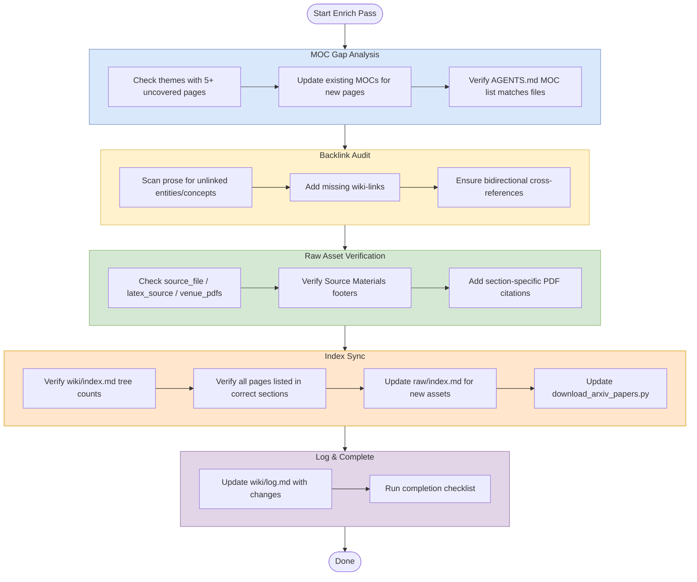

# Enrich (Structural Improvement Pass)

## Purpose
Improve navigation, linking, and discoverability across the wiki without adding new substantive content.

## When To Use
Use this workflow when the wiki already has content and you need to clean up structure, links, asset references, or index consistency.

## Trigger Phrases
- `enrich`
- `improve navigation`
- `fix backlinks`
- `audit links`
- `sync indexes`
- `update asset references`
- `structural cleanup`

## Do Not Use When
- You need to add or deepen substantive page content. Use `workflows/expand.md`.
- You need a broader health check or issue scan. Use `workflows/lint.md`.
- You are ingesting new papers or sources. Use `workflows/ingest.md`.
- You need a full wiki review pass. Use `workflows/review.md`.

## Required Context
- `wiki/index.md`
- Relevant MOCs in `wiki/mocs/`
- Current wiki pages in the affected themes
- `raw/index.md`
- `raw/download_arxiv_papers.py` if arXiv assets were added
- `AGENTS.md` current workflow and MOC references

## Procedure
1. Run a lightweight MOC Gap Analysis:
   - Check whether any theme has 5+ uncovered pages.
   - Update existing MOCs when new pages are added to their theme.
- Verify the `AGENTS.md` Current MOCs list matches actual MOC files.
2. Audit backlinks:
   - Scan for entity and concept names mentioned in prose but not wiki-linked.
   - Add missing links.
   - Check that cross-concept references are bidirectional where the connection is discussed on both sides.
3. Verify raw asset linking:
   - Ensure all source pages have `source_file:`, `latex_source:`, and `venue_pdfs:` when applicable.
   - Ensure all source pages include a `## Source Materials` footer.
   - Add section-specific PDF citations like `[[raw/pdf/file.pdf|Paper §X]]` to concept pages for key claims.
4. Sync indexes:
   - Verify `wiki/index.md` directory tree counts match actual page counts.
   - Verify all pages appear in the appropriate index sections.
5. Update `raw/index.md` if new PDFs or LaTeX sources were added.
6. Update `raw/download_arxiv_papers.py` if arXiv assets were added so the download list stays reproducible.
7. Update `wiki/log.md` with what changed.

## Completion Checklist
- MOC coverage gaps were checked and only expected gaps remain.
- Internal links are present where prose refers to entities or concepts.
- Source pages expose required asset metadata and source-material footers.
- Index counts and page listings match the actual vault state.
- Any arXiv-related changes are reflected in `raw/download_arxiv_papers.py`.
- The work is logged in `wiki/log.md`.

## Related Workflows
- `workflows/lint.md`
- `workflows/expand.md`
- `workflows/ingest.md`
- `workflows/review.md`
- `workflows/moc-gap-analysis.md`
