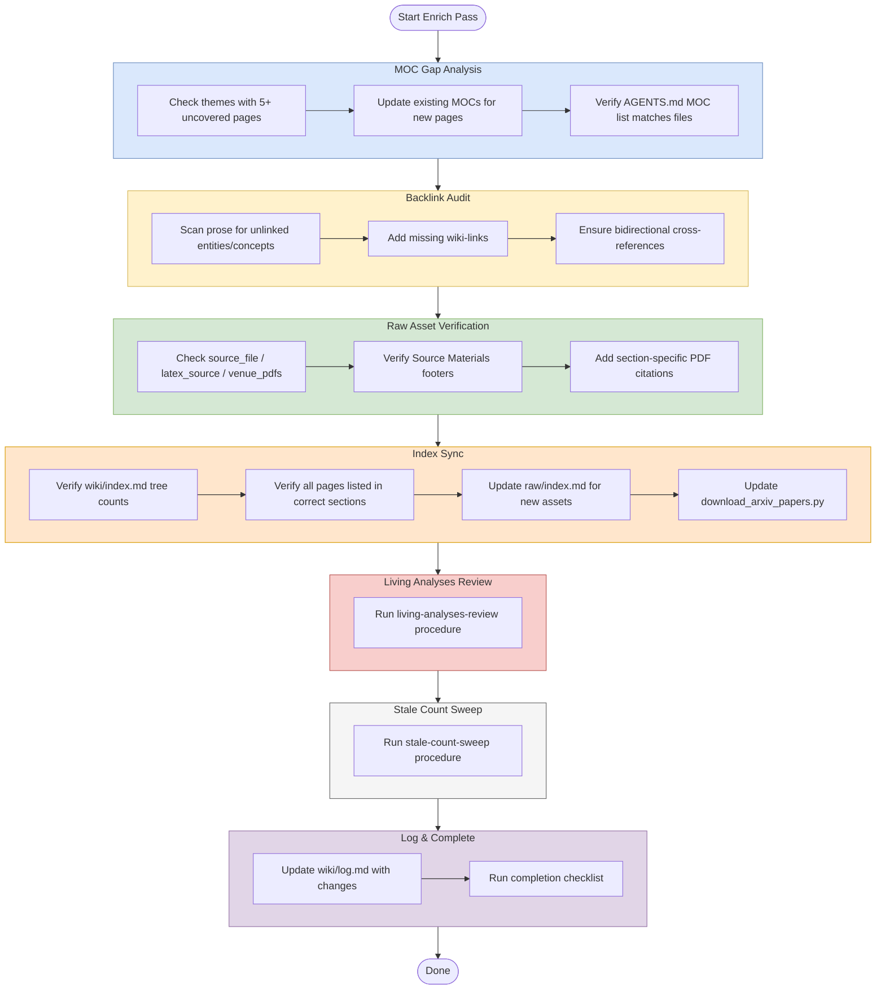

# Enrich (Structural Improvement Pass)

## Purpose
Improve navigation, linking, and discoverability across the wiki without adding new substantive content.

## When To Use
Use this workflow when the wiki already has content and you need to clean up structure, links, asset references, or index consistency.

## Trigger Phrases
- `enrich`
- `improve navigation`
- `fix backlinks`
- `audit links`
- `sync indexes`
- `update asset references`
- `structural cleanup`

## Do Not Use When
- You need to add or deepen substantive page content. Use `workflows/enrich/expand.md`.
- You need a broader health check or issue scan. Use `workflows/audit/lint.md`.
- You are ingesting new papers or sources. Use `workflows/create/ingest.md`.
- You need a full wiki review pass. Use `workflows/audit/review.md`.

## Required Context
- `wiki/index.md`
- Relevant MOCs in `wiki/mocs/`
- Current wiki pages in the affected themes
- `raw/index.md`
- `raw/download_arxiv_papers.py` if arXiv assets were added
- `AGENTS.md` current workflow and MOC references

## Procedure
1. Run a lightweight MOC Gap Analysis:
   - Check whether any theme has 5+ uncovered pages (a full check belongs to `workflows/audit/moc-gap-analysis.md`; this is a quick scan).
   - For each existing MOC whose reading path needs an update, run [moc update](../_shared/procedures/moc-update.md), then return here and continue.
   - Verify the `AGENTS.md` Current MOCs list matches actual MOC files.
   - After completing all sub-steps, continue to step 2.
2. Audit backlinks:
   - Scan for entity and concept names mentioned in prose but not wiki-linked.
   - Add missing links.
   - Check that cross-concept references are bidirectional where the connection is discussed on both sides.
   - For concept partials specifically, run [concept-partial bidirectionality check](../_shared/procedures/concept-partial-bidirectionality.md).
3. Verify raw asset linking:
   a. Run [verify frontmatter completeness](../_shared/procedures/verify-frontmatter-completeness.md) on each source page touched by the pass, then return here.
   b. Separately verify that all source pages include a `## Source Materials` footer.
   c. Add section-specific PDF citations like `[[raw/pdf/file.pdf|Paper §X]]` to concept pages for key claims. Verify each PDF path exists with `Glob` before adding the wiki-link (per [path-discipline](../_shared/rules/path-discipline.md)).
4. **Sync indexes and assets.** Run [update index and assets](../_shared/procedures/update-index-and-assets.md) in full, then return here and continue with step 5. The fragment owns: `wiki/index.md` directory-tree counts and entry-list updates, `raw/index.md` PDF/LaTeX/venue-PDF tables, and `raw/download_arxiv_papers.py` reproducibility.
5. **Living analyses review.** Run [living analyses review](../_shared/procedures/living-analyses-review.md) in full, then return here and continue with step 6.
6. **Stale count sweep.** Run [stale count sweep](../_shared/procedures/stale-count-sweep.md) in full, then return here and continue with step 7.
7. Update `wiki/log.md` with what changed.
8. **Commit and push.** Run [commit and push](../_shared/procedures/commit-and-push.md) in full.

## Completion Checklist
- All items in [`../_shared/checklists/base.md`](../_shared/checklists/base.md) hold.
- MOC coverage gaps were checked and only expected gaps remain.
- Internal links are present where prose refers to entities or concepts.
- Source pages expose required asset metadata and source-material footers.

## Related Workflows
- `workflows/audit/lint.md`
- `workflows/enrich/expand.md`
- `workflows/create/ingest.md`
- `workflows/audit/review.md`
- `workflows/audit/moc-gap-analysis.md`
