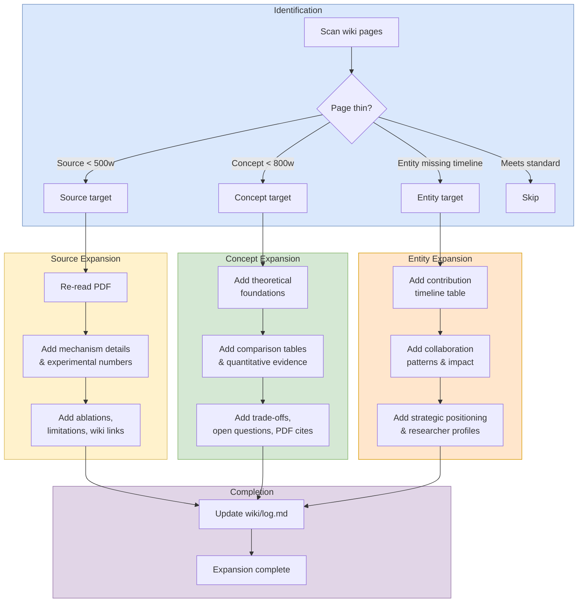

# Expand Workflow

## Purpose

Use this workflow to deepen existing wiki pages without changing the overall information architecture.

## When To Use

Use this workflow when pages already exist but need more depth, more evidence, better comparisons, or stronger technical analysis.

## Trigger Phrases

Choose this workflow when the user says things like:

- `expand this page`
- `deepen the wiki`
- `add more detail`
- `make the summary more thorough`
- `fill out the concept page`

## Do Not Use When

Do not use this workflow for new-source onboarding, direct question answering, synthesis-first work, lint-only passes, or structural reorganization.

## Required Context

- The target pages to expand
- The page type for each target: source, concept, or entity
- Any recent sources or related pages that should be cross-referenced
- The depth or emphasis the user wants preserved

## Procedure

1. Identify thin pages — source summaries under 500 words, concept pages under 800 words, entity pages without contribution timelines or strategic positioning.
2. For **source pages**: Re-read the PDF. Add mechanism details, experimental numbers, ablation results, limitations, and connections to the broader wiki. Run [verify frontmatter completeness](../_shared/procedures/verify-frontmatter-completeness.md) on each expanded source page, then return here and continue with step 3.
3. For **concept pages**: Add theoretical foundations, comparison tables, quantitative evidence, trade-off analyses, open questions, and section-specific PDF citations.
4. For **entity pages**: Add contribution timelines (date/paper/role/result tables), collaboration patterns across institutions, ecosystem impact, strategic positioning relative to frontier research directions, and enriched researcher profiles. If extracting timeline or researcher list as partials for transclusion, run [entity-partials](../_shared/procedures/entity-partials.md) in full, then return here and continue with step 5.
5. Update `wiki/log.md` with what was expanded.
6. **Commit and push.** Run [commit and push](../_shared/procedures/commit-and-push.md) in full, then return here — the workflow is complete after this step.

## Completion Checklist

- All items in [`../_shared/checklists/base.md`](../_shared/checklists/base.md) hold.
- Thin pages were identified against the depth standard.
- Source pages were re-read before being expanded.
- Concept pages include stronger theory, comparisons, and citations.
- Entity pages include timelines and strategic context where appropriate.
- `wiki/log.md` records the expansion pass.
- `wiki/log.md` was updated and committed to master.

## Related Workflows

- `workflows/enrich/enrich.md` — structural cleanup companion to depth expansion.
- `workflows/create/ingest.md` — produces the source pages that expand deepens.
- `workflows/audit/lint.md` — validates links after expansion.
- `workflows/audit/review.md` — broader audit that may trigger expansion work.
