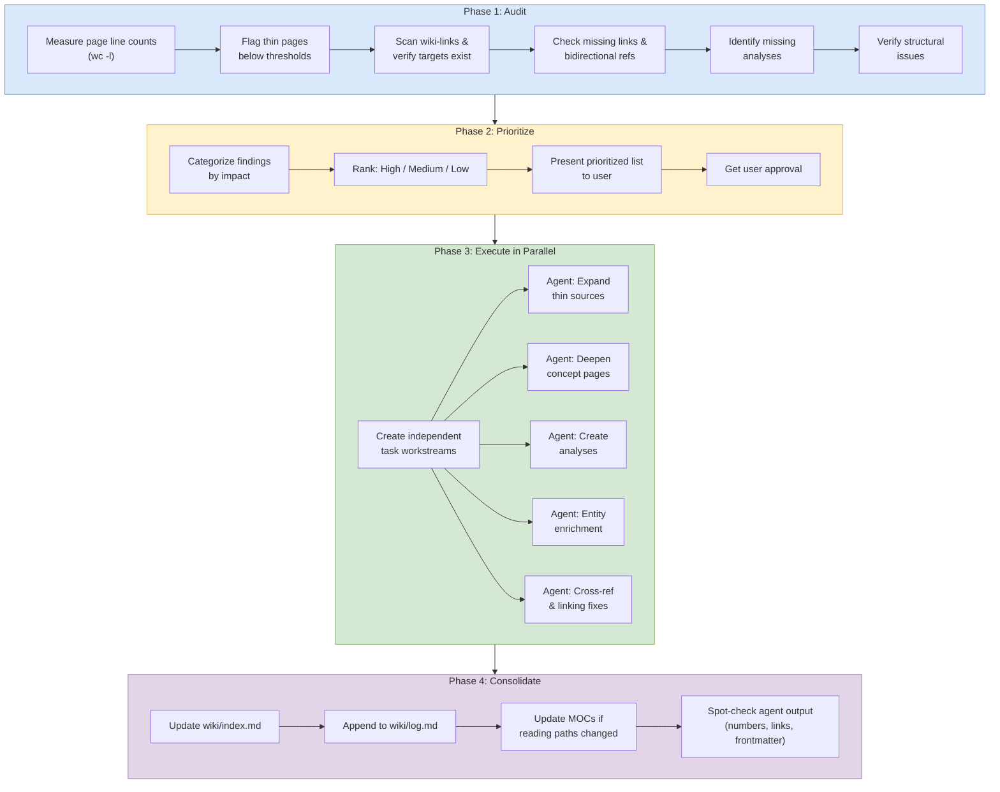

# Enrichment Audit

## Purpose
Data-driven gap-finding pass that inventories enrichment opportunities across the wiki, prioritizes them by impact, and executes the work in parallel via agent teams.

## When To Use
- The user asks to `review for enrichment`.
- The wiki has grown significantly since the last audit.
- You need a systematic pass for thin pages, missing analyses, or structural drift.

## Trigger Phrases
- `review for enrichment`
- `run an enrichment audit`
- `find wiki gaps`
- `audit the wiki for missing coverage`
- `prioritize enrichment work`

## Do Not Use When
- The user only wants a single page expanded.
- The task is a normal ingest, lint, or review pass.
- There is no need to prioritize work across multiple gaps.
- Parallel execution would not add value.

## Required Context
- The current wiki page set and directory structure.
- The latest `wiki/index.md`.
- The latest MOC list and `wiki/mocs/*.md` files.
- Any recent batch output or known drift areas.

## Procedure
### Phase 1: Audit
1. Measure all wiki pages by line count with `wc -l`.
2. Flag pages below these thresholds:
   - Source pages: under 130 lines, target 150-300.
   - Concept pages: under 120 lines, target 120-250.
   - Entity pages: under 50 lines, target 50-80.
   - Analysis pages: under 100 lines, target 150-250.
3. Scan all wiki pages for `[[wiki-links]]` and verify targets exist.
4. Check for entity and concept names mentioned in prose but not wiki-linked, and verify bidirectional linking where relevant.
5. Identify missing analyses, especially benchmarks covered by 3+ papers, themes spanning multiple pages without an analysis, and contradictions not yet tracked.
6. Verify structural issues such as file placement, MOC paths, escaped characters, and index accuracy.

### Phase 2: Prioritize
1. Categorize findings into a table by impact.
2. Use this ranking:
   - High: thin source or concept pages, missing high-value analyses.
   - Medium: entity enrichment, cross-reference gaps, missing MOCs.
   - Low: structural or cosmetic fixes, minor cross-linking.
3. Present the prioritized list to the user with line counts and specific gaps.
4. Get approval before executing any fixes.

### Phase 3: Execute in Parallel
1. Create one task per independent workstream, such as expanding thin source pages, deepening concept pages, or creating a benchmark analysis.
2. **Dispatch the parallel agents under the protocol.** Run [parallel subagent protocol](_shared/procedures/parallel-subagent-protocol.md) in full, then return here and continue with Phase 4. The fragment owns: per-agent scope boundaries, the canonical coordinator-only file enumeration (replacing the drifted 4-item list this phase used to inline), the report-not-edit instruction, and the dispatch contract. Track completion as tasks finish and report results incrementally to the user — the protocol fragment makes this explicit.

### Phase 4: Consolidate
1. **Sync indexes and assets.** Run [update index and assets](_shared/procedures/update-index-and-assets.md), then return here and continue with step 2. The fragment owns the `wiki/index.md` count and entry-list updates.
2. **Update affected MOCs.** For each MOC whose reading path gained an entry during Phase 3, run [moc update](_shared/procedures/moc-update.md). Skip if no MOC was affected.
3. **Spot-check the agent output.** Run [spot check agent output](_shared/procedures/spot-check-agent-output.md), then return here and continue with step 4. If the spot check escalates (2+ issues across the sample), pause and run `workflows/verification.md` in full before logging.
4. Append all activity to `wiki/log.md` as a single audit entry per workstream.
5. **Commit and push.** Run [commit and push](_shared/procedures/commit-and-push.md) in full.

## Completion Checklist
- All items in [`_shared/checklists/base.md`](_shared/checklists/base.md) hold.
- All items in [`_shared/checklists/audit-additions.md`](_shared/checklists/audit-additions.md) hold.
- All gaps are prioritized by impact.
- User approval has been obtained before execution.
- Parallel tasks had disjoint file ownership.

## Related Workflows
- `workflows/lint.md`
- `workflows/expand.md`
- `workflows/synthesize.md`
- `workflows/moc-gap-analysis.md`
- `workflows/verification.md`
