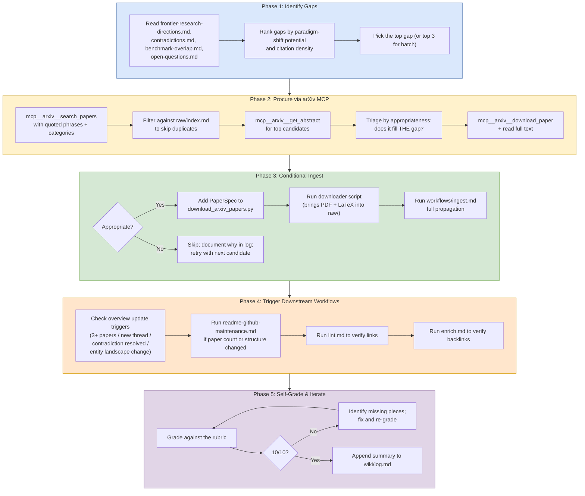

# Gap Analysis Workflow

## Purpose

Find a high-priority gap in the wiki's research coverage, procure the paper that best fills it from arXiv, ingest it through the standard ingest workflow, and trigger any downstream workflows whose conditions are met by the ingest. This is the **proactive counterpart** to `workflows/ingest.md` — instead of starting from a paper the user supplies, you start from a wiki gap and find the paper.

## When To Use

Use this workflow when:

- The user asks for a "gap analysis", "research gap", "find a paper to fill X", or "what's missing from this wiki".
- Periodic maintenance: the wiki has been stable for a while and a fresh research-data ingest would improve it.
- A specific frontier direction or contradiction is blocking analysis and a new paper is the best way to resolve it.

This workflow is **proactive** — it generates new ingest work from the wiki's own analyses, rather than waiting for the user to supply a source.

## Trigger Phrases

- `gap analysis` / `gap analysis workflow`
- `find a paper for gap X`
- `what's missing from the wiki`
- `procure a paper to fill X`
- `find research data on Y`

## Do Not Use When

- The user has already supplied a paper to ingest → use `workflows/ingest.md` directly.
- The task is wiki maintenance without new sources → use `workflows/enrichment-audit.md` or `workflows/review.md`.
- The task is a question about the existing wiki → use `workflows/query.md`.
- The user wants to ingest 3+ papers in parallel that they've already selected → use `workflows/batch-ingest.md`.

## Required Context

- The current wiki state — read `wiki/index.md`, the last 5-10 entries of `wiki/log.md`, and the relevant analysis pages (`frontier-research-directions.md`, `contradictions.md`, `benchmark-overlap.md`, `open-questions.md`).
- The arXiv IDs already in the vault (from `raw/index.md` or `raw/download_arxiv_papers.py`'s `PAPER_SPECS`) — to avoid duplicate ingests.
- The arXiv MCP tools: `mcp__arxiv__search_papers`, `mcp__arxiv__get_abstract`, `mcp__arxiv__download_paper`, `mcp__arxiv__read_paper`. These are required — fall back to `WebSearch` only if the MCP is unavailable.

## Procedure

### Phase 1: Identify Gaps from Existing Analyses

1. Read `wiki/index.md` first (per the Session Start convention) to orient.
2. Read the relevant gap-tracking analysis pages:
   - `wiki/analyses/frontier-research-directions.md` — paradigm-shift directions
   - `wiki/analyses/contradictions.md` — unresolved tensions
   - `wiki/analyses/benchmark-overlap.md` — benchmark blind spots, scale gaps
   - `wiki/analyses/open-questions.md` — clustered open questions
3. Build a ranked list of gaps. Prefer gaps that:
   - Are explicitly tracked as "high priority" or "the central unsolved problem"
   - Have empirical (not purely theoretical) evidence missing
   - Would update multiple existing pages if filled
   - Are likely to have recent (< 18 months) arXiv coverage
4. Pick the top gap (or top 3 for a batch run). State the gap explicitly: *"the wiki tracks X but lacks Y; finding a paper that demonstrates Y would resolve / partially resolve / advance Z."*

### Phase 2: Procure via arXiv MCP

1. **Search**: Call `mcp__arxiv__search_papers` with quoted technical phrases relevant to the gap, restricted to `cs.CL`/`cs.AI`/`cs.LG` (or whatever categories match), `date_from` set to a recent window (typically the last 12 months), `max_results: 15`, `sort_by: relevance`. Avoid generic terms — use the wiki's own vocabulary.
2. **Deduplicate**: Cross-reference candidate arXiv IDs against `raw/index.md` and `raw/download_arxiv_papers.py`'s `PAPER_SPECS`. Drop any IDs already ingested.
3. **Triage abstracts**: For each remaining candidate, call `mcp__arxiv__get_abstract` (cheap, no full download). Score each candidate against the gap statement from Phase 1. Ask:
   - Does this paper directly test, resolve, or advance the gap?
   - Does it make findings that would update existing wiki pages (concepts, contradictions, frontier directions)?
   - Is it appropriately scoped (not a survey, not a tangentially related method)?
4. **Pick the best**: Select the single paper with the highest "fit-to-gap" score. If two candidates are tied, prefer the more recent one or the one with stronger empirical claims. For batch runs (top-3 gap mode), pick one paper per gap, not three papers for the same gap.
5. **Read the paper**: Call `mcp__arxiv__download_paper`, then read it. The download is persisted by the MCP for later access via `mcp__arxiv__read_paper`.

### Phase 3: Conditional Ingest

1. **Appropriateness review** (mandatory, do not skip): Before running the ingest workflow, write a 3-5 sentence appropriateness check answering:
   - What does this paper actually contribute (vs. claim to contribute)?
   - Does it match the gap from Phase 1?
   - What existing wiki pages will it update, and how substantially?
   - Are there caveats (scope, scale, reproducibility) that change the verdict?
2. **If not appropriate**: Document the reason in `wiki/log.md` and return to Phase 2 step 4 with the next-best candidate.
3. **If appropriate**:
   a. Add a `PaperSpec("XXXX.XXXXX", "archive")` (or `"extract"`) entry to `raw/download_arxiv_papers.py` in arXiv-ID order.
   b. Run the downloader script: `cd raw && python download_arxiv_papers.py`. The script is idempotent — it skips files that already exist. The new paper's PDF and LaTeX archive will land in `raw/pdf/` and `raw/latex/`.
   c. Update `raw/index.md` (PDF entry, LaTeX archive entry, summary count).
   d. Run `workflows/ingest.md` end-to-end. Do not paraphrase its steps from memory — read the file. Specifically:
      - Create the source page in the appropriate `wiki/sources/<theme>/` subdirectory at full depth standard.
      - Update or create entity pages (if a new institution appears, create the page).
      - Update concept pages with the new paper's findings.
      - Update other source pages that the new paper directly cites or critiques.
      - Update `wiki/index.md` directory tree counts and entity list.
      - Update relevant MOCs.
      - Update living analyses (`contradictions.md`, `frontier-research-directions.md`, `benchmark-overlap.md`, `open-questions.md`, `paper-timeline.md`, `method-comparison.md`).
      - Append a comprehensive entry to `wiki/log.md`.

### Phase 4: Trigger Downstream Workflows

After the ingest completes, **explicitly check** each of the following trigger conditions and run the corresponding workflow if it fires. Do not assume the ingest workflow handles these — it does not.

1. **Overview update** (`wiki/overview-state-of-field.md`):
   - Trigger: 3+ papers ingested in batch, OR a new research thread emerges, OR a major contradiction is resolved (or partially resolved), OR new MOCs are created, OR the entity landscape changes (new institution).
   - Action: Update the relevant sections of `overview-state-of-field.md` to reflect the new finding. Bump `updated:` frontmatter.
   - For a single-paper ingest, this workflow's job is to *check the trigger*, not to skip it by default.

2. **README update** (`workflows/readme-github-maintenance.md`):
   - Trigger: Paper count changes, vault structure changes, or new institution joins.
   - Action: Update badge counts, paper list, How-It-Was-Built paragraph, vault structure tree.
   - For a single-paper ingest, the paper count always increments — this trigger always fires.

3. **Lint** (`workflows/lint.md`):
   - Trigger: Any ingest that introduces new wiki-links, new anchors, or new section references.
   - Action: Verify all newly introduced wiki-links resolve to existing pages and that any anchor references (`[[page#section]]`) match real headers.

4. **Enrich** (`workflows/enrich.md`):
   - Trigger: Any ingest that creates a new entity page or significantly updates an existing one.
   - Action: Verify bidirectional linking — the new entity is discoverable from the index, the source page links to the entity, and the entity links back to the source.

5. **Schema self-audit** (`workflows/schema-self-audit.md`):
   - Trigger: New source subdirectory created, or AGENTS.md workflow index updated, or new entity-page convention established.
   - Action: Verify AGENTS.md still matches the actual vault layout.

For single-paper ingests, triggers 2-4 always fire; trigger 1 fires conditionally; trigger 5 rarely fires.

### Phase 5: Self-Grade and Iterate

1. **Grade the run** against the following rubric (10 points each, average for the final score):
   - Gap identification — was the chosen gap actually high-priority?
   - Paper selection — was the chosen paper the best available match?
   - arXiv MCP usage — was the workflow followed (search → triage → abstract → download → read)?
   - Source page depth — does it meet the depth standard?
   - Entity creation — if a new entity was needed, was it created at full depth?
   - Concept/source/MOC propagation — were all relevant pages updated with substantive content (not just link additions)?
   - Analysis updates — were all 5+ living analyses checked and updated where relevant?
   - Overview / README / log — were the global pages updated?
   - Lint compliance — do all new links resolve, do all new anchors exist?
   - Workflow trigger discipline — were all downstream workflow triggers explicitly checked and acted on?
2. **If < 10/10**: Identify the missing pieces, fix them, and re-grade. Iterate until 10/10. Do not skip this loop — it is the difference between a 7/10 ingest and a 10/10 ingest.
3. **Append a final summary** to `wiki/log.md` with the gap statement, the chosen paper, the propagation summary, and the final grade.

## Completion Checklist

- A specific gap was identified from the wiki's own analysis pages (not invented).
- arXiv MCP was used for search, abstract triage, and download (not WebSearch).
- The chosen paper was checked for appropriateness with explicit reasoning before ingest.
- The downloader script (`raw/download_arxiv_papers.py`) was updated and run.
- `raw/index.md` was updated with the new PDF and LaTeX entries and summary counts.
- `workflows/ingest.md` was followed end-to-end (source page + entities + concepts + MOCs + analyses + index + log).
- All Phase 4 downstream workflow triggers were explicitly checked and acted on (or explicitly noted as not firing).
- Lint sweep verified no broken wiki-links or anchors were introduced.
- The run was self-graded against the rubric and any < 10/10 items were fixed.
- A comprehensive entry was appended to `wiki/log.md` documenting the full propagation.

## Related Workflows

- `workflows/ingest.md` — invoked in Phase 3 to do the actual ingest propagation.
- `workflows/batch-ingest.md` — used instead of this workflow when 3+ pre-selected papers need parallel ingest.
- `workflows/readme-github-maintenance.md` — triggered in Phase 4 step 2.
- `workflows/lint.md` — triggered in Phase 4 step 3.
- `workflows/enrich.md` — triggered in Phase 4 step 4.
- `workflows/enrichment-audit.md` — alternative entry point for systematic gap-finding when no new paper procurement is needed.
- `workflows/schema-self-audit.md` — triggered in Phase 4 step 5.

## Notes for Future Refinement

- **Batch mode**: The current workflow is single-paper. A batch variant could find the top-3 gaps, run Phase 2 for each in parallel, and then use `workflows/batch-ingest.md` for the parallel propagation.
- **Cross-MCP verification**: The arXiv MCP returns abstracts and full text but not citation counts or impact metrics. A future variant could cross-reference Semantic Scholar via `mcp__arxiv__citation_graph` to weight selection by citation impact.
- **Auto-trigger**: This workflow is currently manual. A future variant could be triggered by a cron schedule (`workflows/schedule.md` + `RemoteTrigger`) to run monthly gap-and-fill cycles automatically.
- **Negative results**: The workflow does not currently track papers that were considered but rejected. A `gap-analysis-rejected.md` log could prevent re-evaluation of the same candidates in future runs.
