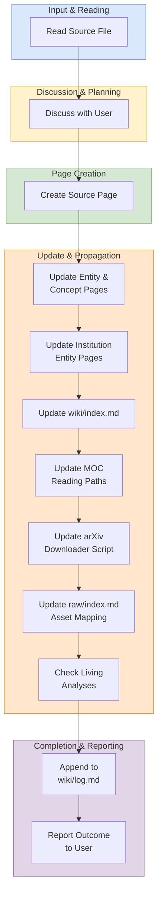

# Ingest Workflow

## Purpose

Use this workflow when adding a new source paper or document from `raw/` into the wiki system.

## When To Use

Use this workflow when the task is to onboard a new source file, generate or update wiki pages from that source, and propagate the change through indexes, MOCs, logs, and related analysis pages.

## Trigger Phrases

Choose this workflow when the user says things like:

- `ingest a paper`
- `add a new source`
- `process this PDF`
- `turn this document into wiki pages`
- `summarize a new source`

## Do Not Use When

Do not use this workflow when the task is only to answer a question, run a lint or review pass, expand existing pages, or create synthesis without introducing a new source.

## Required Context

- The source file in `raw/`
- The target wiki theme or subdirectory, if known
- Any emphasis the user wants preserved in the summary
- Whether the source has a LaTeX archive, duplicate venue PDFs, or arXiv metadata

## Procedure

1. Read the source file in `raw/`.
2. Discuss key takeaways with the user. Ask what to emphasize if unclear.
3. Create a source summary page in the appropriate `wiki/sources/` subdirectory. Include:
   - Full frontmatter: `type`, `title`, `source_file`, `latex_source` (if available), `author`, `date_published`, `date_ingested`, `created`, `tags`.
   - If venue duplicate PDFs exist, add `venue_pdfs:`.
   - A `## Source Materials` footer linking to the PDF and LaTeX source.
   - Section-specific detail per the depth standard.
4. For each significant entity or concept mentioned:
   - If a page exists, update it with new information and cite the new source.
   - If no page exists, create one with `title:` in frontmatter.
5. For each institution involved, update or create the entity page with a contribution timeline entry.
6. Update `wiki/index.md` and verify directory tree counts.
7. Update relevant MOC pages (`wiki/mocs/*.md`) to add the new source or concept to the correct reading path.
8. If the source is on arXiv, update `raw/download_arxiv_papers.py` so the downloader includes the new paper ID and the correct LaTeX storage mode (`archive` vs `extract`).
9. Update `raw/index.md` to add the new PDF and LaTeX source to the asset mapping.
10. Check living analyses and update any that are relevant:
   - `contradictions.md` for new conflicts or nuance
   - `open-questions.md` for new questions or answers
   - `benchmark-overlap.md` for new benchmark results
11. Append an entry to `wiki/log.md`.
12. Report the outcome to the user: pages created, pages updated, and any contradictions found.

## Completion Checklist

- The source page exists in the correct `wiki/sources/` location.
- All relevant entity and concept pages were updated or created.
- `wiki/index.md` reflects the new pages.
- Relevant MOCs include the new reading path entries.
- `raw/index.md` and `raw/download_arxiv_papers.py` were updated if needed.
- Relevant analysis pages were checked or updated.
- `wiki/log.md` includes the ingest entry.

## Related Workflows

- `workflows/query.md`
- `workflows/lint.md`
- `workflows/batch-ingest.md`
- `workflows/enrich.md`
- `workflows/expand.md`
- `workflows/synthesize.md`
- `workflows/review.md`

