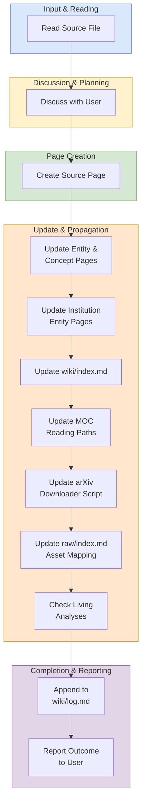

# Ingest Workflow

## Purpose

Use this workflow when adding a new source paper or document from `raw/` into the wiki system.

## When To Use

Use this workflow when the task is to onboard a new source file, generate or update wiki pages from that source, and propagate the change through indexes, MOCs, logs, and related analysis pages.

## Trigger Phrases

Choose this workflow when the user says things like:

- `ingest a paper`
- `add a new source`
- `process this PDF`
- `turn this document into wiki pages`
- `summarize a new source`

## Do Not Use When

Do not use this workflow when the task is only to answer a question, run a lint or review pass, expand existing pages, or create synthesis without introducing a new source.

## Required Context

- The source file in `raw/`
- The target wiki theme or subdirectory, if known
- Any emphasis the user wants preserved in the summary
- Whether the source has a LaTeX archive, duplicate venue PDFs, or arXiv metadata

## Procedure

1. Read the source file in `raw/`.
2. Discuss key takeaways with the user. Ask what to emphasize if unclear.
3. **Pick a slug that disambiguates by default.** Before creating the file, `Glob wiki/sources/**/*.md` and check whether the leading hyphen-token of your candidate slug already exists (e.g., another `kvcomm-*` or `coconut-*`). If it does, use the hybrid form `<technique>-<institution>-<distinguisher>.md` so collisions never accumulate.
4. Create a source summary page in the appropriate `wiki/sources/` subdirectory. Include:
   - Full frontmatter: `type`, `title`, `source_file`, `latex_source` (if available), `author`, `date_published`, `date_ingested`, `created`, `tags`.
   - If venue duplicate PDFs exist **and the file is actually present in `raw/pdf/`**, add `venue_pdfs:`. **Never list a venue PDF you have not downloaded** — verify each path with `Glob` before writing the frontmatter. Phantom `venue_pdfs:` entries propagate into `raw/index.md` and break lint passes weeks later.
   - A `## Source Materials` footer linking to the PDF and LaTeX source. Both paths must already exist on disk.
   - Section-specific detail per the depth standard.
5. For each significant entity or concept mentioned:
   - If a page exists, update it with new information and cite the new source.
   - If no page exists, create one with `title:` in frontmatter.
6. For each institution involved, update or create the entity page. Entity pages use the **partial structure** defined in `workflows/_shared/procedures/entity-partials.md`: a narrative shell at `wiki/entities/<slug>.md` plus partials at `wiki/entities/<slug>/timeline.md` (the Contribution Timeline table) and `wiki/entities/<slug>/researchers.md` (the Key Researchers list), embedded into the shell via `![[<slug>/timeline]]` and `![[<slug>/researchers]]`.
   - **Existing entity**: edit only `wiki/entities/<slug>/timeline.md` to add a new row for the ingested paper, and `wiki/entities/<slug>/researchers.md` if the paper introduces new key researchers. Any MOC or analysis that transcludes these partials updates automatically — do not also hand-edit those consumers.
   - **New entity**: follow the "Adding a new entity under this convention" checklist in `workflows/_shared/procedures/entity-partials.md`. Create the shell, the two partials (with `type: entity-partial` frontmatter), and add the entity to `wiki/index.md`'s Entities section with the partial subdirectory reflected in the directory-tree counts.
7. Update `wiki/index.md` and verify directory tree counts.
8. Update relevant MOC pages (`wiki/mocs/*.md`) to add the new source or concept to the correct reading path.
9. If the source is on arXiv, update `raw/download_arxiv_papers.py` so the downloader includes the new paper ID and the correct LaTeX storage mode (`archive` vs `extract`).
10. Update `raw/index.md` to add the new PDF and LaTeX source to the asset mapping. **Also append a new row to `raw/checklist.md`** (the URL audit trail, parallel to `raw/index.md`'s asset map). The checklist has eight columns: `Paper | Original refs from list | Canonical PDF download | Canonical LaTeX/source download | PDF present | Local PDF | LaTeX present | Local LaTeX/source`. Fill the row as follows:
    - **Paper**: the paper title.
    - **Original refs from list**: `arXiv:XXXX.XXXXX` plus any venue-duplicate IDs (OpenReview, ACL, EMNLP, ICLR, NeurIPS, ICML) that appear in the "Duplicate PDFs (Venue Copies)" section of `raw/index.md` for this paper. Separate multiple refs with `;`. **Only include venue refs whose PDF is actually present in `raw/pdf/`** — same constraint as step 4's `venue_pdfs:` frontmatter.
    - **Canonical PDF download**: `https://arxiv.org/pdf/{id}` (use the bare ID, no version suffix unless intentionally pinning).
    - **Canonical LaTeX/source download**: `https://arxiv.org/e-print/{id}`.
    - **PDF present** / **LaTeX present**: `Yes` once the downloader has run.
    - **Local PDF**: `raw/pdf/arxiv-XXXX.XXXXX.pdf`. **Do not use `reference/pdf/...`** — that is a stale historical path from a pre-move vault layout and has caused drift in the past.
    - **Local LaTeX/source**: must match the actual on-disk format chosen in `raw/download_arxiv_papers.py`. Use `raw/latex/arxiv-XXXX.XXXXX/` (trailing slash) for `extract`-mode papers whose source was unpacked into a directory, and `raw/latex/arxiv-XXXX.XXXXX.tar.gz` for `archive`-mode papers stored as a tarball.

    The invariant: every arXiv paper listed in `raw/index.md`'s "Canonical PDFs" table must have exactly one corresponding row in `raw/checklist.md`. Non-arXiv sources (e.g., the latentcompress GitHub project) are intentionally excluded from the checklist.
11. Check **every** living analysis page in `wiki/analyses/` and update any that the new source touches. The full set is enumerated below — do not skip any. Every direction in `frontier-research-directions.md` and every tension in `contradictions.md` must be reviewed individually, not just the analysis page as a whole, because a single new paper often updates multiple directions or tensions and the high-level "is this page relevant?" question hides individual matches.
    - `contradictions.md` — for each numbered tension, ask whether the new source adds a new claim, resolves an existing one, or shifts the status. Update the per-tension sub-claims table and the summary table at the end.
    - `frontier-research-directions.md` — for each numbered direction (1-8), ask whether the new source provides additional empirical support, a new blocker, or a new "concrete next step" that is now closed. **A new paper often blocks or advances multiple directions** — review every direction individually before moving on.
    - `open-questions.md` — for each clustered question, ask whether the new source partially or fully answers it, or raises a new question that fits an existing cluster.
    - `benchmark-overlap.md` — add new rows to the master matrix and the per-benchmark focused tables; update paper count, methodology paragraph, and any "<XB cluster" or blind-spot notes affected.
    - `paper-timeline.md` — add the paper to the correct year/month entry in chronological order; update the year-narrative paragraph if the new paper changes the field's trajectory.
    - `method-comparison.md` — add a row to the appropriate method category table (Reasoning / Communication / Unified / Diagnostic), or note in the cross-cutting analysis if the paper alters a trade-off.
    - Any other `wiki/analyses/*.md` page that exists at ingest time (the analysis directory grows over time — re-list it before assuming this enumeration is complete).
12. **Stale paper-count sweep** (mandatory, do not skip — this is a first-class regression class that has bitten previous ingests). Hardcoded paper counts in body prose drift every time a paper is added, because the "update index/README counts" instruction only catches the badge counts and the directory tree, *not* the prose counts buried in MOC blurbs and analysis intros.
    a. **Determine the old and new counts**: before this ingest, there were $N$ source pages; after this ingest, there are $N+1$ (or $N+k$ for batch). Note both numbers explicitly.
    b. **Grep the wiki for the old count**: run Grep for `\b{old_count}\s+(papers|source pages|source papers)\b` over `wiki/`. This catches the most common phrasings. Also grep for `(synthesized|covers|across|all)\s+\b{old_count}\b` to catch variants like "synthesized from all 25 papers" or "wiki covers 25 papers".
    c. **Update every match outside `wiki/log.md`**. Log entries are point-in-time records and must never be backdated — leave them alone.
    d. **Common offenders to check by name** (re-verify each one even if grep returns clean): `wiki/analyses/frontier-research-directions.md` (intro line ~11), `wiki/analyses/benchmark-overlap.md` (page intro + methodology paragraph + "Multilingual benchmarks" blind-spot bullet + "Source Materials" footer), `wiki/analyses/paper-timeline.md` (page intro), `wiki/analyses/latentcompress-collaboration-strategy.md` ("What We Have That They Don't" + collaboration pitch), `wiki/mocs/practical-systems.md` (paper-timeline blurb), `wiki/overview-state-of-field.md` (opening paragraph), `README.md` (badge + paragraph + per-thread `(N papers)` summary blocks), `wiki/index.md` (directory tree counts).
    e. **Also sweep for other count drifts**: entity count, MOC count, analysis count, concept count (these appear in `wiki/index.md`'s directory tree, in the README badges, and occasionally in MOC text). Use the same grep-then-update pattern.
13. Append an entry to `wiki/log.md`.
14. Report the outcome to the user: pages created, pages updated, and any contradictions found.
15. **Commit and push** (mirrors `workflows/gap-analysis.md` Phase 6 — apply the same discipline when ingest is invoked directly). Stage research files by explicit path (not `git add -A`); never stage pre-existing in-progress work, `.codex/`, `.mcp.json`, or `.obsidian/graph.json`. Commit on `master` with a descriptive message and the `Co-Authored-By` trailer. Push `master`. **If workflow files were also touched**, create a feature branch, commit workflow changes on the branch, push, and open a PR with a Summary + Test plan body — never commit workflow changes directly to `master`. See `workflows/gap-analysis.md` Phase 6 for the full procedure.

## Completion Checklist

- The source page exists in the correct `wiki/sources/` location.
- All relevant entity and concept pages were updated or created.
- `wiki/index.md` reflects the new pages **and** all directory-tree counts (sources, entities, MOCs, analyses, concepts) are updated.
- Relevant MOCs include the new reading path entries.
- `raw/index.md` and `raw/download_arxiv_papers.py` were updated if needed.
- `raw/checklist.md` includes a new row for the ingested paper, with `raw/pdf/...` (not `reference/...`) paths and any venue-duplicate refs.
- Every numbered direction in `frontier-research-directions.md` and every numbered tension in `contradictions.md` was reviewed individually (not just the page as a whole).
- All 6+ living analyses in `wiki/analyses/` were checked.
- **Stale paper-count sweep performed**: grepped for the old count and updated every match outside `wiki/log.md`. The seven common-offender files (frontier-research-directions, benchmark-overlap × 4 places, paper-timeline, latentcompress-collaboration-strategy × 2 places, practical-systems MOC, overview-state-of-field, README, wiki/index) were re-verified by name even if grep returned clean.
- `README.md` badge counts, paragraph text, and per-thread `(N papers)` summary headers all reflect the new count.
- `wiki/log.md` includes the ingest entry.

## Related Workflows

- `workflows/query.md`
- `workflows/lint.md`
- `workflows/batch-ingest.md`
- `workflows/enrich.md`
- `workflows/expand.md`
- `workflows/synthesize.md`
- `workflows/review.md`

