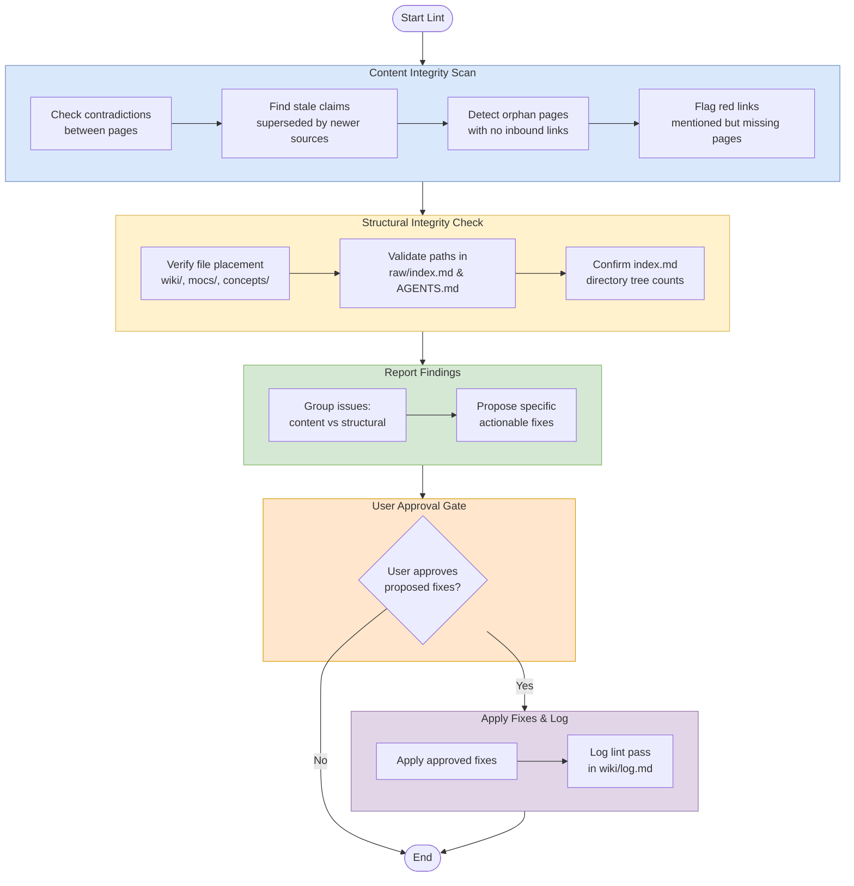

# Lint (Health Check)

## Purpose
Run a health check across the wiki to find content drift, broken references, and structural inconsistencies before they spread.

## When To Use
Use this workflow when you need to audit the wiki for quality issues, especially after refactors, new ingests, bulk edits, or navigation changes.

## Trigger Phrases
- `lint`
- `health check`
- `scan for issues`
- `check the wiki`
- `find broken links`
- `review for drift`

## Do Not Use When
- You only need to answer a question from the wiki. Use `workflows/query.md`.
- You are adding new source material. Use `workflows/ingest.md`.
- You are deepening existing pages rather than checking integrity. Use `workflows/expand.md`.
- You are performing a broader full-wiki pass. Use `workflows/review.md`.

## Required Context
- Current `wiki/` structure and recent edits.
- `wiki/index.md`.
- Relevant MOCs in `wiki/mocs/`.
- `raw/index.md`.
- `AGENTS.md` workflow and path references.

## Procedure
1. Scan all wiki pages for content integrity issues:
   - Contradictions between pages.
   - Stale claims superseded by newer sources.
   - Orphan pages with no inbound links.
   - Mentioned but non-existent pages.
   - Missing cross-references.
   - Gaps worth investigating.
2. Verify structural integrity:
   - All wiki pages live under `wiki/`, not the vault root.
   - MOC files live at `wiki/mocs/*.md`.
   - Concepts live in `wiki/concepts/`.
   - Full-path wiki-links in `raw/index.md` match actual file locations.
   - `wiki/index.md` directory tree counts match actual page counts.
- `AGENTS.md` Current MOCs list matches the actual `wiki/mocs/*.md` files.
- No stale path references remain in `AGENTS.md`, `README.md`, or index files after reorganizations.
   - Mermaid node labels use ` ` for line breaks, not `\n` (which renders literally in Obsidian).
3. Report findings and suggest fixes.
4. Apply fixes only after user approval.
5. Log the lint pass in `wiki/log.md`.

## Completion Checklist
- Findings are grouped by content vs structural issues.
- Proposed fixes are specific and actionable.
- No files were edited without approval.
- The lint pass is logged in `wiki/log.md` after changes are made.

## Related Workflows
- `workflows/query.md`
- `workflows/ingest.md`
- `workflows/expand.md`
- `workflows/review.md`
- `workflows/batch-ingest.md`
