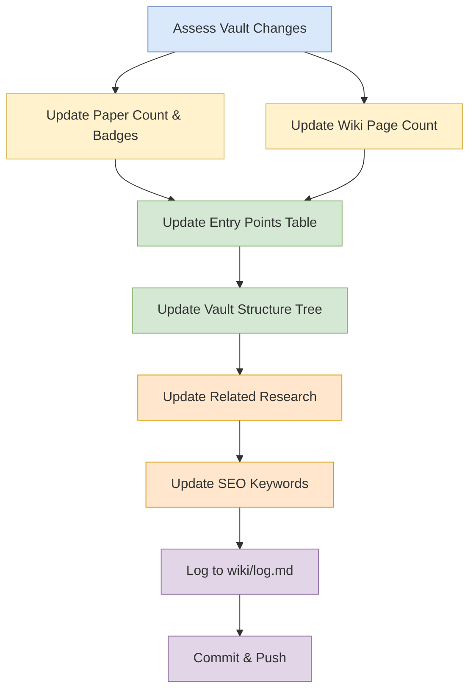

# README & GitHub Maintenance Workflow

## Purpose

Use this workflow to keep the public README and repository-facing metadata aligned with substantial vault changes.

## When To Use

Use this workflow after significant content, structure, or coverage changes that should be reflected in `README.md`.

## Trigger Phrases

Choose this workflow when the user says things like:

- `update the README`
- `refresh the repo metadata`
- `sync the GitHub page`
- `maintain the public-facing docs`
- `update badges and links`

## Do Not Use When

- The task is routine page creation or source ingestion only. Use [`workflows/create/ingest.md`](../create/ingest.md) instead.
- The task is internal wiki enrichment that does not affect the public README. Use [`workflows/enrich/enrich.md`](../enrich/enrich.md) instead.
- The task is a structural health check or lint pass. Use [`workflows/audit/lint.md`](../audit/lint.md) instead.

## Required Context

- The current state of the vault
- What changed materially since the last README update
- Any new papers, MOCs, directories, or research themes
- Any external links or related projects that should be surfaced

## Procedure

The vault is published at `CompleteTech-LLC-AI-Research/beyond-the-token-bottleneck`. When significant changes are made, update `README.md`:

1. **Paper and wiki-page counts.** Run the [stale count sweep](../_shared/procedures/stale-count-sweep.md) in full to identify and fix all stale paper counts and wiki-page counts across `wiki/` and `README.md`, then return here and continue with step 2.
2. **Papers Tracked section.** Add new papers with arXiv links, authors, and venue.
3. **Entry points table.** The entry points table lists all current MOCs. Verify it matches `Glob wiki/mocs/*.md`. Add new MOCs or remove obsolete ones.
4. **Vault structure tree.** Update the vault structure tree to match `wiki/index.md`'s directory enumeration. Add new directories only if they appear in the index.
5. **Related Research section.** Verify all external links resolve. Check descriptions match linked content. Add links to external projects, open calls, or foundational references that relate to the wiki's domain.
6. **SEO keywords**: Update the topics tag cloud at the bottom if new research areas are covered.
7. **Log.** Append a one-line entry to `wiki/log.md` summarising the README refresh (e.g. updated badge counts, added new MOCs to entry-points table, refreshed vault structure tree). Do not backdate or rewrite earlier entries.
8. **Commit and push.** Run [commit and push](../_shared/procedures/commit-and-push.md) in full, then return here — the workflow is complete after this step.

## Completion Checklist

- All items in [`../_shared/checklists/base.md`](../_shared/checklists/base.md) hold.
- Badge counts match the current vault state.
- The Papers Tracked section reflects the current paper set.
- The entry points table matches the current MOC inventory.
- The vault structure tree reflects any new directories.
- Related research links are current and contextual.
- SEO keywords cover the active topic set.

## Related Workflows

- [`workflows/create/ingest.md`](../create/ingest.md) for adding new source-backed content.
- [`workflows/create/batch-ingest.md`](../create/batch-ingest.md) for bulk ingestion runs.
- [`workflows/audit/lint.md`](../audit/lint.md) for structural health checks.
- [`workflows/audit/schema-self-audit.md`](../audit/schema-self-audit.md) for schema compliance audits.

