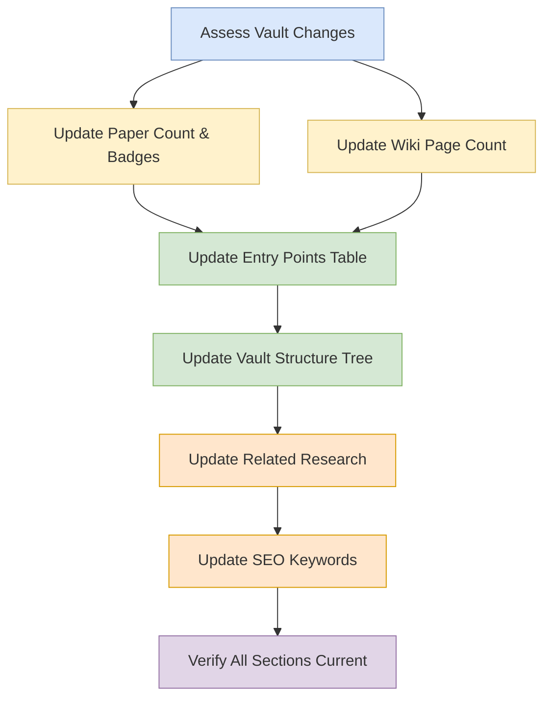

# README & GitHub Maintenance Workflow

## Purpose

Use this workflow to keep the public README and repository-facing metadata aligned with substantial vault changes.

## When To Use

Use this workflow after significant content, structure, or coverage changes that should be reflected in `README.md`.

## Trigger Phrases

Choose this workflow when the user says things like:

- `update the README`
- `refresh the repo metadata`
- `sync the GitHub page`
- `maintain the public-facing docs`
- `update badges and links`

## Do Not Use When

Do not use this workflow for routine page edits, source ingestion only, or internal wiki maintenance that does not affect the public README.

## Required Context

- The current state of the vault
- What changed materially since the last README update
- Any new papers, MOCs, directories, or research themes
- Any external links or related projects that should be surfaced

## Procedure

The vault is published at `CompleteTech-LLC-AI-Research/beyond-the-token-bottleneck`. When significant changes are made, update `README.md`:

1. **Paper count**: Update badges and the Papers Tracked collapsible section. Add new papers with arXiv links, authors, and venue.
2. **Wiki page count**: Update the badge number.
3. **Entry points table**: Add new MOCs or remove obsolete ones.
4. **Vault structure tree**: Update if new directories are created.
5. **Related Research section**: Add links to external projects, open calls, or foundational references that relate to the wiki's domain. Include contextual description of how they connect to wiki content.
6. **SEO keywords**: Update the topics tag cloud at the bottom if new research areas are covered.

## Completion Checklist

- Badge counts match the current vault state.
- The Papers Tracked section reflects the current paper set.
- The entry points table matches the current MOC inventory.
- The vault structure tree reflects any new directories.
- Related research links are current and contextual.
- SEO keywords cover the active topic set.

## Related Workflows

- `workflows/create/ingest.md`
- `workflows/query/query.md`
- `workflows/audit/lint.md`
- `workflows/create/batch-ingest.md`
- `workflows/audit/moc-gap-analysis.md`
- `workflows/audit/schema-self-audit.md`

