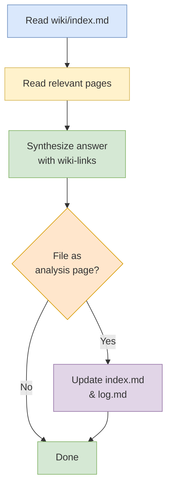

# Query Workflow

## Purpose
Answer a user question by reading the minimum necessary wiki pages and citing them with `[[wiki-links]]`.

## When To Use
Use this workflow when the user wants an explanation, synthesis, comparison, or factual answer grounded in the wiki.

## Trigger Phrases
Common triggers include:
- `what is`
- `how does`
- `why`
- `compare`
- `summarize`
- `explain`
- `what changed`

## Do Not Use When
- The user wants to create or expand wiki content. Use `Ingest`, `Expand`, or `Synthesize` instead.
- The user wants a repo-wide health check. Use `Lint`, `Review`, or `Enrichment Audit` instead.
- The user is asking for a structural wiki change. Use the workflow that matches the change, not `Query`.

## Required Context
- Read `wiki/index.md` first to locate the relevant pages.
- Read the smallest set of pages needed to answer accurately.
- Use wiki-links as the source of truth for citations.

## Procedure
1. Read `wiki/index.md` to identify the most relevant pages.
2. Read those pages directly.
3. Synthesize the answer with `[[wiki-links]]` citations.
4. If the answer is substantial and reusable, offer to file it as an analysis page.
5. If the answer is filed as a page, update `wiki/index.md` and append to `wiki/log.md`.

## Completion Checklist
- The answer is grounded in the relevant wiki pages.
- Citations use `[[wiki-links]]`.
- Reusable answers are offered as analysis pages.
- Any filed page is reflected in `wiki/index.md` and `wiki/log.md`.

## Related Workflows
- `Ingest` for adding new source-backed content.
- `Expand` for deepening an existing page.
- `Synthesize` for creating cross-cutting analysis pages.
- `Lint` for health checks and structural review.
- `Review` for a full wiki once-over.
