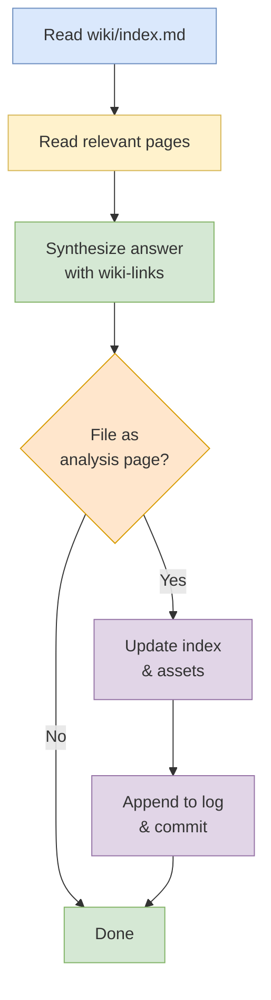

# Query Workflow

## Purpose
Answer a user question by reading the minimum necessary wiki pages and citing them with `[[wiki-links]]`.

## When To Use
Use this workflow when the user wants an explanation, synthesis, comparison, or factual answer grounded in the wiki.

## Trigger Phrases
Common triggers include:
- `what is`
- `how does`
- `why`
- `compare`
- `summarize`
- `explain`
- `what changed`

## Do Not Use When
- The user wants to create or expand wiki content. Use [`workflows/create/ingest.md`](../create/ingest.md), [`workflows/enrich/expand.md`](../enrich/expand.md), or [`workflows/create/synthesize.md`](../create/synthesize.md) instead.
- The user wants a repo-wide health check. Use [`workflows/audit/lint.md`](../audit/lint.md), [`workflows/audit/review.md`](../audit/review.md), or [`workflows/audit/enrichment-audit.md`](../audit/enrichment-audit.md) instead.
- The user is asking for a structural wiki change. Use the workflow that matches the change, not `Query`.

## Required Context
- Read `wiki/index.md` first to locate the relevant pages.
- Read the smallest set of pages needed to answer accurately.
- Use wiki-links as the source of truth for citations.

## Procedure
1. Read `wiki/index.md` to identify the most relevant pages.
2. Read those pages directly.
3. Synthesize the answer with `[[wiki-links]]` citations.
4. If the answer is substantial and reusable, offer to file it as an analysis page.
   - Place the page in `wiki/analyses/`.
   - Include analysis-type frontmatter: `type: analysis`, `created`, `title`, `updated`.
   - The new page is a coordinator-only file per the [shared-file-off-limits rule](../_shared/rules/shared-file-off-limits.md).
   - Run [verify frontmatter completeness](../_shared/procedures/verify-frontmatter-completeness.md) on the new page.
5. **Sync indexes and assets (if a page was filed).** If step 4 resulted in a new analysis page, run [update index and assets](../_shared/procedures/update-index-and-assets.md) in full, then return here and continue with step 6.
6. **Stale count sweep (if a page was filed).** If step 5 ran, run the [stale count sweep](../_shared/procedures/stale-count-sweep.md) in full to verify all prose counts in `wiki/` and `README.md` are current, then return here and continue with step 7.
7. **Append to log.** Add a single entry to `wiki/log.md` summarizing the filed analysis page.
8. **Commit and push.** Run [commit and push](../_shared/procedures/commit-and-push.md) in full, then return here — the workflow is complete after this step.

## Completion Checklist

- All items in [`../_shared/checklists/base.md`](../_shared/checklists/base.md) hold.
- The answer is grounded in the relevant wiki pages.
- Citations use `[[wiki-links]]`.
- Reusable answers are offered as analysis pages.
- Any filed page is reflected in `wiki/index.md` and `wiki/log.md`.
- If a new analysis page was filed, all prose counts in `wiki/` and `README.md` are current.

## Related Workflows
- [`workflows/create/ingest.md`](../create/ingest.md) for adding new source-backed content.
- [`workflows/enrich/expand.md`](../enrich/expand.md) for deepening an existing page.
- [`workflows/audit/lint.md`](../audit/lint.md) for health checks and structural review.
- [`workflows/audit/review.md`](../audit/review.md) for a full wiki once-over.
