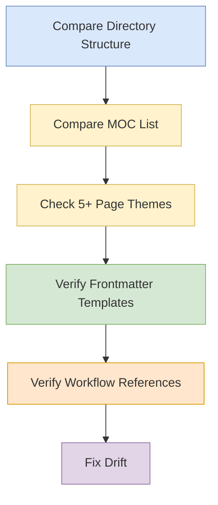

# Schema Self-Audit

## Purpose

Verify that `CLAUDE.md` still matches the real vault layout, current MOC inventory, workflow references, and the frontmatter fields used by existing pages.

## When To Use

- The vault structure changes.
- Workflow files are added, moved, or refactored.
- MOCs are created or removed.
- Frontmatter templates may be stale.
- You need a periodic consistency check on the schema itself.

## Trigger Phrases

- `schema self-audit`
- `audit CLAUDE.md`
- `verify workflow references`
- `check the schema`
- `sync the schema with the vault`

## Do Not Use When

- You only need to add a new page or update content.
- You are doing a normal ingest, expand, or synthesis task.
- You are already in a narrower workflow that will naturally update the affected references.

## Required Context

- The current vault directory structure.
- The actual `wiki/mocs/*.md` files.
- The current workflow files and their paths.
- The frontmatter fields used by real pages.

## Procedure

1. Compare the directory structure listing in `CLAUDE.md` against the actual `ls` output.
2. Compare the `Current MOCs` list against the actual `wiki/mocs/*.md` files.
3. Check whether any theme has accumulated `5+` pages without a MOC, which should trigger `MOC Gap Analysis`.
4. Verify that frontmatter templates include every field actually used in existing pages.
5. Verify that all workflow step references point to files that exist.
6. Fix any drift found.

## Completion Checklist

- `CLAUDE.md` matches the actual vault directory structure.
- `CLAUDE.md` lists the actual MOC files.
- Workflow references point to real files.
- Frontmatter templates reflect the fields used in the vault.
- Any discovered drift was corrected.

## Related Workflows

- `workflows/moc-gap-analysis.md` for coverage gaps in navigation.
- `workflows/review.md` for broader wiki-wide validation.
- `workflows/enrich.md` for structural cleanup after drift is found.

