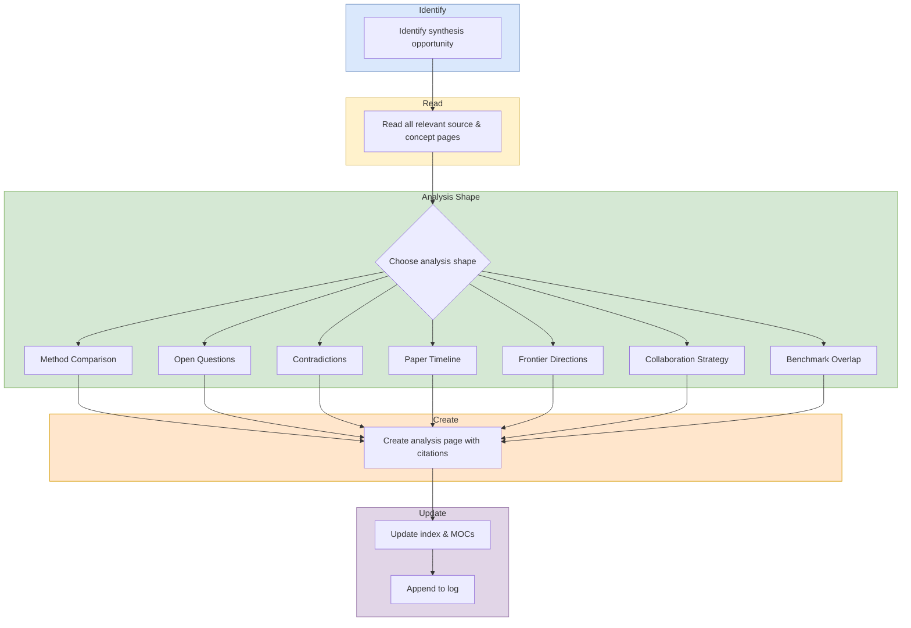

# Synthesize

## Purpose

Create cross-cutting analysis pages that connect multiple sources and concepts into a reusable comparison, timeline, contradiction map, or frontier analysis.

## When To Use

- A user asks for a new analysis page.
- Multiple sources need to be compared, contrasted, or unified.
- The work should synthesize across pages instead of deepening one page.

## Trigger Phrases

- `synthesize`
- `analysis page`
- `compare these methods`
- `find contradictions`
- `build a timeline`
- `map the frontier`
- `aggregate the open questions`

## Do Not Use When

- The task is to deepen one existing page. Use `workflows/expand.md`.
- The task is a single-source ingest. Use `workflows/ingest.md`.
- The task is a general review, lint, or enrichment pass. Use the corresponding workflow instead.

## Required Context

- The synthesis goal and intended audience.
- The source pages and concept pages to read.
- The target analysis type, if known.
- Any existing related analysis pages or MOCs that should be updated.

## Procedure

1. Identify the synthesis opportunity from the user request or from a natural gap discovered during ingest work.
2. Read all relevant source and concept pages before writing.
3. Choose the correct analysis shape:
   - Method comparison for side-by-side evaluation across dimensions such as channel type, training, compute, scale, and results.
   - Open questions aggregation for theme-grouped open questions from concept pages.
   - Contradiction tracking for genuine tensions, complementary findings, and design trade-offs.
   - Paper timeline for chronological field evolution with citation chains.
   - Frontier directions for paradigm-shift opportunities synthesized from gaps.
   - Collaboration strategy for external engagement opportunities.
   - Benchmark overlap for coverage matrices and blind spots across papers.
4. Create the analysis page with citations to all relevant sources.
5. **Sync indexes and assets.** Run [update index and assets](_shared/procedures/update-index-and-assets.md) in full, then return here and continue with step 6. The fragment owns the `wiki/index.md` directory-tree count and entry-list update for the new analysis page.
6. **Update affected MOC reading paths.** For each MOC whose theme the new analysis touches, run [moc update](_shared/procedures/moc-update.md). Skip if no MOC is affected (a synthesis page that creates a new theme may need no immediate MOC update).
7. Append the work to `wiki/log.md`.
8. **Commit and push.** Run [commit and push](_shared/procedures/commit-and-push.md) in full.

## Completion Checklist

- All items in [`_shared/checklists/base.md`](_shared/checklists/base.md) hold.
- The analysis type matches the synthesis problem.
- The page cites all relevant source and concept pages.

## Related Workflows

- `workflows/ingest.md` for source-specific ingestion.
- `workflows/expand.md` for deepening an existing page.
- `workflows/enrich.md` for navigation and cross-link cleanup.
- `workflows/review.md` for broader wiki validation.

